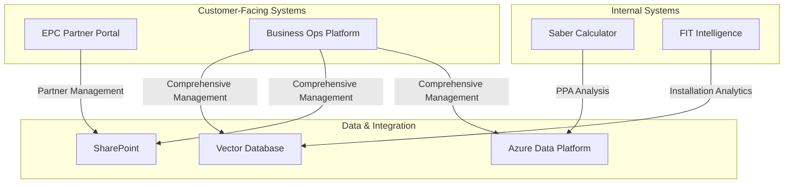

# Saber Renewable Energy Ecosystem

This repository contains the complete suite of Saber Renewable Energy software projects, providing a comprehensive platform for renewable energy management and operations.

## Table of Contents

- [Ecosystem Overview](#ecosystem-overview)
- [Core Projects](#core-projects)
- [Architecture](#architecture)
- [Quick Start](#quick-start)
- [Integration Points](#integration-points)
- [Documentation](#documentation)
- [Development Standards](#development-standards)
- [Contributing](#contributing)
- [License](#license)

## 🏗️ Ecosystem Overview

The Saber Renewable Energy Ecosystem integrates multiple specialized systems to provide end-to-end renewable energy project management, from financial modeling to partner onboarding and installation analytics.

### Core Projects

| Project | Purpose | Technology | Status |
|---------|---------|------------|--------|
| **saber-business-ops-platform** | Comprehensive renewable energy operations platform | Azure, .NET, React, Tailwind CSS | 📋 Planning |
| **saber-calculator** | Solar PPA financial modeling calculator | Python, Streamlit, Tailwind CSS | ✅ Operational |
| **epc-partner-portal** | EPC partner onboarding and management | Next.js, SharePoint, Tailwind CSS | ✅ Operational |
| **fit-intelligence** | AI-powered renewable energy installation intelligence | Python, ChromaDB, Tailwind CSS | ✅ Operational |

## 🏗️ Architecture

### System Components



### Data Flow Architecture

1. **Calculator Results**: Feed into the Business Operations Platform for project tracking
2. **Partner Data**: Managed through EPC Portal and synchronized with Business Ops Platform
3. **Installation Intelligence**: FIT Intelligence provides analytics to all systems
4. **Document Management**: Centralized in SharePoint with access from all platforms

## 🚀 Quick Start

Each project has its own README with specific setup instructions:

### Solar PPA Calculator
```bash
cd saber-calculator
./start_saber_with_tunnels.sh
```

### EPC Partner Portal
```bash
cd epc-partner-portal
cd public-deployment
npm install
npm run dev
```

### FIT Intelligence
```bash
cd fit-intelligence
python fit_intelligence_api.py
```

### Business Operations Platform (Coming Soon)
```bash
cd saber-business-ops-platform
# Implementation in progress
```

## 🔗 Integration Points

### Data Flow
- Calculator results feed into the Business Ops Platform
- Partner data flows between EPC Portal and Business Ops Platform
- FIT Intelligence provides analytics to all systems

### User Management
- Single sign-on across all platforms
- Centralized user permissions
- Role-based access control

### API Integration
- Standardized REST APIs for cross-system communication
- Webhook notifications for real-time updates
- Batch processing for large data operations

### Shared Components
- Common UI components and branding assets
- Shared authentication modules
- Centralized configuration management

## 📚 Documentation

### Cross-Project Architecture
- [System Architecture Overview](docs/Saber_Business_Ops_System_Architecture.md)
- [Azure Deployment Architecture](docs/Saber_Business_Ops_Azure_Deployment_Architecture.md)

### Implementation Guides
- [Implementation Roadmap](docs/Saber_Business_Ops_Implementation_Roadmap.md)
- [Testing & Quality Assurance Framework](docs/Saber_Business_Ops_Testing_Quality_Assurance_Framework.md)

### API Specifications
- [Business Operations API Specifications](docs/Saber_Business_Ops_API_Specifications.md)
- [FIT Intelligence API Documentation](fit-intelligence/)

### Research & Analysis
- [Existing Systems Analysis](docs/Saber_Business_Ops_Existing_Systems_Analysis_Complete.md)
- [Market Research](docs/)

## 🛠️ Development Standards

### Code Quality
- All projects follow Saber coding standards
- Comprehensive code reviews required
- Automated quality checks in CI/CD pipeline

### Security
- Enterprise-grade security across all platforms
- Regular security audits and penetration testing
- Compliance with data protection regulations

### Testing
- Comprehensive test coverage required (>90%)
- Unit, integration, and end-to-end tests
- Performance testing for critical paths

### Documentation
- Up-to-date documentation mandatory
- API documentation auto-generated
- User guides for all customer-facing features

## 🤝 Contributing

1. Follow project-specific contribution guidelines
2. Ensure cross-project compatibility for changes
3. Update relevant documentation
4. Test integrations with dependent systems
5. Submit pull requests with detailed descriptions

## 📄 License

All projects are proprietary to Saber Renewable Energy Ltd.

© 2025 Saber Renewable Energy Ltd | Infinite Power in Partnership
