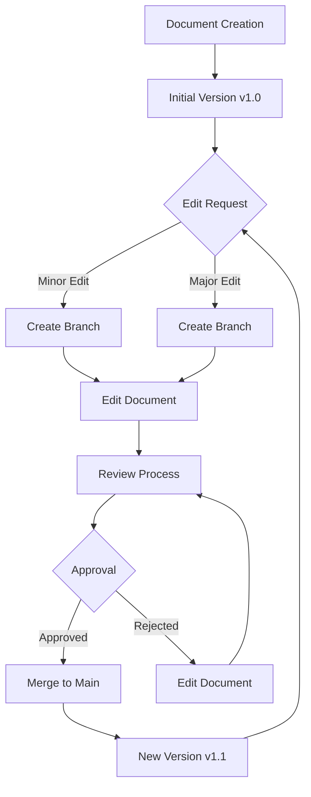

# Saber Business Operations Platform
## Document Management & Version Control System Architecture

**Version:** 1.0  
**Date:** October 23, 2025  
**Author:** Kilo Code (Architect Mode)  
**Status**: Document Management Architecture Design  

---

## Executive Summary

This document defines the comprehensive document management and version control system architecture for the Saber Business Operations Platform. The system provides secure, scalable, and intelligent document management capabilities that support all business processes, from partner onboarding to project delivery and client reporting.

### Key Design Principles
- **Centralized Management**: Single source of truth for all documents
- **Version Control**: Complete version history with change tracking
- **Security First**: Role-based access control with data encryption
- **Intelligent Search**: AI-powered document search and classification
- **Workflow Integration**: Seamless integration with business processes

---

## 1. Document Management Overview

### 1.1 System Objectives

#### Primary Goals
```yaml
Document Management Goals:
  - Centralized Document Storage
    - Single repository for all documents
    - Consistent document organization
    - Efficient document retrieval
    - Scalable storage capacity
  
  - Version Control Management
    - Complete version history
    - Change tracking and audit trail
    - Branching and merging capabilities
    - Rollback capabilities
  
  - Security and Compliance
    - Role-based access control
    - Document encryption
    - Audit trail and logging
    - GDPR compliance
  
  - Workflow Integration
    - Document-based workflows
    - Automated notifications
    - Approval processes
    - Document lifecycle management
  
  - Intelligence and Analytics
    - AI-powered document classification
    - Content extraction and analysis
    - Search and discovery
    - Usage analytics
```

### 1.2 Document Types & Categories

#### Document Classification
```yaml
Document Categories:
  Business Documents:
    - Contracts and Agreements
    - Proposals and Tenders
    - Financial Reports
    - Business Plans
    - Meeting Minutes
    - Policies and Procedures
  
  Technical Documents:
    - System Specifications
    - Design Documents
    - Technical Drawings
    - Calculation Reports
    - Installation Manuals
    - Maintenance Procedures
  
  Project Documents:
    - Project Plans
    - Risk Assessments
    - Progress Reports
    - Deliverables
    - Change Requests
    - Closing Reports
  
  Partner Documents:
    - Onboarding Documents
    - Certifications
    - Insurance Documents
    - Capability Statements
    - Performance Reports
    - Compliance Documents
  
  Client Documents:
    - PPA Agreements
    - Site Surveys
    - Feasibility Studies
    - Installation Reports
    - Performance Reports
    - Invoices and Payments
  
  Regulatory Documents:
    - Planning Permissions
    - Grid Connection Agreements
    - FIT Certificates
    - Compliance Reports
    - Safety Documentation
    - Environmental Assessments
```

---

## 2. Document Storage Architecture

### 2.1 Storage Infrastructure

#### Azure Storage Integration
```yaml
Storage Architecture:
  Primary Storage:
    - Azure Blob Storage
      - Hot Tier: Frequently accessed documents
      - Cool Tier: Infrequently accessed documents
      - Archive Tier: Long-term archival
      - Geo-redundant storage (GRS)
      - Lifecycle management policies
  
  Database Storage:
    - Azure SQL Database
      - Document metadata
      - Version information
      - Access control lists
      - Audit trail data
      - Search indexes
  
  Cache Storage:
    - Azure Redis Cache
      - Frequently accessed metadata
      - Search results caching
      - Session data
      - Performance optimization

Storage Security:
  - Encryption at Rest
    - Azure Storage Service Encryption
    - Customer-managed keys
    - Key rotation policies
    - HSM-backed keys
  
  - Encryption in Transit
    - TLS 1.3 for all connections
    - Certificate-based authentication
    - Perfect forward secrecy
    - End-to-end encryption
```

#### Storage Organization
```yaml
Storage Structure:
  Document Repository:
    - /documents/
      - /business/
        - /contracts/
        - /proposals/
        - /reports/
      - /technical/
        - /specifications/
        - /drawings/
        - /manuals/
      - /projects/
        - /{project_id}/
          - /plans/
          - /reports/
          - /deliverables/
      - /partners/
        - /{partner_id}/
          - /onboarding/
          - /certifications/
          - /performance/
      - /clients/
        - /{client_id}/
          - /agreements/
          - /reports/
          - /invoices/
      - /regulatory/
        - /permissions/
        - /compliance/
        - /safety/
  
  Version Storage:
    - /versions/
      - /{document_id}/
        - /v{version_number}/
          - document_file
          - metadata.json
          - changelog.json
          - audit_log.json
  
  Temporary Storage:
    - /temp/
      - /uploads/
      - /processing/
      - /exports/
      - /previews/
```

### 2.2 Document Metadata Management

#### Metadata Schema
```yaml
Document Metadata:
  Core Metadata:
    - Document ID (UUID)
    - Document Name
    - Document Type
    - Document Category
    - File Format
    - File Size
    - Creation Date
    - Created By
    - Last Modified Date
    - Last Modified By
    - Version Number
    - Status (Draft, Review, Approved, Archived)
  
  Business Metadata:
    - Project ID (if applicable)
    - Partner ID (if applicable)
    - Client ID (if applicable)
    - Contract ID (if applicable)
    - Document Tags
    - Keywords
    - Description
    - Language
    - Classification Level
    - Retention Period
    - Expiry Date
  
  Technical Metadata:
    - MIME Type
    - Checksum (SHA-256)
    - Encoding
    - Compression
    - Digital Signature
    - Watermarking
    - DRM Protection
    - Access Rights
    - Usage Rights
  
  Workflow Metadata:
    - Current Workflow Stage
    - Assigned Reviewers
    - Approval Status
    - Review Comments
    - Approval Date
    - Approved By
    - Next Review Date
    - Notification Preferences
```

---

## 3. Version Control System

### 3.1 Version Control Architecture

#### Version Management Framework
```yaml
Version Control Components:
  - Version Engine
    - Version numbering system
    - Change detection
    - Delta calculation
    - Merge conflict resolution
    - Branch management
  
  - Storage Manager
    - Version storage optimization
    - Delta compression
    - Garbage collection
    - Backup management
    - Recovery procedures
  
  - Access Controller
    - Version-level permissions
    - Branch-level permissions
    - Merge permissions
    - Rollback permissions
    - Audit logging
  
  - Workflow Integrator
    - Version-based workflows
    - Approval processes
    - Notification systems
    - Status tracking
    - Escalation procedures
```

#### Version Control Workflow


### 3.2 Branching Strategy

#### Branch Management
```yaml
Branch Types:
  Main Branch:
    - Production-ready versions
    - Stable releases
    - Approved documents
    - Version tags
    - Release notes
  
  Development Branch:
    - Work in progress
    - Feature development
    - Experimental changes
    - Testing versions
    - Integration testing
  
  Feature Branch:
    - Specific features
    - Bug fixes
    - Minor improvements
    - User-requested changes
    - Quick fixes
  
  Release Branch:
    - Release preparation
    - Final testing
    - Quality assurance
    - Documentation updates
    - Deployment preparation

Branch Policies:
  - Main branch protection
  - Required reviews
  - Automated testing
  - Merge conflict resolution
  - Version tagging
  - Release management
```

### 3.3 Change Tracking & Audit

#### Change Management
```yaml
Change Tracking:
  - Change Detection
    - File content comparison
    - Metadata comparison
    - Structure comparison
    - Semantic comparison
    - Visual comparison
  
  - Change Documentation
    - Change descriptions
    - Reason for change
    - Impact assessment
    - Risk assessment
    - Approval documentation
  
  - Change Approval
    - Review workflows
    - Approval hierarchies
    - Notification systems
    - Escalation procedures
    - Audit trails

Audit Framework:
  - Comprehensive Logging
    - All document access
    - All modifications
    - All version changes
    - All permission changes
    - All system events
  
  - Audit Trail
    - User activity logs
    - System event logs
    - Security event logs
    - Performance logs
    - Error logs
  
  - Compliance Reporting
    - Access reports
    - Change reports
    - Security reports
    - Compliance status
    - Risk assessments
```

---

## 4. Document Security Architecture

### 4.1 Access Control Framework

#### Role-Based Access Control (RBAC)
```yaml
Access Roles:
  System Administrator:
    - Full system access
    - User management
    - System configuration
    - Security policy management
    - Audit log access
  
  Document Manager:
    - Document management
    - Version control
    - Access control
    - Workflow management
    - Reporting
  
  Content Creator:
    - Document creation
    - Document editing
    - Version management
    - Collaboration
    - Publishing
  
  Content Reviewer:
    - Document review
    - Approval workflows
    - Quality control
    - Compliance checking
    - Feedback
  
  Content Consumer:
    - Document access
    - Document viewing
    - Document download
    - Search
    - Sharing

Permission Levels:
  - Read: View documents
  - Write: Edit documents
  - Delete: Remove documents
  - Share: Share documents
  - Publish: Publish documents
  - Approve: Approve documents
  - Admin: Administrative access
```

#### Attribute-Based Access Control (ABAC)
```yaml
ABAC Attributes:
  User Attributes:
    - Role
    - Department
    - Location
    - Security Clearance
    - Certification Level
  
  Resource Attributes:
    - Document Type
    - Classification Level
    - Sensitivity Level
    - Project Association
    - Client Association
  
  Environmental Attributes:
    - Time of Day
    - Location
    - Device Type
    - Network Type
    - Authentication Method
  
  Action Attributes:
    - Action Type
    - Purpose
    - Context
    - Risk Level
    - Compliance Requirements

Access Rules:
  - Dynamic Policy Evaluation
  - Real-time Enforcement
  - Context-aware Decisions
  - Risk-based Authentication
  - Adaptive Access Control
```

### 4.2 Document Protection

#### Encryption & Security
```yaml
Encryption Strategy:
  - Document Encryption
    - AES-256 encryption
    - Customer-managed keys
    - Key rotation policies
    - Per-document encryption
    - Granular key management
  
  - Transmission Security
    - TLS 1.3 for all transfers
    - Certificate-based authentication
    - End-to-end encryption
    - Secure channels
    - VPN protection
  
  - Storage Security
    - Encrypted storage
    - Secure key management
    - Access logging
    - Intrusion detection
    - Data loss prevention

Digital Rights Management (DRM):
  - Access Control
    - User-based permissions
    - Time-based access
    - Location-based access
    - Device-based access
    - Usage-based access
  
  - Usage Rights
    - View permissions
    - Edit permissions
    - Print permissions
    - Copy permissions
    - Share permissions
  
  - Watermarking
    - Dynamic watermarks
    - User identification
    - Timestamp watermarks
    - Classification watermarks
    - Usage tracking
```

---

## 5. Search & Discovery Architecture

### 5.1 Intelligent Search System

#### Search Infrastructure
```yaml
Search Components:
  - Search Engine
    - Azure Cognitive Search
    - Full-text search
    - Semantic search
    - Faceted search
    - Query expansion
  
  - Indexing Service
    - Document indexing
    - Content extraction
    - Metadata indexing
    - Real-time indexing
    - Incremental indexing
  
  - Query Processor
    - Natural language processing
    - Query parsing
    - Query optimization
    - Result ranking
    - Personalization
  
  - User Interface
    - Search interface
    - Advanced search
    - Filters and facets
    - Search suggestions
    - Result preview

Search Capabilities:
  - Text Search
    - Full-text search
    - Phrase search
    - Proximity search
    - Fuzzy search
    - Wildcard search
  
  - Metadata Search
    - Property search
    - Date range search
    - Numeric range search
    - Category search
    - Tag search
  
  - Visual Search
    - Image search
    - Object detection
    - Text extraction from images
    - Similarity search
    - Pattern recognition
  
  - Voice Search
    - Speech recognition
    - Natural language queries
    - Voice commands
    - Text-to-speech
    - Multilingual support
```

### 5.2 AI-Powered Document Intelligence

#### Document Analysis Services
```yaml
AI Services:
  - Document Classification
    - Automatic categorization
    - Content type detection
    - Sensitivity classification
    - Compliance checking
    - Quality assessment
  
  - Content Extraction
    - Text extraction
    - Table extraction
    - Image extraction
    - Chart extraction
    - Metadata extraction
  
  - Entity Recognition
    - Named entity recognition
    - Relationship extraction
    - Pattern recognition
    - Sentiment analysis
    - Topic modeling
  
  - Document Summarization
    - Automatic summarization
    - Key point extraction
    - Executive summary generation
    - Multi-document summarization
    - Customizable summaries

Machine Learning Models:
  - Classification Models
    - Document type classification
    - Content classification
    - Priority classification
    - Risk classification
    - Compliance classification
  
  - Extraction Models
    - Information extraction
    - Data extraction
    - Structure extraction
    - Relationship extraction
    - Pattern extraction
  
  - Recommendation Models
    - Document recommendations
    - Content recommendations
    - User behavior analysis
    - Personalization
    - Context-aware recommendations
```

---

## 6. Workflow Integration Architecture

### 6.1 Document Workflow Framework

#### Workflow Engine
```yaml
Workflow Components:
  - Workflow Designer
    - Visual workflow designer
    - Drag-and-drop interface
    - Template library
    - Custom workflow creation
    - Workflow validation
  
  - Workflow Engine
    - Process execution
    - State management
    - Transition management
    - Condition evaluation
    - Action execution
  
  - Task Management
    - Task assignment
    - Task tracking
    - Task escalation
    - Task completion
    - Task reporting
  
  - Notification System
    - Email notifications
    - SMS notifications
    - In-app notifications
    - Push notifications
    - Webhook notifications

Workflow Types:
  - Approval Workflows
    - Document approval
    - Version approval
    - Content approval
    - Budget approval
    - Contract approval
  
  - Review Workflows
    - Peer review
    - Technical review
    - Legal review
    - Compliance review
    - Quality review
  
  - Publication Workflows
    - Document publishing
    - Version publishing
    - Release publishing
    - Announcement publishing
    - Distribution publishing
  
  - Archival Workflows
    - Document archival
    - Version archival
    - Project archival
    - Record retention
    - Compliance archival
```

### 6.2 Integration Patterns

#### System Integration
```yaml
Integration Points:
  - Partner Management
    - Partner onboarding documents
    - Certification documents
    - Insurance documents
    - Performance reports
    - Compliance documents
  
  - Project Management
    - Project plans
    - Technical specifications
    - Progress reports
    - Deliverables
    - Closing reports
  
  - Calculator Module
    - Calculation reports
    - Technical specifications
    - Financial models
    - Sensitivity analysis
    - Executive summaries
  
  - FIT Intelligence
    - FIT installation reports
    - Opportunity analysis
    - Performance reports
    - Market analysis
    - Regulatory documents
  
  - Reporting System
    - Business reports
    - Financial reports
    - Performance reports
    - Compliance reports
    - Executive reports

Integration Methods:
  - API Integration
    - RESTful APIs
    - Webhook integration
    - Event-driven integration
    - Real-time synchronization
    - Batch processing
  
  - Database Integration
    - Direct database access
    - Data synchronization
    - ETL processes
    - Data validation
    - Data transformation
  
  - File Integration
    - File system integration
    - FTP/SFTP integration
    - Cloud storage integration
    - File format conversion
    - File validation
```

---

## 7. User Interface Architecture

### 7.1 Document Management UI

#### User Interface Components
```yaml
UI Components:
  - Document Library
    - Document listing
    - Grid view
    - List view
    - Card view
    - Thumbnail view
  
  - Document Viewer
    - Inline document viewer
    - Multi-format support
    - Annotation tools
    - Collaboration tools
    - Version comparison
  
  - Search Interface
    - Search bar
    - Advanced search
    - Search filters
    - Search suggestions
    - Search results
  
  - Metadata Editor
    - Metadata forms
    - Custom fields
    - Validation rules
    - Auto-completion
    - Bulk editing
  
  - Version Control
    - Version history
    - Version comparison
    - Branch management
    - Merge conflicts
    - Rollback options

User Experience:
  - Responsive Design
    - Desktop optimization
    - Tablet optimization
    - Mobile optimization
    - Touch-friendly interface
    - Keyboard navigation
  
  - Accessibility
    - WCAG 2.1 AA compliance
    - Screen reader support
    - Keyboard navigation
    - High contrast mode
    - Text resizing
  
  - Performance
    - Fast loading
    - Smooth interactions
    - Lazy loading
    - Caching strategies
    - Progressive enhancement
```

### 7.2 Collaboration Features

#### Collaboration Tools
```yaml
Collaboration Features:
  - Real-time Collaboration
    - Simultaneous editing
    - Live cursors
    - Real-time chat
    - Activity notifications
    - Change synchronization
  
  - Review and Approval
    - Comment system
    - Review workflows
    - Approval processes
    - Status tracking
    - Notification systems
  
  - Version Management
    - Version comparison
    - Change tracking
    - Merge conflicts
    - Rollback options
    - Branch management
  
  - Sharing and Permissions
    - Document sharing
    - Link sharing
    - Permission management
    - Access control
    - Usage tracking

Communication Tools:
  - Comments and Annotations
    - Inline comments
    - Page-level comments
    - Section-level comments
    - Threaded discussions
    - Resolution tracking
  
  - Notifications
    - Email notifications
    - In-app notifications
    - Push notifications
    - SMS notifications
    - Digest notifications
  
  - Activity Tracking
    - User activity
    - Document activity
    - System activity
    - Performance metrics
    - Usage analytics
```

---

## 8. Performance & Scalability

### 8.1 Performance Optimization

#### Optimization Strategies
```yaml
Performance Optimization:
  - Caching Strategy
    - Document caching
    - Metadata caching
    - Search result caching
    - User session caching
    - API response caching
  
  - Content Delivery
    - CDN integration
    - Edge caching
    - Geographic distribution
    - Load balancing
    - Failover mechanisms
  
  - Database Optimization
    - Query optimization
    - Index optimization
    - Connection pooling
    - Read replicas
    - Partitioning
  
  - File Optimization
    - File compression
    - Image optimization
    - Video optimization
    - Format conversion
    - Progressive loading

Performance Metrics:
  - Document Upload Speed
    - Small files: <2 seconds
    - Medium files: <10 seconds
    - Large files: <30 seconds
    - Batch uploads: <1 minute/file
  
  - Search Performance
    - Simple search: <1 second
    - Complex search: <3 seconds
    - Faceted search: <2 seconds
    - AI-powered search: <5 seconds
  
  - Document Viewer Performance
    - PDF loading: <3 seconds
    - Image loading: <2 seconds
    - Video loading: <5 seconds
    - Large documents: <10 seconds
```

### 8.2 Scalability Architecture

#### Scalability Design
```yaml
Scalability Components:
  - Horizontal Scaling
    - Load balancing
    - Auto-scaling
    - Geographic distribution
    - Microservices architecture
    - Container orchestration
  
  - Storage Scalability
    - Scalable storage
    - Tiered storage
    - Archive storage
    - Backup storage
    - Disaster recovery
  
  - Processing Scalability
    - Background processing
    - Queue-based processing
    - Parallel processing
    - Distributed processing
    - Batch processing
  
  - Database Scalability
    - Database sharding
    - Read replicas
    - Connection pooling
    - Caching layers
    - NoSQL integration

Scalability Metrics:
  - Concurrent Users
    - Target: 1000+ concurrent users
    - Peak: 2000+ concurrent users
    - Growth: 10x current capacity
    - Geographic: Global distribution
  
  - Document Volume
    - Target: 10M+ documents
    - Growth: 100% YoY growth
    - Size: 100TB+ storage
    - Types: 50+ document types
  
  - Performance Requirements
    - Upload Speed: 100MB/s
    - Download Speed: 200MB/s
    - Search Speed: <1 second
    - Availability: 99.9% uptime
```

---

## 9. Implementation Roadmap

### 9.1 Development Phases

#### Phase 1: Foundation (Weeks 1-4)
```yaml
Foundation Development:
  - Document storage infrastructure
  - Basic metadata management
  - Simple version control
  - Basic search functionality
  - User authentication
  - Role-based access control
```

#### Phase 2: Core Features (Weeks 5-8)
```yaml
Core Features Development:
  - Advanced version control
  - Document classification
  - Workflow integration
  - Search enhancement
  - Collaboration features
  - Mobile optimization
```

#### Phase 3: Intelligence (Weeks 9-12)
```yaml
Intelligence Development:
  - AI-powered search
  - Document intelligence
  - Advanced analytics
  - Predictive capabilities
  - Automation features
  - Performance optimization
```

#### Phase 4: Production (Weeks 13-16)
```yaml
Production Development:
  - Security hardening
  - Performance tuning
  - Scalability enhancement
  - Monitoring implementation
  - Documentation completion
  - User training materials
```

### 9.2 Success Metrics

#### Technical Metrics
```yaml
Performance Metrics:
  - Document Upload Speed: <10 seconds
  - Search Response Time: <2 seconds
  - System Availability: >99.9%
  - Concurrent Users: 1000+
  - Document Volume: 10M+
  - Storage Capacity: 100TB+

Quality Metrics:
  - System Reliability: >99.9%
  - Data Accuracy: >99.5%
  - Search Accuracy: >95%
  - User Satisfaction: >4.5/5
  - Security Compliance: 100%
  - Performance Standards: 100%
```

#### Business Metrics
```yaml
Business Metrics:
  - Process Efficiency: 70% improvement
  - Document Retrieval Time: 80% reduction
  - Collaboration Efficiency: 60% improvement
  - Compliance Adherence: 100%
  - Cost Savings: 40% reduction
  - User Adoption: >85%
```

---

## 10. Conclusion

### 10.1 Document Management Architecture Summary

This comprehensive document management architecture provides a robust, secure, and intelligent system for managing all documents in the Saber Business Operations Platform, featuring:

1. **Centralized Management**: Single source of truth for all documents
2. **Advanced Version Control**: Complete version history with change tracking
3. **Intelligent Search**: AI-powered document search and classification
4. **Workflow Integration**: Seamless integration with business processes
5. **Scalable Architecture**: Support for enterprise-scale document volumes

### 10.2 Implementation Priorities

#### Immediate Actions (Next 30 Days)
1. **Storage Infrastructure**: Implement Azure Blob Storage with proper organization
2. **Metadata Framework**: Develop comprehensive metadata management system
3. **Version Control**: Implement basic version control with change tracking
4. **Security Framework**: Establish role-based access control and encryption
5. **Search Implementation**: Develop basic search functionality with metadata indexing

#### Long-term Vision (6-12 months)
1. **AI Integration**: Complete AI-powered document intelligence implementation
2. **Advanced Workflows**: Implement sophisticated document-based workflows
3. **Performance Excellence**: Achieve industry-leading performance and scalability
4. **User Experience**: Deliver exceptional user experience with intuitive interfaces
5. **Innovation Leadership**: Establish Saber as technology leader in document management

---

**Document Version Control:**
- Version 1.0 - Initial Architecture (October 23, 2025)
- Next Review: November 15, 2025
- Approved By: [Pending Leadership Review]
- Status: Document Management Architecture Design