# Saber Business Operations Platform
## Detailed System Architecture & Component Integration

**Version:** 1.0  
**Date:** October 23, 2025  
**Author:** Kilo Code (Architect Mode)  
**Status:** Detailed Architecture Design  

---

## 1. High-Level System Architecture

### 1.1 Overall System Overview

```mermaid
graph TB
    subgraph "External Users & Systems"
        EU[Internal Users]
        EP[EPC Partners]
        LC[Client Organizations]
        EC[External Calculators]
        TP[Third Party APIs]
    end
    
    subgraph "Presentation Layer"
        WEB[React Web Application]
        MOB[Mobile Responsive UI]
        PORTAL[Client Portal]
        ADMIN[Admin Dashboard]
    end
    
    subgraph "API Gateway & Security"
        AGW[Azure API Gateway]
        AUTH[Azure AD B2C]
        WAF[Azure WAF]
        RATE[Rate Limiting]
    end
    
    subgraph "Application Services"
        subgraph "Core Business Services"
            CALC[Calculator Service]
            FIT[FIT Intelligence Service]
            PM[Partner Management Service]
            PJM[Project Management Service]
            DOC[Document Service]
            REPORT[Reporting Service]
        end
        
        subgraph "AI/ML Services"
            AI_ROUTER[AI Router Service]
            QWEN_REASONER[Qwen2.5 Reasoner]
            QWEN_MATH[Qwen-Math Calculator]
            LLAMA_COMM[Llama3.1 Communicator]
            LLAMA_CLASS[Llama3.2 Classifier]
            RAG[RAG Knowledge Base]
        end
        
        subgraph "Integration Services"
            INT_CALC[Calculator Integration]
            INT_EMAIL[Email Service]
            INT_WEBHOOK[Webhook Service]
            INT_API[External API Integration]
        end
    end
    
    subgraph "Data Layer"
        subgraph "Primary Storage"
            SQL[Azure SQL Database]
            BLOB[Azure Blob Storage]
            CACHE[Redis Cache]
        end
        
        subgraph "Analytics & Search"
            SEARCH[Azure Cognitive Search]
            ANALYTICS[Azure Synapse]
            MONITOR[Azure Monitor]
        end
        
        subgraph "Security & Backup"
            KEYVAULT[Azure Key Vault]
            BACKUP[Azure Backup]
            LOG[Azure Log Analytics]
        end
    end
    
    subgraph "Infrastructure"
        APP_SVC[Azure App Service]
        FUNC[Azure Functions]
        VNET[Azure Virtual Network]
        CDN[Azure CDN]
    end
    
    EU --> WEB
    EP --> MOB
    LC --> PORTAL
    WEB --> AGW
    MOB --> AGW
    PORTAL --> AGW
    ADMIN --> AGW
    AGW --> AUTH
    AGW --> WAF
    AGW --> RATE
    AGW --> CALC
    AGW --> FIT
    AGW --> PM
    AGW --> PJM
    AGW --> DOC
    AGW --> REPORT
    CALC --> AI_ROUTER
    FIT --> AI_ROUTER
    REPORT --> AI_ROUTER
    AI_ROUTER --> QWEN_REASONER
    AI_ROUTER --> QWEN_MATH
    AI_ROUTER --> LLAMA_COMM
    AI_ROUTER --> LLAMA_CLASS
    AI_ROUTER --> RAG
    CALC --> INT_CALC
    INT_CALC --> EC
    REPORT --> INT_EMAIL
    DOC --> INT_WEBHOOK
    FIT --> INT_API
    INT_API --> TP
    CALC --> SQL
    FIT --> SQL
    PM --> SQL
    PJM --> SQL
    DOC --> BLOB
    REPORT --> BLOB
    CALC --> CACHE
    FIT --> CACHE
    DOC --> SEARCH
    REPORT --> ANALYTICS
    APP_SVC --> MONITOR
    AUTH --> KEYVAULT
    SQL --> BACKUP
    BLOB --> BACKUP
    APP_SVC --> LOG
    VNET --> APP_SVC
    BLOB --> CDN
```

### 1.2 Component Interaction Patterns

#### 1.2.1 Request Flow Pattern

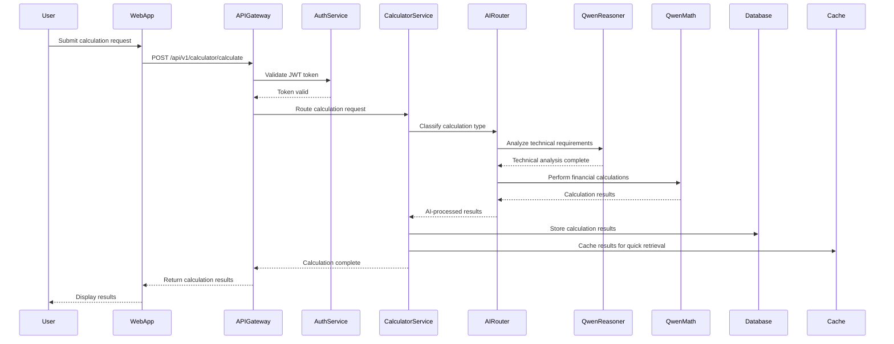

#### 1.2.2 AI Service Integration Pattern

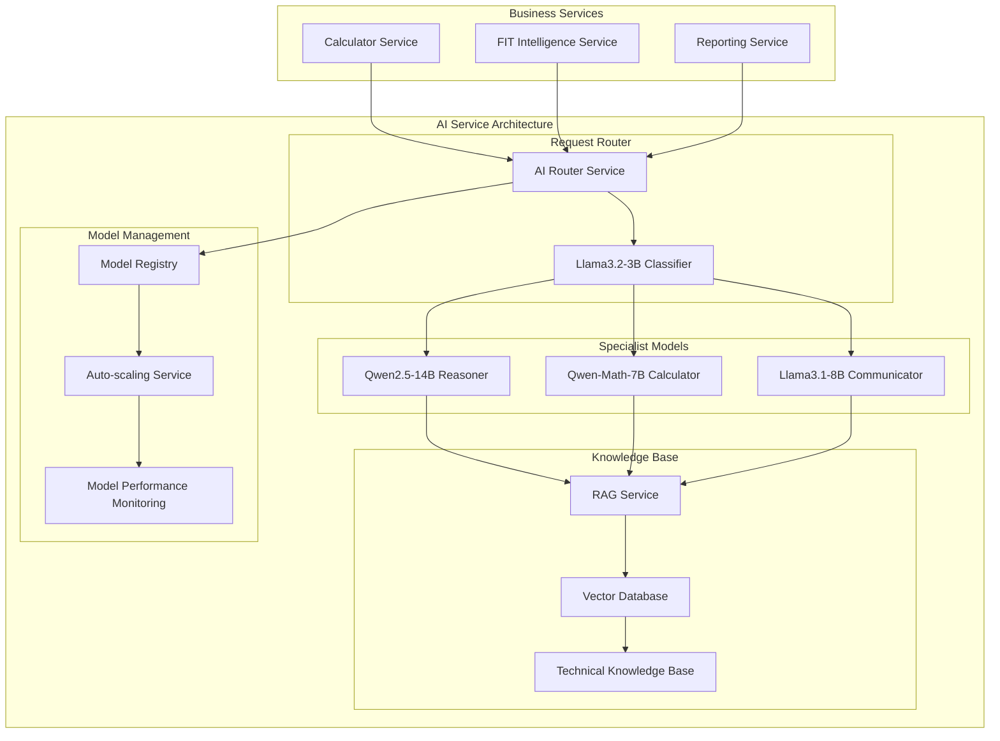

---

## 2. Module Architecture Details

### 2.1 Calculator Module Architecture

#### 2.1.1 Calculator Service Components

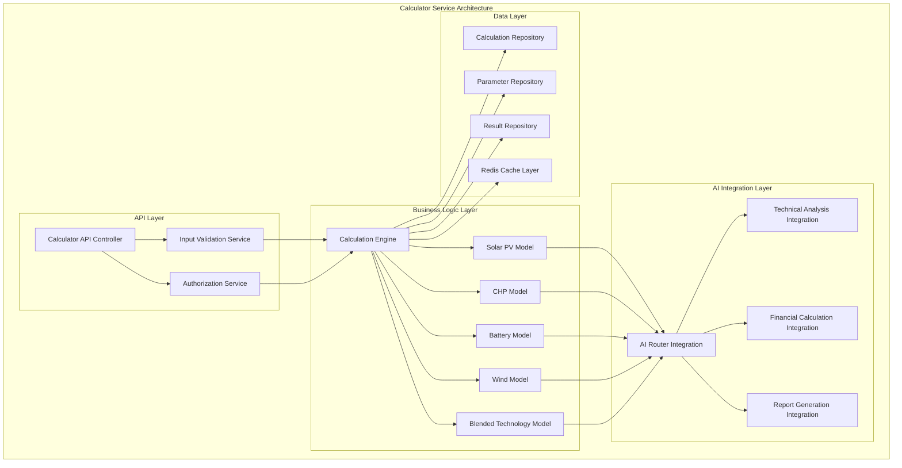

#### 2.1.2 Calculation Workflow

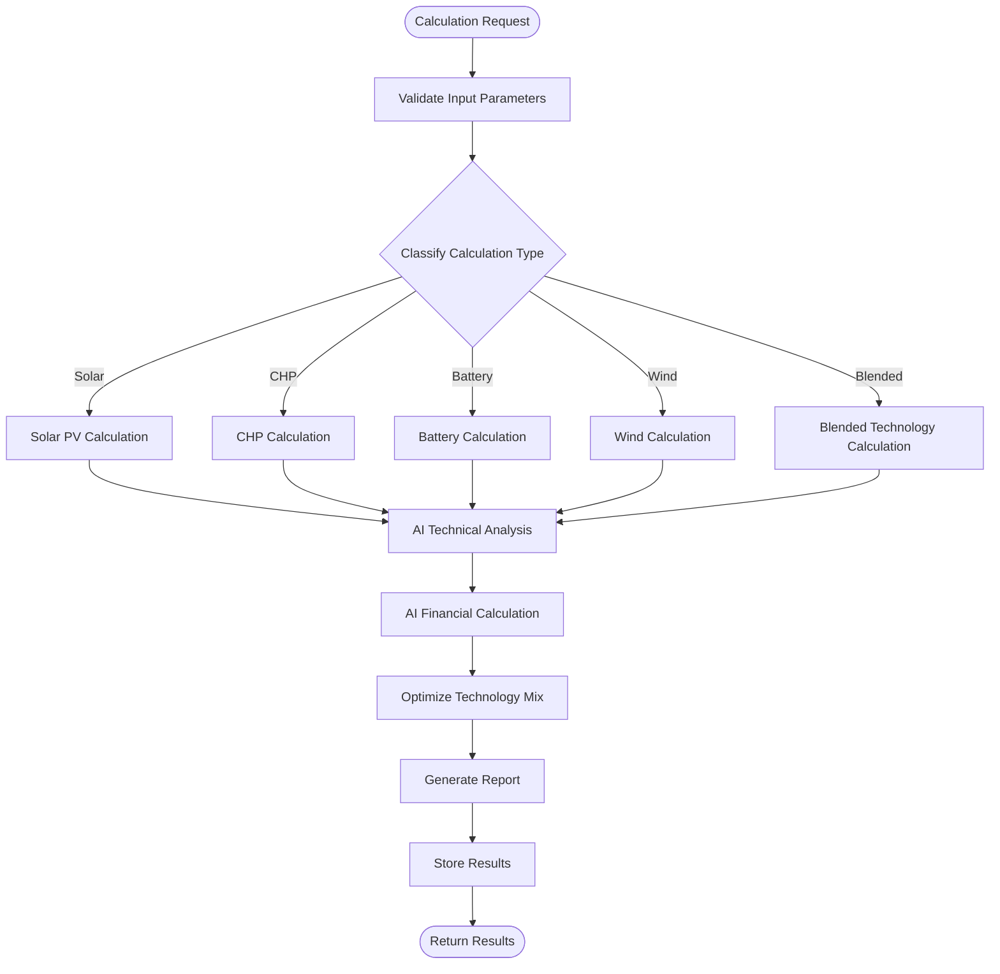

### 2.2 FIT Intelligence Module Architecture

#### 2.2.1 FIT Intelligence Service Components

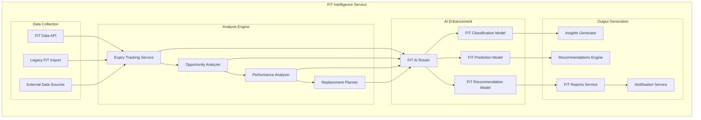

### 2.3 Partner Management Module Architecture

#### 2.3.1 Partner Management Service Components

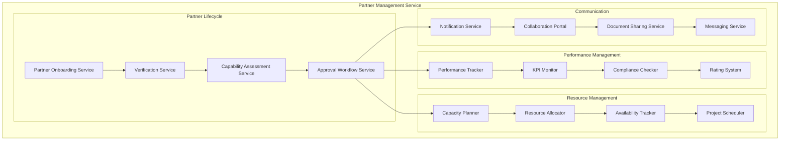

### 2.4 Project Management Module Architecture

#### 2.4.1 Project Management Service Components

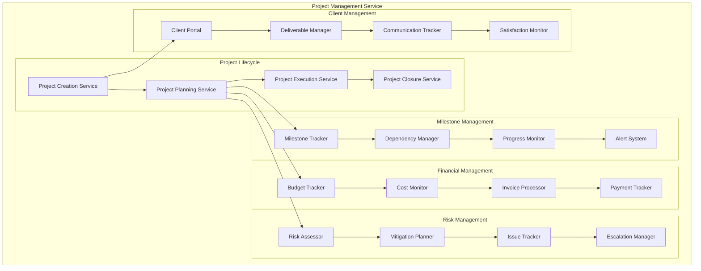

---

## 3. AI/LLM Integration Architecture

### 3.1 AI Service Architecture

#### 3.1.1 AI Model Orchestration

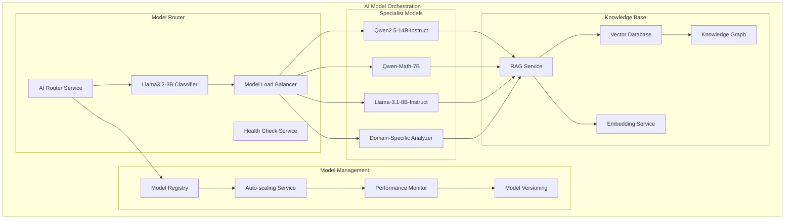

#### 3.1.2 AI Model Deployment Architecture

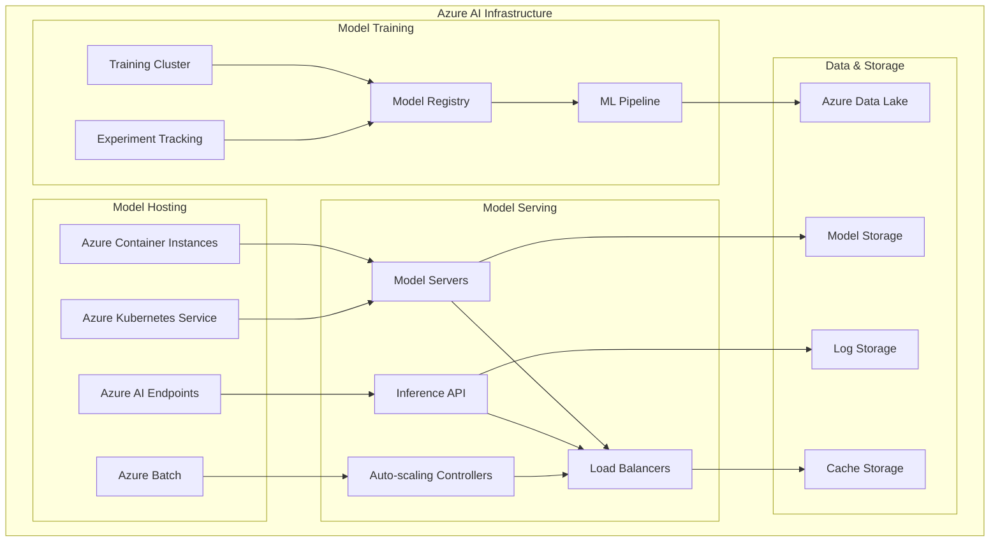

### 3.2 AI Integration Patterns

#### 3.2.1 Intelligent Calculation Enhancement

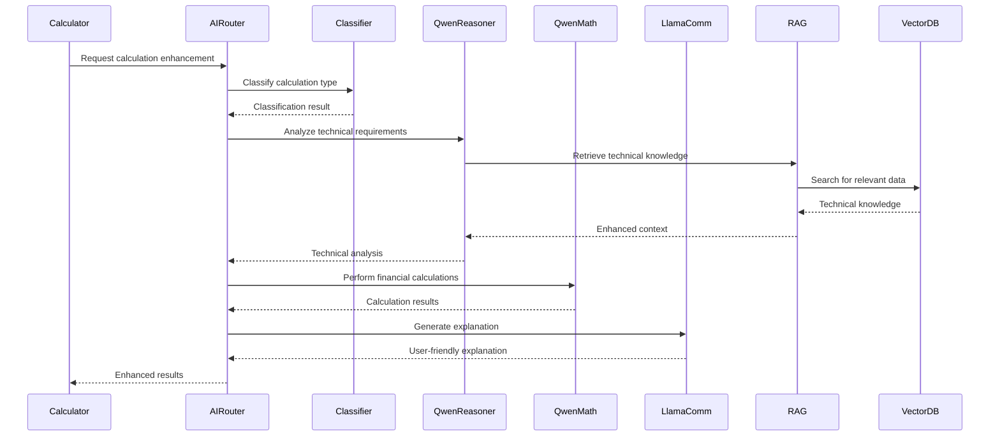

#### 3.2.2 FIT Intelligence Enhancement

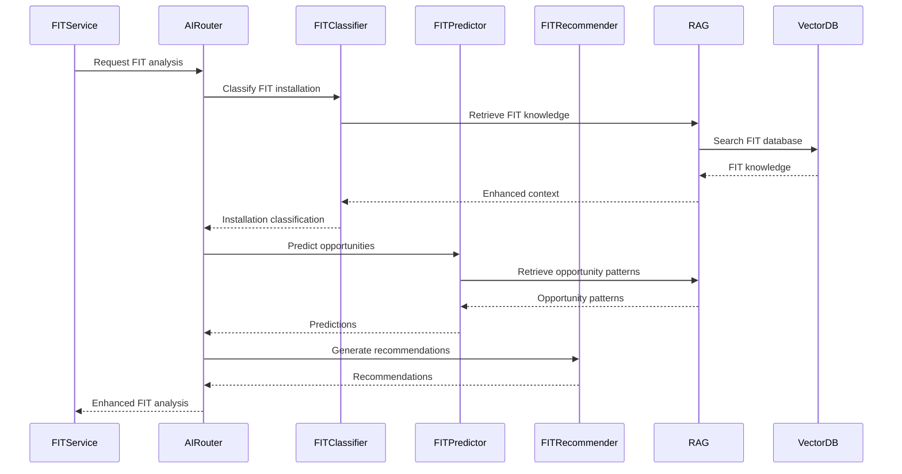

---

## 4. Data Architecture

### 4.1 Data Flow Architecture

#### 4.1.1 Overall Data Flow

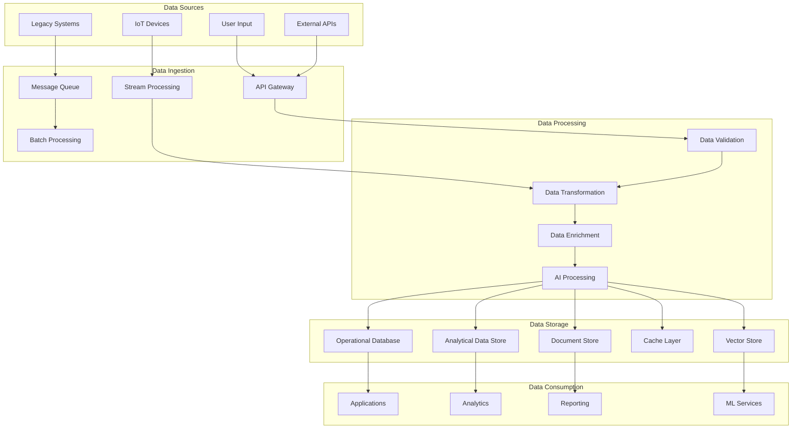

#### 4.1.2 Real-Time Data Processing

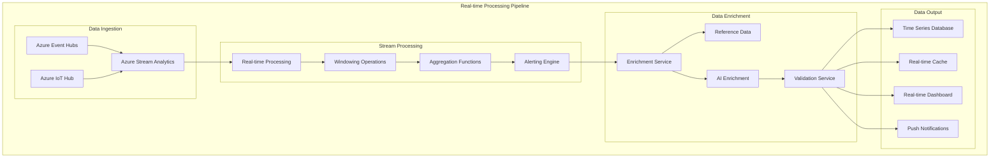

### 4.2 Database Architecture

#### 4.2.1 Database Design Principles

**Polyglot Persistence Approach:**
- **Azure SQL Database**: Relational data with ACID transactions
- **Azure Cosmos DB**: Document data with global distribution
- **Azure Blob Storage**: Unstructured data with lifecycle management
- **Redis Cache**: High-speed caching and session storage
- **Azure Cognitive Search**: Full-text search and AI-powered insights

#### 4.2.2 Database Schema Architecture

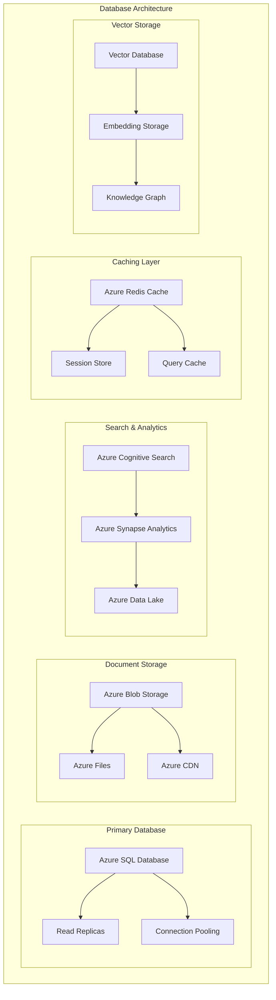

---

## 5. Security Architecture

### 5.1 Security Design Principles

#### 5.1.1 Defense in Depth Strategy

```mermaid
graph TB
    subgraph "Security Layers"
        subgraph "Network Security"
            FIREWALL[Azure Firewall]
            WAF[Web Application Firewall]
            DDOS[DDoS Protection]
            VNET[Virtual Network]
        end
        
        subgraph "Identity & Access"
            AZURE_AD[Azure AD B2C]
            MFA[Multi-factor Authentication]
            RBAC[Role-based Access Control]
            PIM[Privileged Identity Management]
        end
        
        subgraph "Data Protection"
            ENCRYPTION[Encryption Services]
            KEY_MANAGEMENT[Key Management]
            DATA_MASKING[Data Masking]
            DLP[Data Loss Prevention]
        end
        
        subgraph "Application Security"
            SECURE_CODING[Secure Coding Practices]
            VULNERABILITY_SCANNING[Vulnerability Scanning]
            PENETRATION_TESTING[Penetration Testing]
            SECURITY_MONITORING[Security Monitoring]
        end
        
        subgraph "Compliance & Governance"
            COMPLIANCE_FRAMEWORK[Compliance Framework]
            AUDIT_LOGGING[Audit Logging]
            POLICY_ENFORCEMENT[Policy Enforcement]
            RISK_MANAGEMENT[Risk Management]
        end
    end
    
    FIREWALL --> WAF
    WAF --> DDOS
    DDOS --> VNET
    
    AZURE_AD --> MFA
    MFA --> RBAC
    RBAC --> PIM
    
    ENCRYPTION --> KEY_MANAGEMENT
    KEY_MANAGEMENT --> DATA_MASKING
    DATA_MASKING --> DLP
    
    SECURE_CODING --> VULNERABILITY_SCANNING
    VULNERABILITY_SCANNING --> PENETRATION_TESTING
    PENETRATION_TESTING --> SECURITY_MONITORING
    
    COMPLIANCE_FRAMEWORK --> AUDIT_LOGGING
    AUDIT_LOGGING --> POLICY_ENFORCEMENT
    POLICY_ENFORCEMENT --> RISK_MANAGEMENT
```

#### 5.1.2 Identity & Access Management

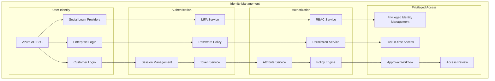

---

## 6. Deployment Architecture

### 6.1 Azure Infrastructure Design

#### 6.1.1 Infrastructure Components

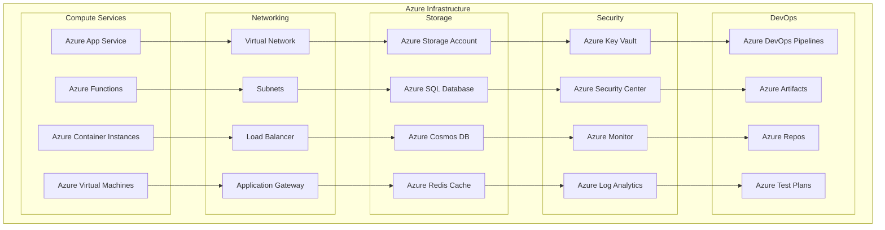

#### 6.1.2 Environment Architecture

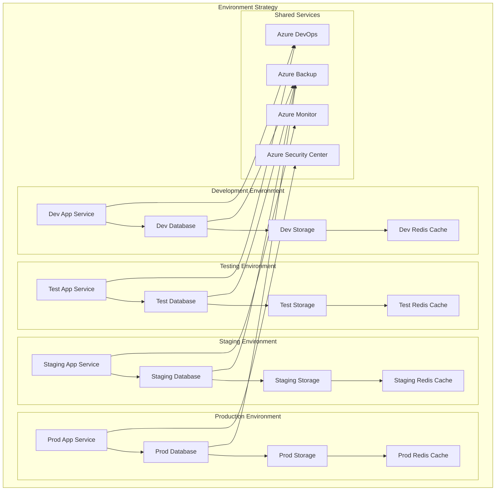

### 6.2 Deployment Pipeline Architecture

#### 6.2.1 CI/CD Pipeline

```mermaid
graph TB
    subgraph "CI/CD Pipeline"
        subgraph "Source Control"
            GIT_REPO[Git Repository]
            BRANCHES[Feature Branches]
            PULL_REQUESTS[Pull Requests]
            MERGE[Merge to Main]
        end
        
        subgraph "Build Pipeline"
            BUILD_TRIGGER[Build Trigger]
            CODE_BUILD[Code Build]
            UNIT_TESTS[Unit Tests]
            CODE_ANALYSIS[Code Analysis]
            SECURITY_SCAN[Security Scan]
            ARTIFACT_BUILD[Artifact Build]
        end
        
        subgraph "Release Pipeline"
            RELEASE_TRIGGER[Release Trigger]
            DEPLOY_DEV[Deploy to Dev]
            INTEGRATION_TESTS[Integration Tests]
            DEPLOY_TEST[Deploy to Test]
            UI_TESTS[UI Tests]
            DEPLOY_STAGING[Deploy to Staging]
            PERFORMANCE_TESTS[Performance Tests]
            DEPLOY_PROD[Deploy to Prod]
        end
        
        subgraph "Monitoring & Feedback"
            BUILD_MONITORING[Build Monitoring]
            DEPLOYMENT_MONITORING[Deployment Monitoring]
            PERFORMANCE_MONITORING[Performance Monitoring]
            ALERTING[Alerting]
        end
    end
    
    GIT_REPO --> BRANCHES
    BRANCHES --> PULL_REQUESTS
    PULL_REQUESTS --> MERGE
    
    MERGE --> BUILD_TRIGGER
    BUILD_TRIGGER --> CODE_BUILD
    CODE_BUILD --> UNIT_TESTS
    UNIT_TESTS --> CODE_ANALYSIS
    CODE_ANALYSIS --> SECURITY_SCAN
    SECURITY_SCAN --> ARTIFACT_BUILD
    
    ARTIFACT_BUILD --> RELEASE_TRIGGER
    RELEASE_TRIGGER --> DEPLOY_DEV
    DEPLOY_DEV --> INTEGRATION_TESTS
    INTEGRATION_TESTS --> DEPLOY_TEST
    DEPLOY_TEST --> UI_TESTS
    UI_TESTS --> DEPLOY_STAGING
    DEPLOY_STAGING --> PERFORMANCE_TESTS
    PERFORMANCE_TESTS --> DEPLOY_PROD
    
    CODE_BUILD --> BUILD_MONITORING
    DEPLOY_PROD --> DEPLOYMENT_MONITORING
    DEPLOY_PROD --> PERFORMANCE_MONITORING
    PERFORMANCE_MONITORING --> ALERTING
```

---

## 7. Integration Architecture

### 7.1 External System Integration

#### 7.1.1 Integration Patterns

```mermaid
graph TB
    subgraph "Integration Architecture"
        subgraph "External Systems"
            EXTERNAL_APIS[External APIs]
            LEGACY_SYSTEMS[Legacy Systems]
            THIRD_PARTY_SERVICES[Third-party Services]
            PARTNER_SYSTEMS[Partner Systems]
        end
        
        subgraph "Integration Layer"
            API_GATEWAY[API Gateway]
            MESSAGE_QUEUE[Message Queue]
            WEBHOOK_SERVICE[Webhook Service]
            DATA_SYNC[Data Synchronization]
        end
        
        subgraph "Integration Patterns"
            REST_API[REST API Integration]
            GRAPHQL[GraphQL Integration]
            EVENT_DRIVEN[Event-driven Integration]
            BATCH_PROCESSING[Batch Processing]
        end
        
        subgraph "Data Transformation"
            MAPPING_SERVICE[Mapping Service]
            VALIDATION_SERVICE[Validation Service]
            TRANSFORMATION_SERVICE[Transformation Service]
            ENRICHMENT_SERVICE[Enrichment Service]
        end
    end
    
    EXTERNAL_APIS --> API_GATEWAY
    LEGACY_SYSTEMS --> MESSAGE_QUEUE
    THIRD_PARTY_SERVICES --> WEBHOOK_SERVICE
    PARTNER_SYSTEMS --> DATA_SYNC
    
    API_GATEWAY --> REST_API
    MESSAGE_QUEUE --> EVENT_DRIVEN
    WEBHOOK_SERVICE --> GRAPHQL
    DATA_SYNC --> BATCH_PROCESSING
    
    REST_API --> MAPPING_SERVICE
    GRAPHQL --> VALIDATION_SERVICE
    EVENT_DRIVEN --> TRANSFORMATION_SERVICE
    BATCH_PROCESSING --> ENRICHMENT_SERVICE
```

#### 7.1.2 Existing Calculator Integration

```mermaid
sequenceDiagram
    participant BusinessOps as Business Ops Platform
    participant Integration as Integration Service
    participant LegacyCalc as Legacy PPA Calculator
    participant Database as Azure SQL Database
    
    BusinessOps->>Integration: Request calculation
    Integration->>LegacyCalc: Forward calculation request
    LegacyCalc->>LegacyCalc: Perform calculation
    LegacyCalc-->>Integration: Return results
    Integration->>Integration: Transform results
    Integration->>Database: Store results
    Integration->>Database: Store calculation metadata
    Integration-->>BusinessOps: Return enhanced results
```

---

## 8. Monitoring & Observability

### 8.1 Monitoring Architecture

#### 8.1.1 Monitoring Components

```mermaid
graph TB
    subgraph "Monitoring Architecture"
        subgraph "Application Monitoring"
            APP_INSIGHTS[Application Insights]
            PERFORMANCE_MONITOR[Performance Monitor]
            ERROR_TRACKING[Error Tracking]
            USER_BEHAVIOR[User Behavior Analytics]
        end
        
        subgraph "Infrastructure Monitoring"
            AZURE_MONITOR[Azure Monitor]
            LOG_ANALYTICS[Log Analytics]
            METRICS[Metrics Collection]
            HEALTH_CHECKS[Health Checks]
        end
        
        subgraph "Security Monitoring"
            SECURITY_CENTER[Azure Security Center]
            THREAT_PROTECTION[Threat Protection]
            VULNERABILITY_ASSESSMENT[Vulnerability Assessment]
            COMPLIANCE_MONITORING[Compliance Monitoring]
        end
        
        subgraph "Business Intelligence"
            POWER_BI[Power BI]
            DASHBOARDS[Dashboards]
            REPORTS[Reports]
            ALERTS[Alerts]
        end
    end
    
    APP_INSIGHTS --> PERFORMANCE_MONITOR
    PERFORMANCE_MONITOR --> ERROR_TRACKING
    ERROR_TRACKING --> USER_BEHAVIOR
    
    AZURE_MONITOR --> LOG_ANALYTICS
    LOG_ANALYTICS --> METRICS
    METRICS --> HEALTH_CHECKS
    
    SECURITY_CENTER --> THREAT_PROTECTION
    THREAT_PROTECTION --> VULNERABILITY_ASSESSMENT
    VULNERABILITY_ASSESSMENT --> COMPLIANCE_MONITORING
    
    POWER_BI --> DASHBOARDS
    DASHBOARDS --> REPORTS
    REPORTS --> ALERTS
```

#### 8.1.2 Observability Strategy

```mermaid
graph TB
    subgraph "Observability Stack"
        subgraph "Logs"
            STRUCTURED_LOGS[Structured Logs]
            LOG_AGGREGATION[Log Aggregation]
            LOG_ANALYSIS[Log Analysis]
            LOG_RETENTION[Log Retention]
        end
        
        subgraph "Metrics"
            CUSTOM_METRICS[Custom Metrics]
            SYSTEM_METRICS[System Metrics]
            BUSINESS_METRICS[Business Metrics]
            METRIC_RETENTION[Metric Retention]
        end
        
        subgraph "Traces"
            DISTRIBUTED_TRACING[Distributed Tracing]
            REQUEST_TRACING[Request Tracing]
            ERROR_TRACING[Error Tracing]
            TRACE_RETENTION[Trace Retention]
        end
        
        subgraph "Alerting"
            ALERT_RULES[Alert Rules]
            NOTIFICATION_CHANNELS[Notification Channels]
            ESCALATION_POLICIES[Escalation Policies]
            INCIDENT_RESPONSE[Incident Response]
        end
    end
    
    STRUCTURED_LOGS --> LOG_AGGREGATION
    LOG_AGGREGATION --> LOG_ANALYSIS
    LOG_ANALYSIS --> LOG_RETENTION
    
    CUSTOM_METRICS --> SYSTEM_METRICS
    SYSTEM_METRICS --> BUSINESS_METRICS
    BUSINESS_METRICS --> METRIC_RETENTION
    
    DISTRIBUTED_TRACING --> REQUEST_TRACING
    REQUEST_TRACING --> ERROR_TRACING
    ERROR_TRACING --> TRACE_RETENTION
    
    LOG_RETENTION --> ALERT_RULES
    METRIC_RETENTION --> NOTIFICATION_CHANNELS
    TRACE_RETENTION --> ESCALATION_POLICIES
    ESCALATION_POLICIES --> INCIDENT_RESPONSE
```

---

## 9. Conclusion

The Saber Business Operations Platform architecture represents a comprehensive, enterprise-grade solution designed to transform Saber Renewable Energy's operational capabilities. The architecture incorporates modern cloud-native patterns, AI/ML integration, and robust security measures to deliver a scalable, maintainable, and future-proof system.

### 9.1 Key Architectural Benefits

**Scalability & Performance:**
- Microservices architecture enabling independent scaling
- Azure-based infrastructure supporting global deployment
- AI-enhanced calculations providing intelligent insights
- Real-time processing capabilities for immediate results

**Security & Compliance:**
- Defense-in-depth security strategy with multiple layers
- Azure AD B2C integration for secure identity management
- Comprehensive audit trails and compliance monitoring
- Data encryption and protection measures

**Integration & Extensibility:**
- Modular design enabling easy addition of new features
- API-first approach supporting external system integration
- Event-driven architecture enabling real-time data flow
- Plugin architecture for AI model integration

**Operational Excellence:**
- Comprehensive monitoring and observability
- Automated deployment and CI/CD pipelines
- Disaster recovery and business continuity measures
- Performance optimization and capacity planning

### 9.2 Implementation Considerations

**Technical Considerations:**
- Azure infrastructure setup and configuration
- AI model deployment and management
- Data migration from Excel-based systems
- Integration with existing PPA calculators

**Organizational Considerations:**
- Team training and skill development
- Change management and user adoption
- Vendor selection and partnership management
- Regulatory compliance and data governance

**Financial Considerations:**
- Azure infrastructure costs and optimization
- AI model licensing and usage costs
- Development resource allocation
- ROI measurement and tracking

### 9.3 Next Steps

1. **Architecture Review**: Conduct thorough architecture review with stakeholders
2. **Infrastructure Planning**: Detailed Azure infrastructure design and costing
3. **AI Model Strategy**: Finalize AI model selection and deployment approach
4. **Development Planning**: Create detailed development timeline and resource allocation
5. **Risk Assessment**: Identify and mitigate potential implementation risks

This architecture provides a solid foundation for the Saber Business Operations Platform, enabling Saber Renewable Energy to streamline operations, enhance partner management, and deliver exceptional value to clients through advanced technology and intelligent automation.

---

**Document Version Control:**
- Version 1.0 - Initial Architecture Design (October 23, 2025)
- Next Review: November 15, 2025
- Approved By: [Pending Leadership Review]
- Status: Detailed Architecture Design