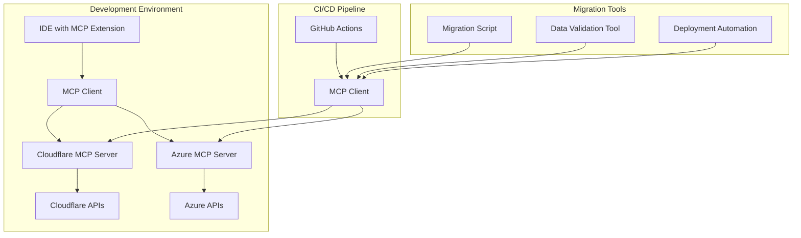
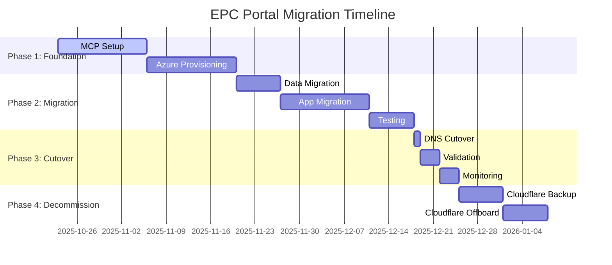

# EPC Partner Portal Migration Plan: Cloudflare to Azure

## Executive Summary

This document outlines the comprehensive migration strategy for moving the Saber EPC Partner Portal from Cloudflare to Azure. This migration is the highest priority project task to establish our Azure foundation and will serve as the blueprint for subsequent platform migrations.

## Project Overview

### Current State
- **Platform**: EPC Partner Portal
- **Current Hosting**: Cloudflare (Pages + Workers)
- **Domain**: `epc.saberrenewable.energy`
- **Frontend**: Next.js 15.4.4 with App Router and Edge Runtime
- **Backend**: Cloudflare Workers with D1 (SQLite) database
- **File Storage**: Cloudflare R2
- **Integration**: Microsoft SharePoint via Power Automate
- **Status**: NOT PRODUCTION READY (critical issues exist)

### Target State
- **Platform**: EPC Partner Portal (Azure-hosted)
- **Target Hosting**: Azure App Service + Azure Functions + Azure SQL
- **Domain**: `epc.saberrenewable.energy` (unchanged)
- **Frontend**: Next.js with Tailwind CSS (unchanged)
- **Backend**: Azure Functions with .NET runtime
- **Database**: Azure SQL Database
- **File Storage**: Azure Blob Storage
- **Integration**: Microsoft SharePoint via Power Automate (enhanced)
- **Status**: PRODUCTION READY with monitoring and reliability

---

## 1. Model Context Protocol (MCP) Setup

### 1.1 MCP Architecture

#### Cloudflare Environment MCP
```yaml
Cloudflare MCP Configuration:
  Server:
    Name: cf-epc-portal-mcp
    Host: localhost:8001
    Description: MCP server for Cloudflare EPC Portal access
  
  Tools:
    - Name: cf-epc-database-query
      Description: Query Cloudflare D1 database for EPC portal data
      Parameters:
        - query: SQL query string
        - database: epc-form-data
    
    - Name: cf-epc-worker-deploy
      Description: Deploy Cloudflare Worker for EPC portal
      Parameters:
        - environment: development|staging|production
        - worker-path: Path to worker source
    
    - Name: cf-epc-r2-access
      Description: Access Cloudflare R2 storage for EPC files
      Parameters:
        - operation: list|upload|download|delete
        - bucket: epc-partner-files
        - key: File key
        - file-path: Local file path (for upload)
```

#### Azure Environment MCP
```yaml
Azure MCP Configuration:
  Server:
    Name: azure-epc-portal-mcp
    Host: localhost:8002
    Description: MCP server for Azure EPC Portal access
  
  Tools:
    - Name: azure-epc-sql-query
      Description: Query Azure SQL database for EPC portal data
      Parameters:
        - query: SQL query string
        - database: saber-epc-sql-prod
    
    - Name: azure-epc-function-deploy
      Description: Deploy Azure Function for EPC portal
      Parameters:
        - environment: development|staging|production
        - function-path: Path to function source
    
    - Name: azure-epc-blob-access
      Description: Access Azure Blob storage for EPC files
      Parameters:
        - operation: list|upload|download|delete
        - container: epc-partner-files
        - blob: Blob name
        - file-path: Local file path (for upload)
    
    - Name: azure-epc-app-service-deploy
      Description: Deploy Azure App Service for EPC portal frontend
      Parameters:
        - environment: development|staging|production
        - app-path: Path to Next.js app
```

### 1.2 MCP Implementation Plan

#### Phase 1: MCP Server Development (Week 1)
```yaml
Tasks:
  - Set up MCP server development environment
  - Implement Cloudflare MCP server tools
  - Implement Azure MCP server tools
  - Create MCP tool testing framework
  - Document MCP tool APIs

Responsible:
  - Lead: Full-Stack Developer
  - Support: Cloud Engineer, Azure Architect

Timeline: 5 business days
```

#### Phase 2: MCP Integration Testing (Week 2)
```yaml
Tasks:
  - Test MCP server connectivity to Cloudflare
  - Test MCP server connectivity to Azure
  - Implement MCP error handling
  - Create MCP monitoring dashboard
  - Document MCP troubleshooting procedures

Responsible:
  - Lead: DevOps Engineer
  - Support: Full-Stack Developer

Timeline: 5 business days
```

---

## 2. MCP Tool Backbone Architecture

### 2.1 Architecture Overview



### 2.2 MCP Tool Specifications

#### Data Migration Tools
```yaml
cf-to-azure-data-migration:
  Description: Migrate data from Cloudflare D1 to Azure SQL
  Process:
    1. Extract data from Cloudflare D1 via MCP
    2. Transform data to Azure SQL schema
    3. Load data into Azure SQL via MCP
    4. Validate data integrity
    5. Generate migration report

cf-to-azure-file-migration:
  Description: Migrate files from Cloudflare R2 to Azure Blob
  Process:
    1. List files in Cloudflare R2 via MCP
    2. Download files from Cloudflare R2
    3. Upload files to Azure Blob via MCP
    4. Validate file integrity
    5. Generate migration report
```

#### Deployment Tools
```yaml
azure-deployment-automation:
  Description: Deploy EPC portal to Azure via MCP
  Process:
    1. Build Next.js application
    2. Deploy to Azure App Service via MCP
    3. Deploy Azure Functions via MCP
    4. Configure Azure resources via MCP
    5. Run deployment validation via MCP

rollback-automation:
  Description: Rollback Azure deployment via MCP
  Process:
    1. Identify last successful deployment
    2. Rollback App Service via MCP
    3. Rollback Functions via MCP
    4. Restore database via MCP
    5. Validate rollback integrity
```

### 2.3 MCP Implementation Timeline

```yaml
MCP Backbone Development:
  Week 1: MCP server development
  Week 2: MCP tool implementation
  Week 3: MCP testing and validation
  Week 4: MCP documentation and training
```

---

## 3. Complete Migration Roadmap

### 3.1 Migration Phases Overview



### 3.2 Phase 1: Foundation (Weeks 1-4)

#### Week 1-2: MCP Setup and Azure Provisioning
```yaml
Tasks:
  - Implement MCP servers for Cloudflare and Azure
  - Provision Azure resource groups
  - Set up Azure networking infrastructure
  - Create Azure SQL database
  - Configure Azure Blob storage
  - Set up Azure Functions
  - Configure Azure App Service

Deliverables:
  - Operational MCP servers
  - Provisioned Azure infrastructure
  - Connectivity validation report

Responsible:
  - Cloud Architecture Lead
  - DevOps Engineer
  - Full-Stack Developer

Timeline: 10 business days
```

#### Week 3-4: Schema Design and Migration Tools
```yaml
Tasks:
  - Design Azure SQL database schema
  - Create data transformation scripts
  - Implement file migration tools
  - Set up monitoring and logging
  - Create backup and recovery procedures

Deliverables:
  - Database schema documentation
  - Migration tools
  - Monitoring framework
  - Backup procedures

Responsible:
  - Database Architect
  - Full-Stack Developer
  - DevOps Engineer

Timeline: 10 business days
```

### 3.3 Phase 2: Migration (Weeks 5-7)

#### Week 5: Data Migration
```yaml
Tasks:
  - Extract data from Cloudflare D1
  - Transform data to Azure SQL schema
  - Load data into Azure SQL
  - Validate data integrity
  - Migrate files from R2 to Azure Blob

Deliverables:
  - Migrated database
  - Migrated files
  - Migration validation report

Responsible:
  - Database Specialist
  - Full-Stack Developer
  - QA Engineer

Timeline: 5 business days
```

#### Week 6-7: Application Migration
```yaml
Tasks:
  - Refactor Cloudflare Workers to Azure Functions
  - Adapt Next.js app for Azure deployment
  - Integrate with Azure services
  - Implement authentication and authorization
  - Configure custom domains and SSL

Deliverables:
  - Migrated backend (Azure Functions)
  - Migrated frontend (Next.js on Azure)
  - Configured authentication
  - Custom domain setup

Responsible:
  - Full-Stack Developer
  - Cloud Engineer
  - Security Specialist

Timeline: 10 business days
```

### 3.4 Phase 3: Cutover (Week 8)

#### DNS Cutover and Validation
```yaml
Tasks:
  - Update DNS to point to Azure
  - Monitor for DNS propagation
  - Validate all functionality
  - Perform load testing
  - Monitor performance and errors
  - Address any issues immediately

Deliverables:
  - DNS pointing to Azure
  - Validation reports
  - Performance metrics
  - Issue resolution documentation

Responsible:
  - DevOps Engineer
  - Full-Stack Developer
  - QA Engineer
  - Network Engineer

Timeline: 5 business days
```

### 3.5 Phase 4: Decommission (Weeks 9-10)

#### Cloudflare Backup and Offboarding
```yaml
Tasks:
  - Maintain Cloudflare backup for 1 week
  - Export all Cloudflare configuration
  - Cancel Cloudflare services
  - Final project documentation
  - Lessons learned session

Deliverables:
  - Backup confirmation
  - Exported configurations
  - Service cancellation confirmation
  - Final documentation

Responsible:
  - DevOps Engineer
  - Project Manager
  - Full-Stack Developer

Timeline: 10 business days
```

---

## 4. Infrastructure Provisioning Requirements

### 4.1 Azure Resource Groups

```yaml
Resource Groups:
  - saber-epc-prod-rg-webapp:
      Purpose: Frontend application
      Location: UK South
      Resources:
        - Azure App Service Plan
        - Azure App Service
        - Application Gateway
        - SSL Certificate
  
  - saber-epc-prod-rg-functions:
      Purpose: Backend API
      Location: UK South
      Resources:
        - Azure Functions
        - Storage Account (for triggers)
        - Service Bus
  
  - saber-epc-prod-rg-database:
      Purpose: Data storage
      Location: UK South
      Resources:
        - Azure SQL Server
        - Azure SQL Database
        - Azure Cache for Redis
  
  - saber-epc-prod-rg-storage:
      Purpose: File storage
      Location: UK South
      Resources:
        - Azure Storage Account
        - Blob Containers
        - File Shares
  
  - saber-epc-prod-rg-networking:
      Purpose: Network infrastructure
      Location: UK South
      Resources:
        - Virtual Network
        - Subnets
        - Network Security Groups
        - Private Endpoints
  
  - saber-epc-prod-rg-monitoring:
      Purpose: Monitoring and logging
      Location: UK South
      Resources:
        - Log Analytics Workspace
        - Application Insights
        - Azure Monitor
```

### 4.2 Azure Services Configuration

#### Azure App Service
```yaml
App Service Configuration:
  Name: saber-epc-portal-prod
  Plan: Premium P3v2
  Runtime: NODE:18-lts
  Auto-scale: Enabled (1-10 instances)
  Deployment slots: Staging, Production
  Custom domains: epc.saberrenewable.energy
  SSL: Azure-managed certificate
  Backup: Enabled (daily, 30-day retention)
```

#### Azure Functions
```yaml
Functions Configuration:
  Name: saber-epc-api-prod
  Plan: Premium EP3
  Runtime: .NET 8
  Functions:
    - validate-invitation
    - sync-invitation
    - submit-application
    - upload-file
    - migrate-files
  Storage: Azure Storage Account
  Trigger: HTTP
  Authentication: Azure AD
```

#### Azure SQL Database
```yaml
SQL Database Configuration:
  Server: saber-epc-sql-prod
  Database: saber-epc-db-prod
  Compute: General Purpose, 8 vCores
  Storage: 1TB
  Auto-scaling: Enabled
  Backup: 35-day retention
  Geo-replication: UK South (primary), UK West (secondary)
```

#### Azure Storage
```yaml
Storage Configuration:
  Account: saber-epc-storage-prod
  Kind: StorageV2
  Replication: Read-access geo-redundant storage (RA-GRS)
  Containers:
    - epc-partner-files (private)
    - epc-app-backups (private)
    - epc-temp-uploads (private)
```

### 4.3 Networking Configuration

```yaml
Virtual Network:
  Name: saber-epc-vnet
  Address Space: 10.5.0.0/16
  Subnets:
    - WebApp: 10.5.1.0/24
    - Functions: 10.5.2.0/24
    - Database: 10.5.3.0/24
    - Storage: 10.5.4.0/24
  
Network Security Groups:
  - WebApp NSG: Allow HTTPS (443), HTTP (80)
  - Functions NSG: Allow HTTPS (443)
  - Database NSG: Allow SQL (1433) from Functions subnet
  - Storage NSG: Allow HTTPS (443) from Functions and WebApp subnets
```

---

## 5. Data Migration Procedures

### 5.1 Database Migration Strategy

#### Schema Mapping
```sql
-- Cloudflare D1 Schema (SQLite)
invitations:
  - id: INTEGER PRIMARY KEY AUTOINCREMENT
  - auth_code: TEXT UNIQUE NOT NULL
  - title: TEXT
  - company_name: TEXT NOT NULL
  - contact_email: TEXT NOT NULL
  - notes: TEXT
  - status: TEXT DEFAULT 'active'
  - created_at: TEXT NOT NULL
  - updated_at: TEXT NOT NULL

-- Azure SQL Schema (T-SQL)
CREATE TABLE invitations (
  id INT IDENTITY(1,1) PRIMARY KEY,
  auth_code NVARCHAR(10) UNIQUE NOT NULL,
  title NVARCHAR(50) NULL,
  company_name NVARCHAR(255) NOT NULL,
  contact_email NVARCHAR(255) NOT NULL,
  notes NVARCHAR(MAX) NULL,
  status NVARCHAR(50) DEFAULT 'active',
  created_at DATETIME2 NOT NULL DEFAULT GETUTCDATE(),
  updated_at DATETIME2 NOT NULL DEFAULT GETUTCDATE()
);

CREATE INDEX idx_invitations_auth_code ON invitations(auth_code);
CREATE INDEX idx_invitations_status ON invitations(status);
```

#### Migration Process
```yaml
Steps:
  1. Extract Data:
     - Connect to Cloudflare D1 via MCP
     - Export all tables to JSON files
     - Validate data completeness
  
  2. Transform Data:
     - Convert JSON to SQL scripts
     - Adapt data types to Azure SQL
     - Generate migration scripts
  
  3. Load Data:
     - Connect to Azure SQL via MCP
     - Execute migration scripts
     - Verify data integrity
  
  4. Validate:
     - Compare record counts between systems
     - Validate data relationships
     - Test application functionality

Tools:
  - MCP cf-epc-database-query tool
  - MCP azure-epc-sql-query tool
  - Custom transformation scripts
  - Data validation scripts
```

### 5.2 File Migration Strategy

#### File Mapping
```yaml
Cloudflare R2 Structure:
  Bucket: epc-partner-files
  Structure: draft/EPC-Applications/<CODE>/<type>/<date>_<field>_<name>

Azure Blob Structure:
  Account: saber-epc-storage-prod
  Container: epc-partner-files
  Structure: epc-applications/<CODE>/<type>/<date>_<field>_<name>
```

#### Migration Process
```yaml
Steps:
  1. Inventory Files:
     - List all files in R2 via MCP
     - Generate file inventory report
     - Identify any large files or special cases
  
  2. Migrate Files:
     - Download files from R2 via MCP
     - Upload files to Azure Blob via MCP
     - Maintain file metadata
     - Track migration progress
  
  3. Validate:
     - Compare file counts
     - Verify file integrity (checksums)
     - Test file access through application
  
  4. Update References:
     - Update file paths in database
     - Test file access in application
     - Validate all file operations

Tools:
  - MCP cf-epc-r2-access tool
  - MCP azure-epc-blob-access tool
  - Custom migration scripts
  - File integrity validation tools
```

---

## 6. Testing and Validation Approach

### 6.1 Testing Strategy

#### Unit Testing
```yaml
Components:
  - Azure Functions
  - Database operations
  - File operations
  - API endpoints

Tools:
  - xUnit (.NET)
  - Jest (Node.js)
  - Azure Functions Test Framework

Coverage Target: >80%
```

#### Integration Testing
```yaml
Test Scenarios:
  - API endpoint integration
  - Database connectivity
  - File upload/download
  - SharePoint integration
  - Authentication flow

Tools:
  - Postman/Newman
  - Azure DevOps Test Plans
  - Custom test scripts
```

#### End-to-End Testing
```yaml
Test Scenarios:
  - Complete user registration flow
  - Application submission process
  - File upload process
  - Admin review process
  - Power Automate integration

Tools:
  - Playwright
  - Selenium
  - Azure Application Insights
```

#### Performance Testing
```yaml
Test Scenarios:
  - Load testing (simulated user load)
  - Stress testing (maximum capacity)
  - Soak testing (sustained load)
  - Spike testing (sudden load increase)

Tools:
  - Azure Load Testing
  - JMeter
  - Application Insights
```

### 6.2 Validation Criteria

#### Functional Validation
```yaml
Criteria:
  - All existing functionality works
  - No data loss during migration
  - No performance degradation
  - All integrations function correctly
  - User interface renders correctly

Success Metrics:
  - 100% feature parity
  - 0% data loss
  - <10% performance variance
  - 100% integration success
  - 100% UI compatibility
```

#### Performance Validation
```yaml
Criteria:
  - Page load time < 3 seconds
  - API response time < 500ms
  - File upload time < 30 seconds
  - Concurrent user support > 100
  - System uptime > 99.9%

Success Metrics:
  - Average page load: <2 seconds
  - 95th percentile API response: <400ms
  - File upload success rate: >99%
  - Peak concurrent users: 150
  - Monthly uptime: >99.95%
```

#### Security Validation
```yaml
Criteria:
  - All data encrypted at rest and in transit
  - Authentication and authorization working
  - No security vulnerabilities
  - Audit logging functional
  - Compliance with GDPR and other regulations

Success Metrics:
  - 100% data encryption
  - 100% authentication success
  - 0 critical vulnerabilities
  - 100% audit trail coverage
  - 100% compliance validation
```

---

## 7. Timeline with Critical Milestones

### 7.1 Overall Timeline

```yaml
Total Duration: 10 weeks
Start Date: Week 1 (October 23, 2025)
End Date: Week 10 (December 29, 2025)
```

### 7.2 Critical Milestones

#### Milestone 1: MCP Implementation Complete
```yaml
Date: End of Week 2
Deliverables:
  - Operational MCP servers
  - MCP tools implemented
  - MCP testing complete

Success Criteria:
  - MCP servers running without errors
  - All MCP tools functional
  - MCP documentation complete
```

#### Milestone 2: Azure Infrastructure Provisioned
```yaml
Date: End of Week 4
Deliverables:
  - All Azure resources provisioned
  - Network connectivity established
  - Monitoring configured

Success Criteria:
  - All Azure resources operational
  - Network connectivity validated
  - Monitoring dashboard functional
```

#### Milestone 3: Data Migration Complete
```yaml
Date: End of Week 5
Deliverables:
  - Database migrated to Azure SQL
  - Files migrated to Azure Blob
  - Migration validation report

Success Criteria:
  - 100% data migrated
  - 0% data corruption
  - Migration validation passed
```

#### Milestone 4: Application Migration Complete
```yaml
Date: End of Week 7
Deliverables:
  - Backend migrated to Azure Functions
  - Frontend migrated to Azure App Service
  - Integration with Azure services

Success Criteria:
  - 100% feature parity
  - All integrations working
  - Performance benchmarks met
```

#### Milestone 5: Production Cutover Complete
```yaml
Date: End of Week 8
Deliverables:
  - DNS pointing to Azure
  - Application running in production
  - Validation reports

Success Criteria:
  - DNS propagation complete
  - Application fully functional
  - Validation criteria met
```

#### Milestone 6: Project Complete
```yaml
Date: End of Week 10
Deliverables:
  - Cloudflare decommissioned
  - Final documentation
  - Lessons learned report

Success Criteria:
  - Cloudflare services cancelled
  - Documentation complete
  - Project closure approved
```

### 7.3 Risk-Based Timeline Adjustments

```yaml
Potential Delays:
  - MCP Implementation: +1 week
  - Data Migration: +1 week
  - Application Migration: +1 week
  - DNS Cutover: +1 day

Mitigation:
  - Parallel tasks where possible
  - Weekend work if needed
  - Resource reallocation
  - Scope reduction if necessary
```

---

## 8. Resource Allocation

### 8.1 Team Structure

#### Core Team
```yaml
Project Manager:
  Role: Overall project coordination
  Allocation: 100%
  Duration: 10 weeks

Cloud Architecture Lead:
  Role: Azure architecture and infrastructure
  Allocation: 100%
  Duration: 10 weeks

Full-Stack Developer:
  Role: Application migration and development
  Allocation: 100%
  Duration: 10 weeks

DevOps Engineer:
  Role: CI/CD, deployment, and monitoring
  Allocation: 100%
  Duration: 10 weeks

Database Specialist:
  Role: Database migration and optimization
  Allocation: 75%
  Duration: Weeks 3-6

QA Engineer:
  Role: Testing and validation
  Allocation: 75%
  Duration: Weeks 5-8

Network Engineer:
  Role: DNS and network configuration
  Allocation: 25%
  Duration: Weeks 1-2, 7-8

Security Specialist:
  Role: Security configuration and validation
  Allocation: 25%
  Duration: Weeks 2-3, 7-8
```

#### Extended Team
```yaml
SharePoint Specialist:
  Role: SharePoint integration and Power Automate
  Allocation: 25%
  Duration: Weeks 4-8

Technical Writer:
  Role: Documentation creation
  Allocation: 25%
  Duration: Weeks 1-10

Business Analyst:
  Role: Requirements validation and user acceptance
  Allocation: 25%
  Duration: Weeks 5-8
```

### 8.2 Resource Requirements

#### Tools and Services
```yaml
Development Tools:
  - Azure DevOps (project management)
  - Visual Studio Code (IDE)
  - Azure CLI (infrastructure management)
  - MCP Client (development integration)

Cloud Services:
  - Azure Subscription (sufficient credits)
  - Cloudflare Account (until decommission)
  - Third-party monitoring tools

Software Licenses:
  - Microsoft 365 (for testing)
  - Database tools (SQL Server Management Studio)
  - Performance testing tools
```

#### Budget Allocation
```yaml
Personnel Costs: 60%
  - Core team salaries
  - Extended team salaries

Cloud Services: 25%
  - Azure services
  - Cloudflare services (temporary)
  - Third-party tools

Tools and Licenses: 10%
  - Development tools
  - Monitoring tools
  - Testing tools

Contingency: 5%
  - Unplanned expenses
  - Scope changes
  - Timeline extensions
```

---

## 9. Risk Mitigation Strategies

### 9.1 Risk Assessment

#### Technical Risks
```yaml
Risk: Data loss during migration
Probability: Medium
Impact: High
Mitigation:
  - Comprehensive backup strategy
  - Data validation procedures
  - Rollback capabilities
  - Incremental migration approach

Risk: Application downtime during cutover
Probability: Medium
Impact: High
Mitigation:
  - Blue-green deployment strategy
  - DNS TTL optimization
  - Off-hours cutover
  - Rapid rollback procedures

Risk: Performance degradation in Azure
Probability: Medium
Impact: Medium
Mitigation:
  - Performance testing before cutover
  - Right-sized Azure resources
  - Monitoring and alerting
  - Performance optimization

Risk: Integration issues with SharePoint
Probability: Medium
Impact: Medium
Mitigation:
  - Thorough integration testing
  - SharePoint specialist involvement
  - Fallback integration methods
  - Comprehensive error handling
```

#### Project Risks
```yaml
Risk: Timeline delays
Probability: High
Impact: Medium
Mitigation:
  - Buffer time in schedule
  - Parallel task execution
  - Resource flexibility
  - Scope prioritization

Risk: Budget overruns
Probability: Medium
Impact: Medium
Mitigation:
  - Detailed cost tracking
  - Regular budget reviews
  - Contingency fund
  - Scope control measures

Risk: Resource constraints
Probability: Medium
Impact: Medium
Mitigation:
  - Cross-training team members
  - External resource options
  - Resource allocation flexibility
  - Priority-based task assignment

Risk: Stakeholder resistance
Probability: Low
Impact: Medium
Mitigation:
  - Regular stakeholder communication
  - Demonstration of benefits
  - User involvement in testing
  - Change management support
```

### 9.2 Mitigation Implementation

#### Pre-Migration Mitigation
```yaml
Comprehensive Backup Strategy:
  - Full Cloudflare D1 database backups
  - Complete R2 file system backups
  - Application code backups
  - Configuration backups

Detailed Migration Plan:
  - Step-by-step procedures
  - Rollback procedures
  - Validation criteria
  - Success metrics

Resource Preparation:
  - Team training on Azure
  - Tool setup and configuration
  - Access rights and permissions
  - Communication channels
```

#### During Migration Mitigation
```yaml
Incremental Migration:
  - Phased approach to migration
  - Validation after each phase
  - Rollback capability after each phase
  - Issue resolution before proceeding

Real-time Monitoring:
  - Comprehensive monitoring setup
  - Alert configuration
  - Dashboard access
  - Escalation procedures

Communication Plan:
  - Regular status updates
  - Issue escalation process
  - Stakeholder notifications
  - Support availability
```

#### Post-Migration Mitigation
```yaml
Parallel Running:
  - Keep Cloudflare active for 1 week
  - Gradual traffic shift
  - Continuous comparison
  - Final cutover after validation

Performance Optimization:
  - Monitor performance metrics
  - Identify bottlenecks
  - Implement optimizations
  - Baseline establishment

Documentation:
  - Complete technical documentation
  - Operational procedures
  - Troubleshooting guides
  - Knowledge transfer
```

---

## 10. Success Metrics

### 10.1 Technical Metrics

#### Performance Metrics
```yaml
Response Time:
  - Target: <500ms for API endpoints
  - Measurement: 95th percentile
  - Tool: Application Insights

Throughput:
  - Target: >100 requests/second
  - Measurement: Peak load
  - Tool: Azure Load Testing

Availability:
  - Target: >99.9% uptime
  - Measurement: Monthly
  - Tool: Azure Monitor

Error Rate:
  - Target: <0.1% of requests
  - Measurement: Daily
  - Tool: Azure Monitor
```

#### Migration Metrics
```yaml
Data Integrity:
  - Target: 100% data completeness
  - Measurement: Record count comparison
  - Tool: Custom validation scripts

Migration Speed:
  - Target: Complete within 5 days
  - Measurement: Start to finish
  - Tool: Project tracking

Downtime:
  - Target: <1 hour total
  - Measurement: Cutover period
  - Tool: Application Insights
```

### 10.2 Business Metrics

#### User Experience
```yaml
User Satisfaction:
  - Target: >4.5/5 rating
  - Measurement: User surveys
  - Tool: Microsoft Forms

Task Completion:
  - Target: >95% completion rate
  - Measurement: Form submissions
  - Tool: Azure Application Insights

Support Tickets:
  - Target: <5 tickets/week
  - Measurement: Support system
  - Tool: Support ticket system
```

#### Financial Metrics
```yaml
Cost Reduction:
  - Target: 20% reduction vs current
  - Measurement: Monthly spend
  - Tool: Azure Cost Management

ROI:
  - Target: Positive ROI within 6 months
  - Measurement: Cost vs benefits
  - Tool: Financial analysis
```

### 10.3 Operational Metrics

#### Development Metrics
```yaml
Deployment Frequency:
  - Target: >1 deployment/week
  - Measurement: Deployment count
  - Tool: Azure DevOps

Lead Time:
  - Target: <1 day from commit to deploy
  - Measurement: Time tracking
  - Tool: Azure DevOps

Change Failure Rate:
  - Target: <5% of deployments
  - Measurement: Deployment failures
  - Tool: Azure DevOps
```

#### Security Metrics
```yaml
Security Incidents:
  - Target: 0 critical incidents
  - Measurement: Incident count
  - Tool: Azure Security Center

Vulnerability Remediation:
  - Target: <30 days to remediate
  - Measurement: Time to fix
  - Tool: Azure Security Center
```

---

## 11. Conclusion

### 11.1 Migration Summary

This comprehensive migration plan provides a structured approach to moving the EPC Partner Portal from Cloudflare to Azure, establishing our Azure foundation for future platform migrations. The plan addresses all technical, operational, and business aspects of the migration, ensuring a smooth transition with minimal risk and disruption.

### 11.2 Key Success Factors

1. **MCP Implementation**: The Model Context Protocol provides a unified interface for both Cloudflare and Azure environments, enabling seamless development and migration.

2. **Phased Approach**: The migration is divided into clear phases with specific deliverables and success criteria, reducing risk and ensuring quality.

3. **Comprehensive Testing**: Extensive testing and validation procedures ensure that the migrated system meets or exceeds current functionality and performance.

4. **Risk Mitigation**: Proactive risk identification and mitigation strategies minimize the potential for issues and ensure rapid resolution if problems occur.

5. **Resource Allocation**: Appropriate team structure and resource allocation ensure that the project has the necessary expertise and capacity for successful execution.

### 11.3 Next Steps

1. **Project Kickoff**: Assemble the project team and conduct a kickoff meeting to review the migration plan and assign responsibilities.

2. **MCP Implementation**: Begin implementing the MCP servers and tools for unified access to Cloudflare and Azure environments.

3. **Azure Provisioning**: Start provisioning the Azure infrastructure according to the specifications in this plan.

4. **Regular Reviews**: Conduct weekly project reviews to track progress, identify issues, and adjust plans as necessary.

5. **Stakeholder Communication**: Maintain regular communication with stakeholders to ensure alignment and manage expectations.

---

**Document Version Control:**
- Version 1.0 - Initial Migration Plan (October 23, 2025)
- Next Review: October 30, 2025
- Approved By: [Pending Leadership Review]
- Status: Migration Plan Design