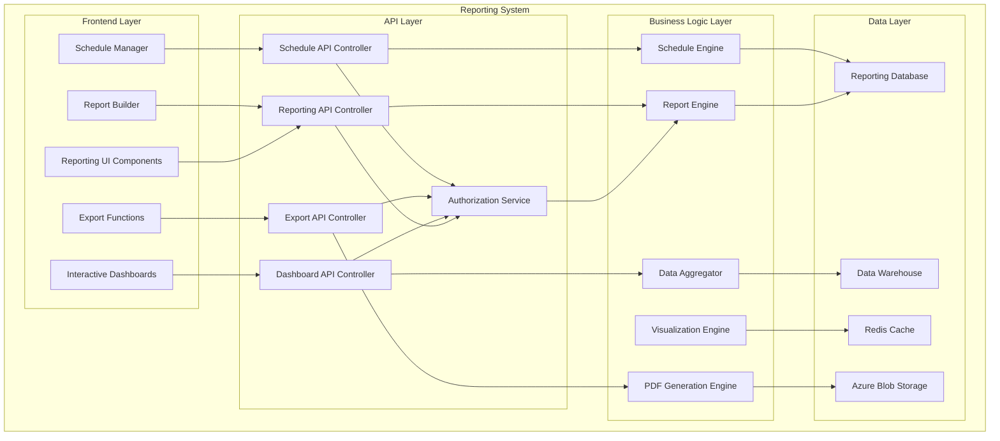

# Saber Business Operations Platform
## Reporting System Architecture with PDF Export Capabilities

**Version:** 1.0  
**Date:** October 23, 2025  
**Author:** Kilo Code (Architect Mode)  
**Status**: Reporting System Architecture Design  

---

## Executive Summary

This document defines the comprehensive reporting system architecture for Saber Business Operations Platform, featuring advanced reporting capabilities with professional PDF export functionality. The system provides real-time, interactive, and customizable reporting across all business modules with intelligent data visualization and automated distribution.

### Key Design Principles
- **Data-Driven Reporting**: Real-time data from all platform modules
- **Interactive Visualization**: Dynamic charts and interactive dashboards
- **Professional Export**: High-quality PDF exports with custom branding
- **Automated Distribution**: Scheduled reports with intelligent routing
- **Performance Optimized**: Sub-10-second report generation for complex reports

---

## 1. Reporting System Overview

### 1.1 System Objectives & Scope

#### Primary Objectives
```yaml
Reporting Objectives:
  Business Intelligence:
    - Executive dashboards
    - KPI tracking and monitoring
    - Trend analysis and forecasting
    - Performance benchmarking
    - Market intelligence
  
  Financial Reporting:
    - Revenue and cost analysis
    - Profitability reporting
    - Cash flow analysis
    - Budget vs. actual reporting
    - ROI and IRR analysis
  
  Operational Reporting:
    - Project progress reporting
    - Partner performance reporting
    - Resource utilization reporting
    - Efficiency metrics
    - Quality and compliance reporting
  
  Regulatory Reporting:
    - FIT compliance reporting
    - Environmental impact reporting
    - Safety and compliance reporting
    - Audit trail reporting
    - Data protection reporting
```

#### Report Categories
```yaml
Report Categories:
  Executive Reports:
    - Executive Summary
    - Business Overview
    - Strategic Dashboard
    - Market Position
    - Competitive Analysis
  
  Financial Reports:
    - Profit and Loss Statement
    - Cash Flow Statement
    - Balance Sheet
    - Budget Analysis
    - ROI Analysis
    - Cost Analysis
  
  Operational Reports:
    - Project Status Report
    - Resource Utilization Report
    - Partner Performance Report
    - Efficiency Metrics Report
    - Quality Metrics Report
  
  Technical Reports:
    - System Performance Report
    - FIT Intelligence Report
    - Calculator Analysis Report
    - Technology Performance Report
    - Maintenance Report
  
  Compliance Reports:
    - GDPR Compliance Report
    - Data Protection Report
    - Security Audit Report
    - Environmental Impact Report
    - Safety Compliance Report
```

### 1.2 Reporting Architecture

#### High-Level Architecture


---

## 2. Report Engine Architecture

### 2.1 Core Report Engine

#### Report Processing Framework
```yaml
Report Engine Components:
  - Report Definition Service
    - Report template management
    - Report parameter configuration
    - Report data source mapping
    - Report validation rules
    - Report versioning
  
  - Data Processing Service
    - Data extraction from sources
    - Data transformation and aggregation
    - Data validation and cleansing
    - Data enrichment and enhancement
    - Data caching and optimization
  
  - Report Generation Service
    - Report layout generation
    - Data visualization creation
    - Interactive element generation
    - Export format generation
    - Report optimization
  
  - Distribution Service
    - Report delivery management
    - User notification system
    - Access control enforcement
    - Audit trail logging
    - Performance monitoring

Report Types:
  - Tabular Reports
    - Summary Reports
    - Detailed Reports
    - Comparative Reports
  - Trend Reports
  - Forecast Reports
  - Exception Reports
```

#### Report Template System
```yaml
Template Framework:
  - Template Designer
    - Visual template designer
    - Drag-and-drop interface
    - Component library
    - Custom component creation
    - Template validation
  
  - Template Engine
    - Template parsing
    - Data binding
    - Conditional rendering
    - Loop processing
    - Expression evaluation
  
  - Template Storage
    - Template versioning
    - Template sharing
    - Template security
    - Template backup
    - Template recovery

Template Types:
  - Executive Templates
    - Financial Templates
    - Operational Templates
    - Technical Templates
  - Compliance Templates
  - Custom Templates
```

### 2.2 Data Aggregation Framework

#### Data Processing Pipeline
```yaml
Data Pipeline:
  - Data Extraction
    - Multi-source data extraction
    - Real-time data streaming
    - Batch data processing
    - Data validation
    - Data cleansing
  
  - Data Transformation
    - Data normalization
    - Data enrichment
    - Data aggregation
    - Data calculation
    - Data optimization
  
  - Data Storage
    - Processed data storage
    - Historical data archiving
    - Data backup and recovery
    - Data security
    - Data privacy

Data Sources:
  - Calculator Module Data
    - FIT Intelligence Data
    - Partner Management Data
    - Project Management Data
    - Document Management Data
    - External Data Sources
```

---

## 3. Visualization Engine Architecture

### 3.1 Interactive Visualization Framework

#### Visualization Components
```yaml
Visualization Library:
  - Charts and Graphs
    - Line Charts
    - Bar Charts
    - Pie Charts
    - Area Charts
    - Scatter Plots
    - Bubble Charts
    - Heat Maps
    - Tree Maps
  
  - Tables and Grids
    - Data Tables
    - Pivot Tables
    - Tree Tables
    - Hierarchical Grids
    - Virtual Tables
    - Editable Tables
  
  - Advanced Visualizations
    - Gauges and Meters
    - Geographic Maps
    - Network Diagrams
    - Sankey Diagrams
    - Gantt Charts
    - Waterfall Charts
    - Funnel Charts

Interactive Features:
  - Filtering and Sorting
  - Drill-down and Roll-up
  - Zoom and Pan
  - Tooltips and Details
  - Selection and Highlighting
  - Animation and Transitions
  - Responsive Design
  - Accessibility Support
```

#### Dashboard Framework
```yaml
Dashboard Components:
  - Dashboard Designer
    - Drag-and-drop interface
    - Widget library
    - Layout templates
    - Custom widget creation
    - Real-time configuration
  
  - Widget Framework
    - Data binding
    - Real-time updates
    - Interactive controls
    - Custom styling
    - Responsive behavior
  
  - Layout System
    - Grid layout system
    - Responsive breakpoints
    - Component positioning
    - Size constraints
    - Overflow handling

Dashboard Types:
  - Executive Dashboards
  - Operational Dashboards
  - Financial Dashboards
  - Project Dashboards
  - Partner Dashboards
  - Custom Dashboards
```

### 3.2 Real-time Data Visualization

#### Real-time Processing
```yaml
Real-time Framework:
  - Data Streaming
    - WebSocket connections
    - Server-sent events
    - Real-time data processing
    - Event handling
    - Data buffering
  
  - Update Mechanisms
    - Incremental updates
    - Differential updates
    - Batch updates
    - Conflict resolution
    - State synchronization
  
  - Performance Optimization
    - Data throttling
    - Update batching
    - Client-side caching
    - Server-side optimization
    - Load balancing

Real-time Features:
  - Live Data Updates
  - Real-time Alerts
  - Interactive Filtering
  - Dynamic Chart Updates
  - Collaborative Features
  - Mobile Optimization
```

---

## 4. PDF Export Architecture

### 4.1 PDF Generation Engine

#### PDF Processing Framework
```yaml
PDF Engine Components:
  - PDF Generation Service
    - Template-based PDF generation
    - Dynamic content rendering
    - Chart and image embedding
    - Table and list formatting
    - Page layout management
  
  - PDF Styling Engine
    - CSS styling support
    - Custom styling rules
    - Brand template application
    - Responsive layout
    - Print optimization
  
  - PDF Optimization Service
    - File size optimization
    - Image compression
    - Font embedding
    - Metadata management
    - Security features

PDF Features:
  - Professional Layouts
    - Custom Branding
    - Interactive Elements
    - Digital Signatures
    - Watermarking
    - Password Protection
  - Accessibility Features
```

#### PDF Template System
```yaml
PDF Template Framework:
  - Template Designer
    - Visual PDF designer
    - Drag-and-drop interface
    - Component library
    - Custom component creation
    - Template validation
  
  - Template Engine
    - Template parsing
    - Data binding
    - Conditional rendering
    - Loop processing
    - Expression evaluation
  
  - Template Storage
    - Template versioning
    - Template sharing
    - Template security
    - Template backup
    - Template recovery

Template Types:
  - Executive Report Templates
  - Financial Report Templates
  - Project Report Templates
  - Partner Report Templates
  - Compliance Report Templates
  - Custom Report Templates
```

### 4.2 Advanced PDF Features

#### Interactive PDF Capabilities
```yaml
Interactive Features:
  - Navigation Elements
    - Bookmarks and outlines
    - Internal links
    - External links
    - Table of contents
    - Cross-references
  
  - Form Elements
    - Fillable forms
    - Interactive fields
    - Calculation fields
    - Validation rules
    - Submit actions
  
  - Media Elements
    - Embedded videos
    - Audio annotations
    - Interactive images
    - 3D models
    - Animations

Security Features:
  - Access Control
    - User permissions
    - Document encryption
    - Digital signatures
    - Watermarking
    - Copy protection
    - Print restrictions
```

---

## 5. Report Scheduling & Distribution

### 5.1 Scheduling Framework

#### Schedule Management
```yaml
Scheduling Components:
  - Schedule Engine
    - Cron-based scheduling
    - Event-based scheduling
    - Recurring schedules
    - Conditional scheduling
    - Conflict resolution
  
  - Trigger Management
    - Time-based triggers
    - Event-based triggers
    - Data-based triggers
    - Custom triggers
    - Trigger chaining
  
  - Job Management
    - Job queue management
    - Job prioritization
    - Job dependency management
    - Job retry mechanisms
    - Job failure handling

Schedule Types:
  - Daily Reports
  - Weekly Reports
  - Monthly Reports
  - Quarterly Reports
  - Annual Reports
  - Custom Schedules
  - Event-driven Reports
```

### 5.2 Distribution Framework

#### Distribution Management
```yaml
Distribution Components:
  - Delivery Engine
    - Email delivery
    - SMS delivery
    - Push notifications
    - Webhook delivery
    - FTP delivery
  
  - Recipient Management
    - User groups
    - Distribution lists
    - Role-based distribution
    - Custom recipient lists
    - Dynamic recipient resolution
  
  - Tracking Management
    - Delivery confirmation
    - Open tracking
    - Click tracking
    - Download tracking
    - Engagement analytics

Distribution Channels:
  - Email Distribution
  - Portal Notifications
  - Mobile App Notifications
  - API Webhooks
  - Cloud Storage Links
  - Secure File Transfer
```

---

## 6. Performance & Scalability

### 6.1 Performance Optimization

#### Optimization Strategies
```yaml
Performance Optimization:
  - Caching Strategy
    - Report result caching
    - Data aggregation caching
    - Visualization caching
    - PDF generation caching
    - User session caching
  
  - Processing Optimization
    - Parallel processing
    - Background processing
    - Batch processing
    - Stream processing
    - Memory optimization
  
  - Network Optimization
    - Data compression
    - Lazy loading
    - CDN distribution
    - Edge caching
    - Connection pooling
    - Protocol optimization

Performance Metrics:
  - Report Generation Time
    - Small Reports: <2 seconds
    - Medium Reports: <5 seconds
    - Large Reports: <15 seconds
    - Complex Reports: <30 seconds
  
  - Dashboard Load Time
    - Simple Dashboards: <3 seconds
    - Complex Dashboards: <5 seconds
    - Real-time Updates: <1 second
    - Interactive Response: <500ms
```

### 6.2 Scalability Architecture

#### Scalability Design
```yaml
Scalability Components:
  - Horizontal Scaling
    - Load balancing
    - Auto-scaling
    - Geographic distribution
    - Microservices architecture
    - Container orchestration
  
  - Data Scalability
    - Database sharding
    - Read replicas
    - Data partitioning
    - Archive management
    - Data lifecycle management
  
  - Processing Scalability
    - Distributed processing
    - Queue-based processing
    - Parallel processing
    - Stream processing
    - Batch processing

Scalability Targets:
  - Concurrent Users
    - Target: 1000+ concurrent users
    - Peak: 2000+ concurrent users
    - Growth: 10x current capacity
    - Geographic: Global distribution
  
  - Report Volume
    - Target: 10000+ reports/day
    - Peak: 20000+ reports/day
    - Growth: 100% YoY growth
    - Archive: 5-year retention
```

---

## 7. Integration Architecture

### 7.1 Module Integration

#### Integration Points
```yaml
Module Integrations:
  - Calculator Module
    - Calculation results
    - Financial models
    - Technical specifications
    - Performance data
    - Historical trends
  
  - FIT Intelligence Module
    - FIT installation data
    - Opportunity analysis
    - Market intelligence
    - Performance metrics
    - Compliance data
  
  - Partner Management Module
    - Partner performance data
    - Capability assessments
    - Project delivery metrics
    - Quality metrics
    - Compliance status
  
  - Project Management Module
    - Project progress data
    - Milestone completion
    - Resource utilization
    - Budget tracking
    - Risk assessments
  
  - Document Management Module
    - Document metadata
    - Version history
    - Access logs
    - Compliance status
    - Archive data

Integration Patterns:
  - Real-time Data Sync
  - Batch Data Processing
  - Event-driven Updates
  - API-based Integration
  - Database Integration
  - File-based Integration
```

### 7.2 External System Integration

#### External Integrations
```yaml
External Systems:
  - Financial Systems
    - Accounting software
    - ERP systems
    - Banking systems
    - Payment processors
    - Tax systems
  
  - Business Intelligence
    - BI platforms
    - Analytics tools
    - Data warehouses
    - Visualization tools
    - Reporting platforms
  
  - Communication Systems
    - Email platforms
    - SMS platforms
    - Collaboration tools
    - Notification systems
    - CRM systems

Integration Methods:
  - API Integration
  - Database Integration
  - File Integration
  - Webhook Integration
  - Event Streaming
  - Batch Processing
```

---

## 8. Security & Compliance

### 8.1 Report Security

#### Security Framework
```yaml
Security Measures:
  - Access Control
    - Role-based access control
    - Attribute-based access control
    - User authentication
    - Session management
    - Audit logging
  
  - Data Protection
    - Data encryption
    - Secure transmission
    - Data masking
    - Privacy controls
    - GDPR compliance
  
  - Report Protection
    - Digital signatures
    - Watermarking
    - Copy protection
    - Print restrictions
    - Download restrictions
    - Time-based access

Security Features:
  - User Authentication
  - Role-based Permissions
  - Data Encryption
  - Audit Trails
  - Access Logging
  - Session Management
  - Secure Storage
  - Secure Transmission
```

### 8.2 Compliance Framework

#### Compliance Management
```yaml
Compliance Requirements:
  - GDPR Compliance
    - Data subject rights
    - Consent management
    - Data protection
    - Breach notification
    - Privacy by design
  
  - Industry Compliance
    - Financial reporting standards
    - Data retention policies
    - Audit requirements
    - Security standards
    - Quality standards
  
  - Regulatory Compliance
    - FIT reporting requirements
    - Environmental reporting
    - Safety reporting
    - Energy market regulations
    - Grid compliance

Compliance Features:
  - Data Classification
  - Retention Management
  - Consent Tracking
  - Audit Reporting
  - Compliance Monitoring
  - Risk Assessment
  - Policy Enforcement
  - Training Management
```

---

## 9. User Interface Architecture

### 9.1 Reporting UI Framework

#### UI Components
```yaml
UI Components:
  - Report Builder
    - Drag-and-drop interface
    - Component library
    - Data source selection
    - Filter configuration
    - Visualization selection
  
  - Dashboard Designer
    - Widget library
    - Layout templates
    - Real-time configuration
    - Custom widget creation
    - Responsive design
  
  - Report Viewer
    - Interactive report viewer
    - Drill-down capabilities
    - Export options
    - Print functionality
    - Sharing capabilities
  
  - Schedule Manager
    - Schedule configuration
    - Recurrence patterns
    - Trigger configuration
    - Recipient management
    - Preview functionality

User Experience:
  - Responsive Design
  - Mobile optimization
  - Touch-friendly interface
  - Keyboard navigation
  - Screen reader support
  - High contrast mode
  - Performance optimization
```

### 9.2 Mobile Reporting

#### Mobile Optimization
```yaml
Mobile Features:
  - Mobile-optimized UI
    - Touch-friendly controls
    - Gesture support
    - Offline capabilities
    - Push notifications
    - Background sync
  
  - Mobile Reporting
    - On-the-go reporting
    - Mobile dashboards
    - Quick reports
    - Voice commands
    - Camera integration
    - Location services
  
  - Performance Optimization
    - Lazy loading
    - Image optimization
    - Data compression
    - Caching strategies
    - Battery optimization
    - Network optimization
```

---

## 10. Implementation Roadmap

### 10.1 Development Phases

#### Phase 1: Foundation (Weeks 1-4)
```yaml
Foundation Development:
  - Report Engine Framework
  - Basic PDF Generation
  - Simple Dashboard Framework
  - Core Data Integration
  - Basic Security Framework
```

#### Phase 2: Core Features (Weeks 5-8)
```yaml
Core Features Development:
  - Advanced Report Builder
  - Interactive Visualization Engine
  - Professional PDF Templates
  - Real-time Dashboard Updates
  - Report Scheduling Framework
```

#### Phase 3: Advanced Features (Weeks 9-12)
```yaml
Advanced Features Development:
  - AI-powered Insights
  - Advanced Analytics
  - Custom Visualization Components
  - Mobile Reporting App
  - Performance Optimization
```

#### Phase 4: Production (Weeks 13-16)
```yaml
Production Development:
  - Security Hardening
  - Performance Tuning
  - Scalability Enhancement
  - Compliance Validation
  - User Training Materials
```

### 10.2 Success Metrics

#### Technical Metrics
```yaml
Performance Metrics:
  - Report Generation Speed
    - Simple Reports: <2 seconds
    - Complex Reports: <10 seconds
    - PDF Generation: <5 seconds
    - Dashboard Load: <3 seconds
  
  - System Availability
    - Uptime: >99.9%
    - Response Time: <500ms
    - Concurrent Users: 1000+
    - Error Rate: <0.1%

Quality Metrics:
  - Report Accuracy: >99.5%
  - Data Integrity: 100%
  - Security Compliance: 100%
  - User Satisfaction: >4.5/5
  - System Reliability: >99.9%
```

#### Business Metrics
```yaml
Business Metrics:
  - Reporting Efficiency: 80% improvement
  - Decision Support: 90% improvement
  - Data Accessibility: 95% improvement
  - Process Automation: 70% improvement
  - Cost Reduction: 40% reduction
  - User Adoption: >85%
  - Time Savings: 50% reduction
```

---

## 11. Conclusion

### 11.1 Reporting System Architecture Summary

This comprehensive reporting system architecture provides a robust, scalable, and intelligent reporting solution for Saber Business Operations Platform, featuring:

1. **Advanced Reporting Engine**: Flexible, customizable report generation with real-time data
2. **Interactive Visualization**: Dynamic charts and dashboards with drill-down capabilities
3. **Professional PDF Export**: High-quality PDF generation with custom branding
4. **Automated Distribution**: Scheduled reports with intelligent routing and tracking
5. **Performance Optimized**: Sub-10-second report generation for complex reports

### 11.2 Implementation Priorities

#### Immediate Actions (Next 30 Days)
1. **Report Engine Development**: Implement core report generation framework
2. **PDF Generation**: Develop professional PDF export capabilities
3. **Dashboard Framework**: Create interactive dashboard system
4. **Data Integration**: Establish data integration with all platform modules
5. **Security Framework**: Implement comprehensive security and compliance controls

#### Long-term Vision (6-12 months)
1. **AI-Powered Insights**: Implement advanced analytics and predictive capabilities
2. **Mobile Reporting**: Develop comprehensive mobile reporting application
3. **Performance Excellence**: Achieve industry-leading performance and scalability
4. **User Experience**: Deliver exceptional user experience with intuitive interfaces
5. **Innovation Leadership**: Establish Saber as technology leader in renewable energy reporting

---

**Document Version Control:**
- Version 1.0 - Initial Architecture (October 23, 2025)
- Next Review: November 15, 2025
- Approved By: [Pending Leadership Review]
- Status: Reporting System Architecture Design