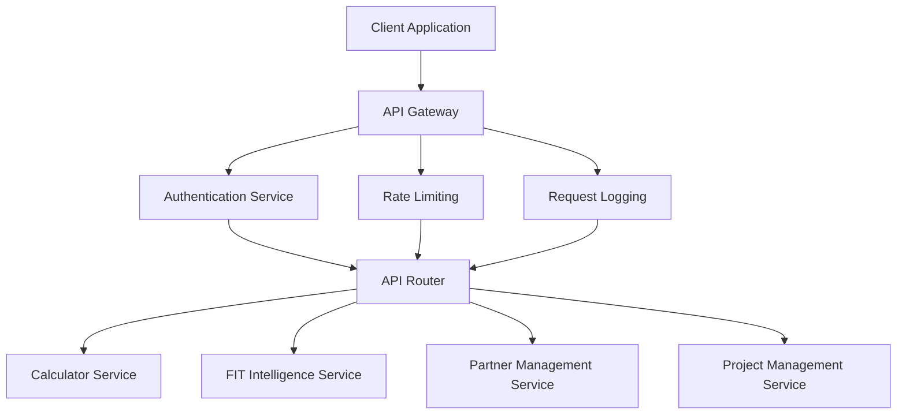

# Saber Business Operations Platform
## API Specifications & Integration Documentation

**Version:** 1.0  
**Date:** October 23, 2025  
**Author:** Kilo Code (Architect Mode)  
**Status**: Detailed API Specifications  

---

## Executive Summary

This document provides comprehensive API specifications for the Saber Business Operations Platform, detailing the integration patterns, endpoint definitions, data models, and security requirements for all four core modules: FIT Intelligence, Calculator, Partner Management, and Project Management.

### Key Design Principles
- **RESTful Architecture**: Resource-based URLs with standard HTTP methods
- **API Versioning**: Semantic versioning with URL path versioning (/api/v1/)
- **Consistent Patterns**: Standardized request/response formats across all endpoints
- **Security First**: JWT-based authentication with role-based authorization
- **Comprehensive Documentation**: OpenAPI 3.0 specifications with interactive docs

---

## 1. API Architecture Overview

### 1.1 API Design Standards

#### RESTful Design Principles
```yaml
URL Structure:
  - Base URL: https://api.saberrenewable.energy/api/v1
  - Resource Naming: Plural nouns (e.g., /calculations, /partners, /projects)
  - Hierarchy: Nested resources (e.g., /projects/{id}/milestones)
  - Query Parameters: Filtering, sorting, pagination
  
HTTP Methods:
  - GET: Retrieve resources
  - POST: Create new resources
  - PUT: Update existing resources (full update)
  - PATCH: Partial resource updates
  - DELETE: Remove resources
  
Status Codes:
  - 200: OK (successful GET, PUT, PATCH, DELETE)
  - 201: Created (successful POST)
  - 204: No Content (successful DELETE with no response body)
  - 400: Bad Request (validation errors)
  - 401: Unauthorized (authentication required)
  - 403: Forbidden (authorization failed)
  - 404: Not Found (resource doesn't exist)
  - 409: Conflict (resource conflicts)
  - 500: Internal Server Error (unexpected errors)
```

#### Authentication & Authorization
```yaml
Authentication:
  Method: JWT Bearer Token
  Header: Authorization: Bearer <token>
  Token Source: Azure AD B2C
  Token Expiry: 15 minutes (access token)
  Refresh Token: 30 days
  
Authorization:
  Model: Role-Based Access Control (RBAC)
  Roles: 
    - SystemAdmin: Full system access
    - PartnerAdmin: Partner management access
    - ProjectManager: Project management access
    - Analyst: Read-only access to analytics
    - Partner: Limited access to own data
  Permissions: Granular resource-level permissions
```

#### Response Format Standards
```yaml
Success Response Format:
  {
    "success": true,
    "data": <response_data>,
    "metadata": {
      "timestamp": "2025-10-23T10:00:00Z",
      "requestId": "req_123456789",
      "version": "1.0"
    },
    "pagination": {  // For list endpoints only
      "page": 1,
      "pageSize": 20,
      "totalCount": 150,
      "totalPages": 8,
      "hasNext": true,
      "hasPrevious": false
    }
  }

Error Response Format:
  {
    "success": false,
    "error": {
      "code": "VALIDATION_ERROR",
      "message": "Request validation failed",
      "details": [
        {
          "field": "email",
          "message": "Invalid email format"
        }
      ]
    },
    "metadata": {
      "timestamp": "2025-10-23T10:00:00Z",
      "requestId": "req_123456789",
      "version": "1.0"
    }
  }
```

### 1.2 API Gateway Configuration

#### Request Processing Pipeline


#### Cross-Cutting Concerns
```yaml
Request Processing:
  1. CORS Headers: Applied for all endpoints
  2. Rate Limiting: 100 requests per minute per user
  3. Request Logging: All requests logged with correlation ID
  4. Metrics Collection: Response times and error rates
  5. Security Scanning: Input validation and sanitization

Response Processing:
  1. Response Compression: GZIP compression for large responses
  2. Caching Headers: Appropriate cache control headers
  3. Security Headers: HSTS, XSS protection, content security policy
  4. Correlation ID: Added to response headers for tracing
```

---

## 2. Calculator Module API

### 2.1 Calculator Endpoints

#### Perform Calculation
```yaml
Endpoint: POST /api/v1/calculator/calculate
Description: Perform financial calculation for renewable energy project
Authentication: Required (PartnerAdmin, ProjectManager, Analyst)
Request Body:
  type: object
  required: [projectName, calculationType, parameters]
  properties:
    projectName:
      type: string
      description: Project name for reference
    calculationType:
      type: string
      enum: [solar, chp, wind, battery, blended]
      description: Type of calculation to perform
    parameters:
      type: object
      description: Calculation-specific parameters
      properties:
        # Solar PV Parameters
        systemCapacity:
          type: number
          description: System capacity in kWp
        annualYield:
          type: number
          description: Annual yield in kWh/kWp
        degradation:
          type: number
          description: Annual degradation percentage
        
        # Financial Parameters
        projectCost:
          type: number
          description: Total project cost in £
        targetIRR:
          type: number
          description: Target IRR percentage
        projectLife:
          type: integer
          description: Project life in years
        
        # CHP Parameters (if applicable)
        electricalEfficiency:
          type: number
          description: Electrical efficiency percentage
        thermalEfficiency:
          type: number
          description: Thermal efficiency percentage
        
        # Additional parameters based on calculation type
Response:
  type: object
  properties:
    calculationId:
      type: string
      description: Unique calculation identifier
    results:
      type: object
      properties:
        ppaPrice:
          type: number
          description: Required PPA price in £/MWh
        irr:
          type: number
          description: Internal Rate of Return
        npv:
          type: number
          description: Net Present Value
        paybackPeriod:
          type: number
          description: Payback period in years
        lcoe:
          type: number
          description: Levelized Cost of Energy
    performance:
      type: object
      properties:
        calculationTime:
          type: number
          description: Calculation time in seconds
        memoryUsage:
          type: number
          description: Memory usage in MB
Example Request:
  {
    "projectName": "Solar Crown Manufacturing",
    "calculationType": "solar",
    "parameters": {
      "systemCapacity": 500,
      "annualYield": 950,
      "degradation": 0.5,
      "projectCost": 375000,
      "targetIRR": 11.0,
      "projectLife": 25
    }
  }
Example Response:
  {
    "success": true,
    "data": {
      "calculationId": "calc_123456789",
      "results": {
        "ppaPrice": 165.50,
        "irr": 11.2,
        "npv": 125000,
        "paybackPeriod": 8.5,
        "lcoe": 145.75
      },
      "performance": {
        "calculationTime": 2.3,
        "memoryUsage": 128
      }
    },
    "metadata": {
      "timestamp": "2025-10-23T10:00:00Z",
      "requestId": "req_123456789",
      "version": "1.0"
    }
  }
```

#### Get Calculation History
```yaml
Endpoint: GET /api/v1/calculator/history/{projectId}
Description: Retrieve calculation history for a project
Authentication: Required (PartnerAdmin, ProjectManager, Analyst)
Parameters:
  - name: projectId
    in: path
    required: true
    schema:
      type: string
  - name: page
    in: query
    schema:
      type: integer
      default: 1
  - name: pageSize
    in: query
    schema:
      type: integer
      default: 20
  - name: calculationType
    in: query
    schema:
      type: string
      enum: [solar, chp, wind, battery, blended]
Response:
  type: object
  properties:
    calculations:
      type: array
      items:
        type: object
        properties:
          calculationId:
            type: string
          calculationType:
            type: string
          parameters:
            type: object
          results:
            type: object
          createdAt:
            type: string
            format: date-time
          createdBy:
            type: string
    pagination:
      $ref: '#/components/schemas/Pagination'
```

#### Export Calculation Results
```yaml
Endpoint: POST /api/v1/calculator/export/{calculationId}
Description: Export calculation results in specified format
Authentication: Required (PartnerAdmin, ProjectManager, Analyst)
Parameters:
  - name: calculationId
    in: path
    required: true
    schema:
      type: string
Request Body:
  type: object
  required: [format]
  properties:
    format:
      type: string
      enum: [pdf, excel, csv]
      description: Export format
    includeDetails:
      type: boolean
      default: true
      description: Include detailed calculation breakdown
    template:
      type: string
      enum: [standard, detailed, client]
      default: standard
      description: Report template
Response:
  type: object
  properties:
    exportId:
      type: string
      description: Export job identifier
    downloadUrl:
      type: string
      description: Download URL for exported file
    expiresAt:
      type: string
      format: date-time
      description: When download URL expires
```

### 2.2 Calculator Data Models

#### Calculation Parameters Schema
```yaml
SolarCalculationParameters:
  type: object
  required: [systemCapacity, annualYield, projectCost, targetIRR, projectLife]
  properties:
    systemCapacity:
      type: number
      minimum: 1
      maximum: 50000
      description: System capacity in kWp
    annualYield:
      type: number
      minimum: 700
      maximum: 1200
      description: Annual yield in kWh/kWp
    degradation:
      type: number
      minimum: 0
      maximum: 2
      default: 0.5
      description: Annual degradation percentage
    
CHPCalculationParameters:
  type: object
  required: [electricalCapacity, thermalCapacity, electricalEfficiency, thermalEfficiency, projectCost, targetIRR, projectLife]
  properties:
    electricalCapacity:
      type: number
      minimum: 10
      maximum: 10000
      description: Electrical capacity in kWe
    thermalCapacity:
      type: number
      minimum: 20
      maximum: 20000
      description: Thermal capacity in kWth
    electricalEfficiency:
      type: number
      minimum: 30
      maximum: 50
      description: Electrical efficiency percentage
    thermalEfficiency:
      type: number
      minimum: 40
      maximum: 90
      description: Thermal efficiency percentage
    operatingHours:
      type: number
      minimum: 1000
      maximum: 8760
      default: 8000
      description: Annual operating hours

BlendedCalculationParameters:
  type: object
  required: [technologies, projectCost, targetIRR, projectLife]
  properties:
    technologies:
      type: array
      items:
        type: object
        required: [type, capacity]
        properties:
          type:
            type: string
            enum: [solar, chp, wind, battery]
          capacity:
            type: number
            description: Technology capacity in appropriate units
          percentage:
            type: number
            minimum: 0
            maximum: 100
            description: Percentage of total system
```

#### Calculation Results Schema
```yaml
CalculationResults:
  type: object
  properties:
    ppaPrice:
      type: number
      description: Required PPA price in £/MWh
    ppaPricePence:
      type: number
      description: Required PPA price in p/kWh
    irr:
      type: number
      description: Internal Rate of Return percentage
    npv:
      type: number
      description: Net Present Value in £
    paybackPeriod:
      type: number
      description: Payback period in years
    lcoe:
      type: number
      description: Levelized Cost of Energy in £/MWh
    totalSavings:
      type: number
      description: Total savings over project life in £
    carbonReduction:
      type: number
      description: Annual carbon reduction in tonnes CO2e
    cashFlows:
      type: array
      items:
        type: object
        properties:
          year:
            type: integer
          revenue:
            type: number
          costs:
            type: number
          netCashFlow:
            type: number
```

---

## 3. FIT Intelligence Module API

### 3.1 FIT Intelligence Endpoints

#### Search FIT Installations
```yaml
Endpoint: POST /api/v1/fit/search
Description: Search FIT installations and licenses with advanced filtering
Authentication: Required (SystemAdmin, Analyst, Partner)
Request Body:
  type: object
  properties:
    query:
      type: string
      description: Natural language search query
    filters:
      type: object
      properties:
        technology:
          type: array
          items:
            type: string
            enum: [solar, wind, hydro, anaerobic_digestion, micro_chp]
        minCapacity:
          type: number
          description: Minimum capacity in kW
        maxCapacity:
          type: number
          description: Maximum capacity in kW
        location:
          type: string
          description: Geographic location (postcode, region, etc.)
        fitStatus:
          type: array
          items:
            type: string
            enum: [active, expired, approaching_expiry, transferred]
        installationDateRange:
          type: object
          properties:
            start:
              type: string
              format: date
            end:
              type: string
              format: date
    pagination:
      type: object
      properties:
        page:
          type: integer
          default: 1
        pageSize:
          type: integer
          default: 20
Response:
  type: object
  properties:
    results:
      type: array
      items:
        $ref: '#/components/schemas/FITInstallation'
    searchMetadata:
      type: object
      properties:
        totalResults:
          type: integer
        searchTime:
          type: number
        queryExpansion:
          type: string
        filtersApplied:
          type: array
          items:
            type: string
    pagination:
      $ref: '#/components/schemas/Pagination'
```

#### Get FIT Opportunities
```yaml
Endpoint: GET /api/v1/fit/opportunities
Description: Retrieve FIT opportunities based on expiry and repowering potential
Authentication: Required (SystemAdmin, Analyst, Partner)
Parameters:
  - name: opportunityType
    in: query
    schema:
      type: string
      enum: [ppa_opportunity, repowering, expansion, maintenance]
      default: ppa_opportunity
  - name: urgency
    in: query
    schema:
      type: string
      enum: [immediate, urgent, optimal, planning]
  - name: technology
    in: query
    schema:
      type: string
      enum: [solar, wind, hydro, anaerobic_digestion, micro_chp]
  - name: region
    in: query
    schema:
      type: string
  - name: minCapacity
    in: query
    schema:
      type: number
  - name: limit
    in: query
    schema:
      type: integer
      default: 50
Response:
  type: object
  properties:
    opportunities:
      type: array
      items:
        $ref: '#/components/schemas/FITOpportunity'
    summary:
      type: object
      properties:
        totalOpportunities:
          type: integer
        totalCapacity:
          type: number
        averageIRR:
          type: number
        estimatedMarketValue:
          type: number
```

#### Analyze FIT Installation
```yaml
Endpoint: POST /api/v1/fit/analyze/{fitId}
Description: Perform comprehensive analysis of specific FIT installation
Authentication: Required (SystemAdmin, Analyst, Partner)
Parameters:
  - name: fitId
    in: path
    required: true
    schema:
      type: string
Request Body:
  type: object
  properties:
    analysisType:
      type: array
      items:
        type: string
        enum: [ppa_potential, repowering_feasibility, expansion_opportunity, maintenance_optimization]
    includeRecommendations:
      type: boolean
      default: true
    includeFinancialModeling:
      type: boolean
      default: true
    clientRate:
      type: number
      description: Current electricity rate in p/kWh
Response:
  type: object
  properties:
    installation:
      $ref: '#/components/schemas/FITInstallation'
    analysis:
      type: object
      properties:
        ppaPotential:
          $ref: '#/components/schemas/PPAPotentialAnalysis'
        repoweringFeasibility:
          $ref: '#/components/schemas/RepoweringFeasibilityAnalysis'
        expansionOpportunity:
          $ref: '#/components/schemas/ExpansionOpportunityAnalysis'
        maintenanceOptimization:
          $ref: '#/components/schemas/MaintenanceOptimizationAnalysis'
    recommendations:
      type: array
      items:
        type: object
        properties:
          type:
            type: string
            enum: [immediate, short_term, medium_term, long_term]
          priority:
            type: string
            enum: [high, medium, low]
          description:
            type: string
          estimatedImpact:
            type: string
          implementationCost:
            type: number
```

### 3.2 FIT Intelligence Data Models

#### FIT Installation Schema
```yaml
FITInstallation:
  type: object
  required: [fitId, technology, capacity, location, commissionDate, fitExpiryDate]
  properties:
    fitId:
      type: string
      description: Unique FIT installation identifier
    technology:
      type: string
      enum: [solar, wind, hydro, anaerobic_digestion, micro_chp]
    capacity:
      type: number
      description: Installation capacity in kW
    location:
      type: object
      properties:
        address:
          type: string
        postcode:
          type: string
        latitude:
          type: number
        longitude:
          type: number
        region:
          type: string
    commissionDate:
      type: string
      format: date
      description: Commissioning date
    fitExpiryDate:
      type: string
      format: date
      description: FIT expiry date
    generationTariff:
      type: number
      description: Generation tariff in p/kWh
    exportTariff:
      type: number
      description: Export tariff in p/kWh
    exportMethod:
      type: string
      enum: [deemed, metered]
    annualGeneration:
      type: number
      description: Annual generation in kWh
    performanceRatio:
      type: number
      description: Performance ratio percentage
    remainingYears:
      type: number
      description: Remaining FIT years
    status:
      type: string
      enum: [active, expired, transferred, suspended]
```

#### FIT Opportunity Schema
```yaml
FITOpportunity:
  type: object
  required: [fitId, opportunityType, urgency, estimatedValue]
  properties:
    fitId:
      type: string
    installation:
      $ref: '#/components/schemas/FITInstallation'
    opportunityType:
      type: string
      enum: [ppa_opportunity, repowering, expansion, maintenance]
    urgency:
      type: string
      enum: [immediate, urgent, optimal, planning]
    estimatedValue:
      type: number
      description: Estimated opportunity value in £
    potentialSavings:
      type: number
      description: Potential annual savings in £
    implementationComplexity:
      type: string
      enum: [low, medium, high]
    confidence:
      type: number
      minimum: 0
      maximum: 1
      description: Confidence score
    lastAnalyzed:
      type: string
      format: date-time
```

---

## 4. Partner Management Module API

### 4.1 Partner Management Endpoints

#### List Partners
```yaml
Endpoint: GET /api/v1/partners
Description: List EPC partners with filtering and pagination
Authentication: Required (SystemAdmin, PartnerAdmin, Analyst)
Parameters:
  - name: status
    in: query
    schema:
      type: string
      enum: [active, inactive, pending, suspended]
  - name: partnerType
    in: query
    schema:
      type: string
      enum: [EPC, Installer, Maintainer, Consultant]
  - name: technology
    in: query
    schema:
      type: string
      enum: [solar, wind, chp, battery, all]
  - name: region
    in: query
    schema:
      type: string
  - name: minRating
    in: query
    schema:
      type: number
      minimum: 1
      maximum: 5
  - name: page
    in: query
    schema:
      type: integer
      default: 1
  - name: pageSize
    in: query
    schema:
      type: integer
      default: 20
Response:
  type: object
  properties:
    partners:
      type: array
      items:
        $ref: '#/components/schemas/Partner'
    filters:
      type: object
      description: Applied filters
    pagination:
      $ref: '#/components/schemas/Pagination'
```

#### Create Partner
```yaml
Endpoint: POST /api/v1/partners
Description: Create new EPC partner
Authentication: Required (SystemAdmin, PartnerAdmin)
Request Body:
  type: object
  required: [name, companyType, primaryContactEmail]
  properties:
    name:
      type: string
      description: Partner company name
    tradingName:
      type: string
      description: Trading name (if different)
    companyType:
      type: string
      enum: [limited_company, partnership, sole_trader, other]
    registrationNumber:
      type: string
      description: Company registration number
    vatNumber:
      type: string
      description: VAT number
    address:
      type: object
      properties:
        line1:
          type: string
        line2:
          type: string
        city:
          type: string
        postcode:
          type: string
        country:
          type: string
          default: United Kingdom
    primaryContact:
      type: object
      required: [name, email, phone]
      properties:
        name:
          type: string
        title:
          type: string
        email:
          type: string
          format: email
        phone:
          type: string
    secondaryContact:
      type: object
      properties:
        name:
          type: string
        email:
          type: string
          format: email
        phone:
          type: string
    partnerType:
      type: array
      items:
        type: string
        enum: [EPC, Installer, Maintainer, Consultant]
    capabilities:
      type: array
      items:
        $ref: '#/components/schemas/PartnerCapability'
    certifications:
      type: array
      items:
        type: string
    insurance:
      type: object
      properties:
        provider:
          type: string
        publicLiability:
          type: number
        employersLiability:
          type: number
        professionalIndemnity:
          type: number
        expiryDate:
          type: string
          format: date
    notes:
      type: string
Response:
  type: object
  properties:
    partner:
      $ref: '#/components/schemas/Partner'
    onboardingStatus:
      type: string
      enum: [pending, in_review, approved, rejected]
    nextSteps:
      type: array
      items:
        type: string
```

#### Assess Partner Capabilities
```yaml
Endpoint: POST /api/v1/partners/{partnerId}/assess
Description: Assess partner capabilities and generate score
Authentication: Required (SystemAdmin, PartnerAdmin)
Parameters:
  - name: partnerId
    in: path
    required: true
    schema:
      type: string
Request Body:
  type: object
  properties:
    assessmentType:
      type: string
      enum: [initial, annual, project_specific]
    technologies:
      type: array
      items:
        type: string
        enum: [solar, wind, chp, battery]
    projectComplexity:
      type: string
      enum: [simple, moderate, complex, highly_complex]
    region:
      type: string
    requiredCapacity:
      type: number
      description: Required capacity in kW
    specialRequirements:
      type: array
      items:
        type: string
Response:
  type: object
  properties:
    assessmentId:
      type: string
    partnerId:
      type: string
    overallScore:
      type: number
      minimum: 0
      maximum: 100
    categoryScores:
      type: object
      properties:
        technicalCapability:
          type: number
        financialStability:
          type: number
        experience:
          type: number
        certifications:
          type: number
        insurance:
          type: number
    recommendations:
      type: array
      items:
        type: object
        properties:
          category:
            type: string
          recommendation:
            type: string
          priority:
            type: string
            enum: [high, medium, low]
    suitable:
      type: boolean
    confidence:
      type: number
      minimum: 0
      maximum: 1
    assessedAt:
      type: string
      format: date-time
    assessedBy:
      type: string
```

#### Get Partner Performance
```yaml
Endpoint: GET /api/v1/partners/{partnerId}/performance
Description: Retrieve partner performance metrics and history
Authentication: Required (SystemAdmin, PartnerAdmin, Analyst, Partner)
Parameters:
  - name: partnerId
    in: path
    required: true
    schema:
      type: string
  - name: period
    in: query
    schema:
      type: string
      enum: [1month, 3months, 6months, 1year, 2years, all]
      default: 1year
  - name: metrics
    in: query
    schema:
      type: array
      items:
        type: string
        enum: [project_completion, budget_adherence, quality_score, client_satisfaction, safety_record]
Response:
  type: object
  properties:
    partnerId:
      type: string
    period:
      type: string
    metrics:
      type: object
      properties:
        projectCompletion:
          type: object
          properties:
            onTime:
              type: number
            withinBudget:
              type: number
            totalProjects:
              type: integer
        budgetAdherence:
          type: object
          properties:
            averageVariance:
              type: number
            overBudgetProjects:
              type: integer
            underBudgetProjects:
              type: integer
        qualityScore:
          type: object
          properties:
            average:
              type: number
            trend:
              type: string
              enum: [improving, stable, declining]
        clientSatisfaction:
          type: object
          properties:
            averageRating:
              type: number
            totalReviews:
              type: integer
            responseRate:
              type: number
        safetyRecord:
          type: object
          properties:
            incidentRate:
              type: number
            riddorReportable:
              type: integer
            daysSinceLastIncident:
              type: integer
    projects:
      type: array
      items:
        type: object
        properties:
          projectId:
            type: string
          projectName:
            type: string
          completionDate:
            type: string
            format: date
          onTime:
            type: boolean
          withinBudget:
            type: boolean
          clientRating:
            type: number
          qualityScore:
            type: number
    benchmarks:
      type: object
      properties:
        industryAverage:
          type: object
        peerComparison:
          type: object
        ranking:
          type: object
```

### 4.2 Partner Management Data Models

#### Partner Schema
```yaml
Partner:
  type: object
  required: [id, name, companyType, status, createdAt]
  properties:
    id:
      type: string
      description: Unique partner identifier
    name:
      type: string
      description: Partner company name
    tradingName:
      type: string
      description: Trading name
    companyType:
      type: string
      enum: [limited_company, partnership, sole_trader, other]
    registrationNumber:
      type: string
      description: Company registration number
    vatNumber:
      type: string
      description: VAT number
    address:
      $ref: '#/components/schemas/Address'
    primaryContact:
      $ref: '#/components/schemas/Contact'
    secondaryContact:
      $ref: '#/components/schemas/Contact'
    partnerType:
      type: array
      items:
        type: string
        enum: [EPC, Installer, Maintainer, Consultant]
    capabilities:
      type: array
      items:
        $ref: '#/components/schemas/PartnerCapability'
    certifications:
      type: array
      items:
        type: string
    insurance:
      $ref: '#/components/schemas/Insurance'
    status:
      type: string
      enum: [active, inactive, pending, suspended]
    rating:
      type: number
      minimum: 1
      maximum: 5
      description: Average partner rating
    notes:
      type: string
    createdAt:
      type: string
      format: date-time
    updatedAt:
      type: string
      format: date-time
```

#### Partner Capability Schema
```yaml
PartnerCapability:
  type: object
  required: [technology, maxCapacity]
  properties:
    technology:
      type: string
      enum: [solar, wind, chp, battery]
    maxCapacity:
      type: number
      description: Maximum capacity in kW
    experience:
      type: object
      properties:
        years:
          type: integer
        projects:
          type: integer
        totalCapacity:
          type: number
    certifications:
      type: array
      items:
        type: string
    regions:
      type: array
      items:
        type: string
    specializations:
      type: array
      items:
        type: string
```

---

## 5. Project Management Module API

### 5.1 Project Management Endpoints

#### List Projects
```yaml
Endpoint: GET /api/v1/projects
Description: List projects with filtering and pagination
Authentication: Required (SystemAdmin, ProjectManager, Analyst, Partner)
Parameters:
  - name: status
    in: query
    schema:
      type: string
      enum: [lead, active, completed, cancelled, on_hold]
  - name: partnerId
    in: query
    schema:
      type: string
  - name: clientId
    in: query
    schema:
      type: string
  - name: technology
    in: query
    schema:
      type: string
      enum: [solar, wind, chp, battery, blended]
  - name: region
    in: query
    schema:
      type: string
  - name: minCapacity
    in: query
    schema:
      type: number
  - name: maxCapacity
    in: query
    schema:
      type: number
  - name: startDateFrom
    in: query
    schema:
      type: string
      format: date
  - name: startDateTo
    in: query
    schema:
      type: string
      format: date
  - name: page
    in: query
    schema:
      type: integer
      default: 1
  - name: pageSize
    in: query
    schema:
      type: integer
      default: 20
Response:
  type: object
  properties:
    projects:
      type: array
      items:
        $ref: '#/components/schemas/Project'
    filters:
      type: object
      description: Applied filters
    pagination:
      $ref: '#/components/schemas/Pagination'
```

#### Create Project
```yaml
Endpoint: POST /api/v1/projects
Description: Create new project
Authentication: Required (SystemAdmin, ProjectManager)
Request Body:
  type: object
  required: [name, clientId, partnerId, technology, estimatedCapacity]
  properties:
    name:
      type: string
      description: Project name
    description:
      type: string
      description: Project description
    clientId:
      type: string
      description: Client identifier
    partnerId:
      type: string
      description: Assigned partner identifier
    technology:
      type: string
      enum: [solar, wind, chp, battery, blended]
      description: Primary technology
    estimatedCapacity:
      type: number
      description: Estimated capacity in kW
    siteAddress:
      $ref: '#/components/schemas/Address'
    estimatedStartDate:
      type: string
      format: date
      description: Estimated start date
    estimatedEndDate:
      type: string
      format: date
      description: Estimated end date
    budget:
      type: number
      description: Project budget in £
    status:
      type: string
      enum: [lead, active, completed, cancelled, on_hold]
      default: lead
    priority:
      type: string
      enum: [low, medium, high, critical]
      default: medium
    notes:
      type: string
Response:
  type: object
  properties:
    project:
      $ref: '#/components/schemas/Project'
    milestones:
      type: array
      items:
        $ref: '#/components/schemas/Milestone'
    nextSteps:
      type: array
      items:
        type: string
```

#### Update Project Status
```yaml
Endpoint: PUT /api/v1/projects/{projectId}/status
Description: Update project status and progress
Authentication: Required (SystemAdmin, ProjectManager, Partner)
Parameters:
  - name: projectId
    in: path
    required: true
    schema:
      type: string
Request Body:
  type: object
  required: [status, updatedBy]
  properties:
    status:
      type: string
      enum: [lead, active, completed, cancelled, on_hold]
    updatedBy:
      type: string
      description: User making the update
    notes:
      type: string
      description: Status update notes
    completionPercentage:
      type: number
      minimum: 0
      maximum: 100
      description: Project completion percentage
    actualStartDate:
      type: string
      format: date
      description: Actual start date (if applicable)
    actualEndDate:
      type: string
      format: date
      description: Actual end date (if completed)
    finalCost:
      type: number
      description: Final project cost in £ (if completed)
Response:
  type: object
  properties:
    project:
      $ref: '#/components/schemas/Project'
    statusHistory:
      type: array
      items:
        type: object
        properties:
          status:
            type: string
          updatedBy:
            type: string
          updatedAt:
            type: string
            format: date-time
          notes:
            type: string
```

#### Get Project Milestones
```yaml
Endpoint: GET /api/v1/projects/{projectId}/milestones
Description: Retrieve project milestones and progress
Authentication: Required (SystemAdmin, ProjectManager, Analyst, Partner)
Parameters:
  - name: projectId
    in: path
    required: true
    schema:
      type: string
  - name: status
    in: query
    schema:
      type: string
      enum: [pending, in_progress, completed, overdue]
  - name: includeCompleted
    in: query
    schema:
      type: boolean
      default: true
Response:
  type: object
  properties:
    projectId:
      type: string
    milestones:
      type: array
      items:
        $ref: '#/components/schemas/Milestone'
    summary:
      type: object
      properties:
        totalMilestones:
          type: integer
        completedMilestones:
          type: integer
        overdueMilestones:
          type: integer
        completionPercentage:
          type: number
        nextMilestone:
          $ref: '#/components/schemas/Milestone'
```

### 5.2 Project Management Data Models

#### Project Schema
```yaml
Project:
  type: object
  required: [id, name, clientId, partnerId, technology, status, createdAt]
  properties:
    id:
      type: string
      description: Unique project identifier
    name:
      type: string
      description: Project name
    description:
      type: string
      description: Project description
    clientId:
      type: string
      description: Client identifier
    partnerId:
      type: string
      description: Assigned partner identifier
    technology:
      type: string
      enum: [solar, wind, chp, battery, blended]
      description: Primary technology
    estimatedCapacity:
      type: number
      description: Estimated capacity in kW
    actualCapacity:
      type: number
      description: Actual capacity in kW (if completed)
    siteAddress:
      $ref: '#/components/schemas/Address'
    estimatedStartDate:
      type: string
      format: date
      description: Estimated start date
    actualStartDate:
      type: string
      format: date
      description: Actual start date
    estimatedEndDate:
      type: string
      format: date
      description: Estimated end date
    actualEndDate:
      type: string
      format: date
      description: Actual end date
    budget:
      type: number
      description: Project budget in £
    actualCost:
      type: number
      description: Actual project cost in £
    status:
      type: string
      enum: [lead, active, completed, cancelled, on_hold]
      description: Project status
    priority:
      type: string
      enum: [low, medium, high, critical]
      description: Project priority
    completionPercentage:
      type: number
      minimum: 0
      maximum: 100
      description: Project completion percentage
    notes:
      type: string
      description: Project notes
    createdAt:
      type: string
      format: date-time
      description: Project creation date
    updatedAt:
      type: string
      format: date-time
      description: Last update date
```

#### Milestone Schema
```yaml
Milestone:
  type: object
  required: [id, projectId, title, dueDate, status]
  properties:
    id:
      type: string
      description: Unique milestone identifier
    projectId:
      type: string
      description: Project identifier
    title:
      type: string
      description: Milestone title
    description:
      type: string
      description: Milestone description
    dueDate:
      type: string
      format: date
      description: Due date
    completedDate:
      type: string
      format: date
      description: Completion date
    status:
      type: string
      enum: [pending, in_progress, completed, overdue]
      description: Milestone status
    dependencies:
      type: array
      items:
        type: string
      description: Dependencies on other milestones
    assignee:
      type: string
      description: Assigned user
    deliverables:
      type: array
      items:
        type: string
      description: Expected deliverables
    notes:
      type: string
      description: Milestone notes
    createdAt:
      type: string
      format: date-time
    updatedAt:
      type: string
      format: date-time
```

---

## 6. Shared Components & Data Models

### 6.1 Common Schemas

#### Address Schema
```yaml
Address:
  type: object
  required: [line1, city, postcode, country]
  properties:
    line1:
      type: string
      description: Address line 1
    line2:
      type: string
      description: Address line 2
    city:
      type: string
      description: City
    postcode:
      type: string
      description: Postcode
    country:
      type: string
      default: United Kingdom
    latitude:
      type: number
      description: Latitude
    longitude:
      type: number
      description: Longitude
```

#### Contact Schema
```yaml
Contact:
  type: object
  required: [name, email]
  properties:
    name:
      type: string
      description: Contact name
    title:
      type: string
      description: Contact title
    email:
      type: string
      format: email
      description: Email address
    phone:
      type: string
      description: Phone number
    mobile:
      type: string
      description: Mobile number
```

#### Pagination Schema
```yaml
Pagination:
  type: object
  properties:
    page:
      type: integer
      description: Current page number
    pageSize:
      type: integer
      description: Page size
    totalCount:
      type: integer
      description: Total number of items
    totalPages:
      type: integer
      description: Total number of pages
    hasNext:
      type: boolean
      description: Has next page
    hasPrevious:
      type: boolean
      description: Has previous page
```

### 6.2 Error Handling

#### Standard Error Codes
```yaml
ErrorCodes:
  VALIDATION_ERROR: 400
  UNAUTHORIZED: 401
  FORBIDDEN: 403
  NOT_FOUND: 404
  CONFLICT: 409
  RATE_LIMITED: 429
  INTERNAL_ERROR: 500
  SERVICE_UNAVAILABLE: 503

ErrorMessages:
  VALIDATION_ERROR: "Request validation failed"
  UNAUTHORIZED: "Authentication required"
  FORBIDDEN: "Access denied"
  NOT_FOUND: "Resource not found"
  CONFLICT: "Resource conflict"
  RATE_LIMITED: "Rate limit exceeded"
  INTERNAL_ERROR: "Internal server error"
  SERVICE_UNAVAILABLE: "Service temporarily unavailable"
```

#### Error Response Schema
```yaml
ErrorResponse:
  type: object
  properties:
    success:
      type: boolean
      example: false
    error:
      type: object
      properties:
        code:
          type: string
          description: Error code
        message:
          type: string
          description: Error message
        details:
          type: array
          items:
            type: object
            properties:
              field:
                type: string
                description: Field with error
              message:
                type: string
                description: Error message
              code:
                type: string
                description: Error code
    metadata:
      type: object
      properties:
        timestamp:
          type: string
          format: date-time
          description: Error timestamp
        requestId:
          type: string
          description: Request identifier
        version:
          type: string
          description: API version
```

---

## 7. API Security & Authentication

### 7.1 Authentication Flow

#### JWT Token Structure
```yaml
JWT Token:
  header:
    alg: HS256
    typ: JWT
  payload:
    iss: saberrenewable.energy
    sub: user_123456
    aud: saber-api
    exp: 1634567890
    iat: 1634564290
    jti: token_123456
    roles: ["ProjectManager", "Analyst"]
    permissions: ["calculator:read", "calculator:write"]
    partnerId: partner_123456
  signature: <signature>
```

#### Authentication Endpoints
```yaml
Endpoint: POST /api/v1/auth/login
Description: Authenticate user and return JWT token
Request Body:
  type: object
  required: [email, password]
  properties:
    email:
      type: string
      format: email
    password:
      type: string
      minLength: 8
    rememberMe:
      type: boolean
      default: false
Response:
  type: object
  properties:
    success:
      type: boolean
    data:
      type: object
      properties:
        accessToken:
          type: string
        refreshToken:
          type: string
        expiresIn:
          type: integer
        user:
          $ref: '#/components/schemas/User'

Endpoint: POST /api/v1/auth/refresh
Description: Refresh JWT token using refresh token
Request Body:
  type: object
  required: [refreshToken]
  properties:
    refreshToken:
      type: string
Response:
  type: object
  properties:
    success:
      type: boolean
    data:
      type: object
      properties:
        accessToken:
          type: string
        expiresIn:
          type: integer
```

### 7.2 Authorization Framework

#### Role-Based Access Control
```yaml
Roles:
  SystemAdmin:
    description: Full system access
    permissions:
      - "*:*"
  
  PartnerAdmin:
    description: Partner management access
    permissions:
      - "partners:*"
      - "projects:read"
      - "calculator:read"
      - "fit:read"
  
  ProjectManager:
    description: Project management access
    permissions:
      - "projects:*"
      - "partners:read"
      - "calculator:read"
      - "fit:read"
  
  Analyst:
    description: Read-only analytics access
    permissions:
      - "projects:read"
      - "partners:read"
      - "calculator:read"
      - "fit:read"
  
  Partner:
    description: Limited partner access
    permissions:
      - "projects:read"
      - "partners:read:own"
      - "calculator:read:own"
```

#### Permission Checking
```yaml
Permission Check Logic:
  1. Extract JWT token from Authorization header
  2. Validate token signature and expiry
  3. Extract user roles and permissions
  4. Check if user has required permission for resource
  5. For partner-specific resources, check partner ownership
  6. Allow or deny access based on permission check
```

---

## 8. API Documentation & Testing

### 8.1 OpenAPI Specification

#### API Documentation Structure
```yaml
OpenAPI Specification:
  openapi: 3.0.3
  info:
    title: Saber Business Operations API
    description: Comprehensive API for Saber Business Operations Platform
    version: 1.0.0
    contact:
      name: Saber API Team
      email: api@saberrenewable.energy
    license:
      name: Proprietary
  servers:
    - url: https://api.saberrenewable.energy/api/v1
      description: Production server
    - url: https://staging-api.saberrenewable.energy/api/v1
      description: Staging server
    - url: https://dev-api.saberrenewable.energy/api/v1
      description: Development server
  security:
    - BearerAuth: []
  components:
    securitySchemes:
      BearerAuth:
        type: http
        scheme: bearer
        bearerFormat: JWT
    schemas:
      # All schema definitions from previous sections
    responses:
      # Standard response definitions
    parameters:
      # Standard parameter definitions
```

### 8.2 API Testing Framework

#### Testing Strategy
```yaml
Testing Levels:
  1. Unit Testing:
     - Test individual functions and methods
     - Mock external dependencies
     - Fast feedback loop
  
  2. Integration Testing:
     - Test API endpoints with real database
     - Test authentication and authorization
     - Test data validation and business logic
  
  3. End-to-End Testing:
     - Test complete user workflows
     - Test cross-module interactions
     - Test with realistic data volumes
  
  4. Performance Testing:
     - Test API response times
     - Test concurrent user load
     - Test system scalability

Testing Tools:
  - Unit Tests: Jest, pytest
  - Integration Tests: Supertest, Postman/Newman
  - E2E Tests: Playwright, Cypress
  - Performance Tests: Artillery, k6
  - API Documentation: Swagger/OpenAPI, Postman Collections
```

---

## 9. Implementation Guidelines

### 9.1 API Development Standards

#### Coding Standards
```yaml
.NET API Standards:
  - Follow Microsoft C# coding conventions
  - Use async/await patterns for I/O operations
  - Implement proper exception handling
  - Use dependency injection for services
  - Add comprehensive XML documentation comments

React Frontend Standards:
  - Follow TypeScript best practices
  - Use functional components with hooks
  - Implement proper error boundaries
  - Use consistent naming conventions
  - Add comprehensive JSDoc comments

Database Standards:
  - Use consistent naming conventions (PascalCase for tables, camelCase for columns)
  - Implement proper indexing strategy
  - Use appropriate data types
  - Add foreign key constraints
  - Include audit fields (CreatedAt, UpdatedAt, CreatedBy, UpdatedBy)
```

#### Version Control Standards
```yaml
Git Workflow:
  - Use feature branches for development
  - Implement pull request review process
  - Use semantic versioning for releases
  - Include comprehensive commit messages
  - Tag releases with version numbers

Branch Naming:
  - feature/<feature-name>: New features
  - bugfix/<bug-description>: Bug fixes
  - hotfix/<hotfix-description>: Critical fixes
  - release/<version>: Release preparation
  - develop: Development integration branch
  - main: Production-ready code
```

### 9.2 Deployment Guidelines

#### CI/CD Pipeline
```yaml
Build Pipeline:
  1. Code Checkout
  2. Restore Dependencies
  3. Run Unit Tests
  4. Build Application
  5. Run Integration Tests
  6. Code Quality Analysis
  7. Security Scanning
  8. Create Build Artifact
  9. Deploy to Staging
  10. Run E2E Tests
  11. Deploy to Production (if all tests pass)

Deployment Strategy:
  - Blue-Green Deployment for zero downtime
  - Canary Releases for gradual rollout
  - Rollback capability for failed deployments
  - Health checks and monitoring
  - Automated rollback on failure detection
```

---

## 10. Conclusion

### 10.1 API Specification Summary

This comprehensive API specification provides the foundation for the Saber Business Operations Platform, defining:

1. **Standardized Architecture**: RESTful design with consistent patterns across all modules
2. **Comprehensive Security**: JWT-based authentication with role-based authorization
3. **Complete Coverage**: Full API coverage for all four core modules
4. **Quality Assurance**: Testing frameworks and implementation guidelines
5. **Future-Proof Design**: Extensible architecture supporting future enhancements

### 10.2 Implementation Priorities

#### Phase 1: Core APIs (Weeks 1-4)
- Authentication and authorization system
- Calculator module APIs
- Basic partner management APIs
- Foundation infrastructure and monitoring

#### Phase 2: Advanced APIs (Weeks 5-8)
- FIT intelligence APIs
- Complete partner management APIs
- Project management APIs
- Integration testing and validation

#### Phase 3: Enhancement APIs (Weeks 9-12)
- Advanced reporting APIs
- Analytics and insights APIs
- Performance optimization
- Comprehensive testing and documentation

### 10.3 Success Metrics

#### Technical Metrics
- API response time < 500ms for 95th percentile
- 99.9% API availability
- Zero security vulnerabilities
- 100% API documentation coverage

#### Business Metrics
- 70% reduction in manual data entry
- 50% faster project onboarding
- 90% improvement in data accuracy
- 60% increase in operational efficiency

---

**Document Version Control:**
- Version 1.0 - Initial Specification (October 23, 2025)
- Next Review: November 15, 2025
- Approved By: [Pending Leadership Review]
- Status: Detailed API Specifications