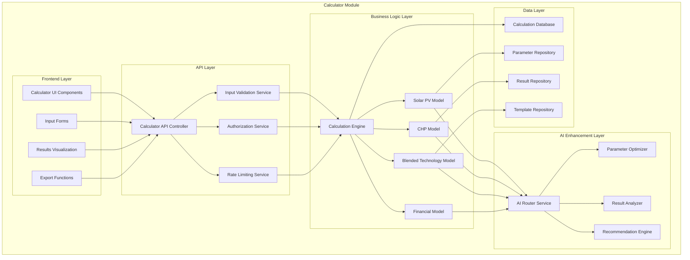
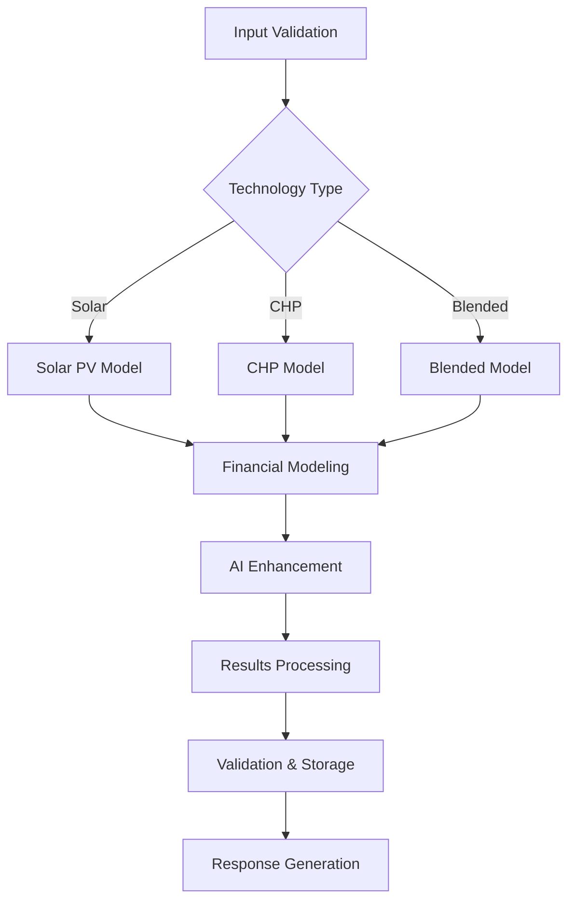

# Saber Business Operations Platform
## Calculator Module Architecture - Solar PV & CHP Integration

**Version:** 1.0  
**Date:** October 23, 2025  
**Author:** Kilo Code (Architect Mode)  
**Status**: Calculator Module Architecture Design  

---

## Executive Summary

This document defines the comprehensive architecture for the Saber Calculator Module, which integrates advanced solar photovoltaic (PV) and combined heat and power (CHP) financial modeling capabilities. The calculator module serves as the core financial analysis engine for the Saber Business Operations Platform, providing accurate, transparent, and comprehensive financial modeling for renewable energy projects.

### Key Design Principles
- **Accuracy First**: Precise financial calculations with validated models
- **Transparency**: Complete calculation visibility with detailed breakdowns
- **Flexibility**: Support for multiple technologies and financing structures
- **Performance**: Optimized calculation engine with sub-10-second processing
- **Integration**: Seamless integration with AI enhancement and reporting systems

---

## 1. Calculator Module Overview

### 1.1 Module Purpose & Scope

#### Primary Objectives
```yaml
Financial Modeling:
  - Solar PV system financial analysis
  - CHP system financial modeling
  - Blended technology optimization
  - PPA pricing and structuring
  - Investment analysis and ROI calculations

Technical Analysis:
  - Energy yield modeling
  - Performance optimization
  - Technology comparison
  - Site suitability assessment
  - Capacity planning

Business Intelligence:
  - Market analysis
  - Competitive benchmarking
  - Risk assessment
  - Scenario modeling
  - Sensitivity analysis
```

#### Supported Technologies
```yaml
Solar Technologies:
  - Rooftop Solar PV
  - Ground-mount Solar PV
  - Solar Carports
  - Building-integrated PV (BIPV)
  - Floating Solar
  - Agrivoltaics

CHP Technologies:
  - Gas CHP
  - Biomass CHP
  - Biogas CHP
  - Hydrogen-ready CHP
  - Micro-CHP
  - Tri-generation Systems

Energy Storage:
  - Battery Storage (Lithium-ion)
  - Flow Batteries
  - Thermal Storage
  - Hydrogen Storage
  - Pumped Hydro
  - Compressed Air

Blended Systems:
  - Solar + Battery
  - Solar + CHP
  - CHP + Thermal Storage
  - Solar + Wind + Storage
  - Multi-technology Hybrid
```

### 1.2 Module Architecture

#### High-Level Architecture


---

## 2. Solar PV Modeling Architecture

### 2.1 Solar PV Technical Model

#### System Sizing & Yield Modeling
```yaml
System Sizing:
  Input Parameters:
    - Available Roof Area (m²)
    - Roof Orientation (degrees from south)
    - Roof Tilt (degrees)
    - Shading Factor (%)
    - System Efficiency (%)
    - Module Type (monocrystalline, polycrystalline, thin-film)
    - Module Efficiency (%)
    - Inverter Efficiency (%)
    - Temperature Coefficient (%/°C)
    - Degradation Rate (%/year)
  
  Calculations:
    - Optimal System Capacity (kWp)
    - Annual Energy Yield (kWh/year)
    - Monthly Energy Profile (kWh/month)
    - Performance Ratio (%)
    - Specific Yield (kWh/kWp)
    - Capacity Factor (%)
    - System Losses (%)

Yield Modeling:
  Weather Data Integration:
    - Solar Irradiance Data (kWh/m²/day)
    - Temperature Data (°C)
    - Wind Speed Data (m/s)
    - Historical Weather Patterns
    - Climate Projections
  
  Performance Modeling:
    - Hourly Energy Production
    - Monthly Production Profiles
    - Seasonal Variations
    - Weather Impact Analysis
    - Degradation Over Time
```

#### Solar PV Financial Model
```yaml
Cost Structure:
  Capital Costs:
    - Module Costs (£/kWp)
    - Inverter Costs (£/kWp)
    - Mounting System Costs (£/kWp)
    - Installation Costs (£/kWp)
    - Grid Connection Costs (£)
    - Planning Costs (£)
    - Engineering Costs (£)
    - Contingency (%)
  
  Operating Costs:
    - Maintenance Costs (£/year)
    - Insurance Costs (£/year)
    - Land Lease Costs (£/year)
    - Monitoring Costs (£/year)
    - O&M Provider Costs (£/year)
    - Replacement Costs (£/year)
    - Decommissioning Costs (£)

Revenue Modeling:
  PPA Revenue:
    - PPA Price (£/MWh)
    - Annual Energy Production (MWh/year)
    - PPA Escalation (%/year)
    - Contract Term (years)
    - Offtake Percentage (%)
  
  Export Revenue:
    - Export Price (£/MWh)
    - Export Volume (MWh/year)
    - Export Tariff Structure
    - Grid Availability
  
  Savings:
    - Electricity Price (p/kWh)
    - Self-consumption (%)
    - Annual Savings (£/year)
    - Price Escalation (%/year)

Financial Metrics:
  - Net Present Value (NPV)
  - Internal Rate of Return (IRR)
  - Payback Period (years)
  - Levelized Cost of Energy (LCOE)
  - Return on Investment (ROI)
  - Debt Service Coverage Ratio (DSCR)
  - Profitability Index (PI)
```

### 2.2 Solar PV AI Enhancement

#### AI-Powered Optimization
```yaml
Parameter Optimization:
  - System Size Optimization
  - Orientation Optimization
  - Tilt Angle Optimization
  - Module Selection Optimization
  - Inverter Sizing Optimization
  - Battery Sizing Optimization

Performance Prediction:
  - Machine Learning Models
  - Historical Performance Data
  - Weather Pattern Recognition
  - System Degradation Prediction
  - Maintenance Prediction
  - Fault Detection

Financial Optimization:
  - PPA Pricing Optimization
  - Financing Structure Optimization
  - Tax Optimization
  - Revenue Maximization
  - Cost Minimization
  - Risk Mitigation
```

---

## 3. CHP Modeling Architecture

### 3.1 CHP Technical Model

#### System Sizing & Performance Modeling
```yaml
System Sizing:
  Input Parameters:
    - Site Heat Demand (kW)
    - Site Electricity Demand (kW)
    - Heat-to-Power Ratio
    - Operating Hours (hours/year)
    - Load Factor (%)
    - Fuel Type (natural gas, biomass, biogas, hydrogen)
    - Fuel Cost (£/MWh)
    - Electrical Efficiency (%)
    - Thermal Efficiency (%)
    - Total Efficiency (%)
    - Maintenance Requirements
  
  Calculations:
    - Optimal CHP Size (kWe)
    - Heat Recovery Potential (kWth)
    - Annual Electricity Generation (MWh/year)
    - Annual Heat Generation (MWhth/year)
    - Fuel Consumption (MWh/year)
    - Emissions Reduction (tonnes CO2/year)
    - System Availability (%)
    - Part-load Performance

Performance Modeling:
  Load Profile Analysis:
    - Hourly Electricity Demand
    - Hourly Heat Demand
    - Seasonal Variations
    - Daily Variations
    - Peak Demand Analysis
    - Base Load Analysis
  
  Efficiency Modeling:
    - Full-load Efficiency
    - Part-load Efficiency
    - Maintenance Requirements
    - Emissions Calculations
    - Fuel Consumption Analysis
  
  Fuel Analysis:
    - Fuel Cost Modeling
    - Fuel Price Forecasts
    - Fuel Supply Security
    - Alternative Fuel Analysis
    - Carbon Emissions Factor
    - Fuel Efficiency Metrics
```

#### CHP Financial Model
```yaml
Cost Structure:
  Capital Costs:
    - CHP Unit Costs (£/kWe)
    - Installation Costs (£/kWe)
    - Heat Distribution System (£)
    - Electrical Connection Costs (£)
    - Fuel System Installation (£)
    - Control System Costs (£)
    - Contingency (%)
  
  Operating Costs:
    - Fuel Costs (£/year)
    - Maintenance Costs (£/year)
    - Insurance Costs (£/year)
    - Monitoring Costs (£/year)
    - Emissions Costs (£/year)
    - Replacement Costs (£/year)
    - Labor Costs (£/year)

Revenue Modeling:
  Electricity Revenue:
    - Electricity Export Price (£/MWh)
    - Electricity Export Volume (MWh/year)
    - Grid Availability (%)
    - Capacity Payments (£/kW)
    - Ancillary Services Revenue (£/year)
  
  Heat Revenue:
    - Heat Price (£/MWhth)
    - Heat Sales Volume (MWhth/year)
    - Heat Demand Profile
    - Seasonal Variations
    - Heat Network Availability (%)
  
  Savings:
    - Displaced Electricity (MWh/year)
    - Displaced Gas (MWh/year)
    - Electricity Price (p/kWh)
    - Gas Price (p/kWh)
    - Annual Savings (£/year)
    - Price Escalation (%/year)

Financial Metrics:
  - Net Present Value (NPV)
  - Internal Rate of Return (IRR)
  - Payback Period (years)
  - Levelized Cost of Energy (LCOE)
  - Levelized Cost of Heat (LCOH)
  - Return on Investment (ROI)
  - Debt Service Coverage Ratio (DSCR)
  - Profitability Index (PI)
```

### 3.2 CHP AI Enhancement

#### AI-Powered Optimization
```yaml
System Optimization:
  - CHP Size Optimization
  - Heat-to-Power Ratio Optimization
  - Operating Schedule Optimization
  - Fuel Type Selection
  - Maintenance Schedule Optimization
  - Emissions Optimization

Performance Prediction:
  - Machine Learning Models
  - Historical Performance Data
  - Load Profile Recognition
  - Fuel Price Prediction
  - Maintenance Prediction
  - Efficiency Degradation Prediction

Financial Optimization:
  - Revenue Maximization
  - Cost Minimization
  - PPA Pricing Optimization
  - Financing Structure Optimization
  - Tax Optimization
  - Risk Mitigation
```

---

## 4. Blended Technology Modeling Architecture

### 4.1 Multi-Technology Integration

#### Blended System Configuration
```yaml
Technology Combinations:
  Solar + Battery:
    - Solar PV System (kWp)
    - Battery Capacity (kWh)
    - Battery Efficiency (%)
    - Charge/Discharge Rates
    - Round-trip Efficiency (%)
    - Degradation Rate (%/year)
  
  Solar + CHP:
    - Solar PV System (kWp)
    - CHP System (kWe)
    - Heat Recovery System
    - Thermal Storage (kWhth)
    - Control System Integration
    - Load Matching Algorithm
  
  Wind + Solar + Storage:
    - Wind Turbine (kW)
    - Solar PV System (kWp)
    - Battery Storage (kWh)
    - Hybrid Inverter System
    - Energy Management System
    - Grid Connection Requirements
  
  Multi-Technology Hybrid:
    - Solar PV System (kWp)
    - Wind Turbine (kW)
    - CHP System (kWe)
    - Battery Storage (kWh)
    - Thermal Storage (kWhth)
    - Advanced Control System
    - Grid Integration System
    - Energy Management Platform
```

#### Blended System Optimization
```yaml
Optimization Algorithms:
  - Technology Sizing Optimization
  - Cost Optimization
  - Performance Optimization
  - Emissions Optimization
  - Reliability Optimization
  - Grid Integration Optimization

Control Strategies:
  - Load Following Strategy
  - Peak Shaving Strategy
  - Energy Arbitrage Strategy
  - Grid Support Strategy
  - Island Mode Operation
  - Emergency Power Strategy
```

### 4.2 Blended Financial Model

#### Multi-Technology Cost Structure
```yaml
Capital Costs:
  Technology-specific Costs:
    - Solar PV Costs (£/kWp)
    - Wind Turbine Costs (£/kW)
    - CHP System Costs (£/kWe)
    - Battery Storage Costs (£/kWh)
    - Thermal Storage Costs (£/kWhth)
  
  Integration Costs:
    - Hybrid Inverter Costs (£/kW)
    - Control System Costs (£)
    - Energy Management System Costs (£)
    - Grid Connection Costs (£)
    - Installation Costs (£)
    - Commissioning Costs (£)
  
  Soft Costs:
    - Engineering Costs (£)
    - Permitting Costs (£)
    - Interconnection Costs (£)
    - Land Lease Costs (£/year)
    - Insurance Costs (£/year)
    - Contingency (%)

Operating Costs:
  Technology-specific O&M:
    - Solar O&M Costs (£/kW/year)
    - Wind O&M Costs (£/kW/year)
    - CHP O&M Costs (£/kWe/year)
    - Battery O&M Costs (£/kWh/year)
    - Thermal Storage O&M Costs (£/kWhth/year)
  
  Fuel Costs:
    - Natural Gas Costs (£/MWh)
    - Biomass Fuel Costs (£/tonne)
    - Biogas Production Costs (£/MWh)
    - Hydrogen Production Costs (£/kg)
    - Fuel Transportation Costs (£/MWh)
  
  Replacement Costs:
    - Inverter Replacement Costs (£/kW)
    - Battery Replacement Costs (£/kWh)
    - CHP Engine Replacement Costs (£/kWe)
    - Component Replacement Schedule
    - Replacement Fund Contribution (%/year)

Revenue Modeling:
  Electricity Revenue:
    - PPA Electricity Price (£/MWh)
    - Export Electricity Price (£/MWh)
    - Capacity Payments (£/kW)
    - Ancillary Service Revenue (£/year)
    - Grid Services Revenue (£/year)
  
  Heat Revenue:
    - Heat Sales Price (£/MWhth)
    - Heat Network Revenue (£/year)
    - Process Heat Revenue (£/year)
    - District Heating Revenue (£/year)
    - Thermal Storage Revenue (£/year)
  
  Savings:
    - Electricity Displacement (MWh/year)
    - Gas Displacement (MWh/year)
    - Carbon Credit Revenue (£/tonne CO2)
    - Peak Demand Reduction (kW)
    - Demand Charge Reduction (£/year)
    - Energy Efficiency Savings (£/year)

Financial Metrics:
  - Technology-specific NPV
  - Blended System IRR
  - Technology Payback Periods
  - System LCOE (£/MWh)
  - Levelized Cost of Heat (£/MWhth)
  - Return on Investment (%)
  - Debt Service Coverage Ratio
  - Profitability Index
  - Sensitivity Analysis Results
```

---

## 5. AI Enhancement Architecture

### 5.1 AI Model Integration

#### AI Model Architecture
```yaml
AI Model Stack:
  - Qwen2.5-14B-Instruct (Primary Reasoning)
    - Technical Analysis
    - System Optimization
    - Performance Prediction
    - Risk Assessment
  
  - Qwen-Math-7B (Financial Calculations)
    - Precise Financial Modeling
    - IRR/NPV Calculations
    - Sensitivity Analysis
    - Scenario Modeling
  
  - Llama-3.1-8B-Instruct (Communication)
    - Report Generation
    - Client Explanations
    - Recommendation Summaries
    - User Interface Text
  
  - Llama-3.2-3B (Classification)
    - Query Classification
    - Request Routing
    - Data Validation
    - Priority Assessment

Model Integration:
  - Azure AI Services
  - Custom Model Deployment
  - Model Versioning
  - A/B Testing
  - Performance Monitoring
  - Model Retraining
```

#### AI Enhancement Services
```yaml
AI Services:
  - Parameter Optimization Service
    - Input Parameter Optimization
    - Technology Selection Optimization
    - System Sizing Optimization
    - Financial Structure Optimization
  
  - Result Analysis Service
    - Calculation Result Analysis
    - Performance Benchmarking
    - Risk Assessment
    - Opportunity Identification
    - Recommendation Generation
  
  - Report Generation Service
    - Automated Report Generation
    - Client-facing Report Creation
    - Executive Summary Generation
    - Technical Appendix Generation
    - Visualization Creation
  
  - Prediction Service
    - Performance Prediction
    - Maintenance Prediction
    - Failure Prediction
    - Market Price Prediction
    - Technology Trend Prediction
```

### 5.2 AI Integration Patterns

#### AI Service Integration
```yaml
Integration Architecture:
  - AI Router Service
    - Request Classification
    - Model Selection
    - Load Balancing
    - Failover Handling
    - Response Aggregation
  
  - Model Management Service
    - Model Deployment
    - Model Versioning
    - Model Monitoring
    - Model Retraining
    - Model A/B Testing
  
  - Data Enhancement Service
    - Data Validation
    - Data Enrichment
    - Data Normalization
    - Data Quality Assessment
    - Data Privacy Protection

Integration Patterns:
  - Synchronous Integration
    - Real-time AI Enhancement
    - Immediate Response
    - User-facing AI Features
  
  - Asynchronous Integration
    - Batch Processing
    - Background AI Analysis
    - Scheduled AI Tasks
    - Report Generation
    - Data Analysis
  
  - Hybrid Integration
    - Rule-based + AI
    - Fallback Mechanisms
    - Confidence Scoring
    - Human-in-the-loop
    - Continuous Learning
```

---

## 6. Calculation Engine Architecture

### 6.1 Core Calculation Engine

#### Engine Components
```yaml
Calculation Engine:
  - Input Validation Service
    - Parameter Validation
    - Range Validation
    - Type Validation
    - Business Rule Validation
    - Consistency Validation
  
  - Calculation Orchestrator
    - Technology Selection
    - Model Selection
    - Calculation Workflow
    - Dependency Management
    - Error Handling
  
  - Financial Modeling Service
    - Cash Flow Modeling
    - Discount Rate Calculation
    - Tax Modeling
    - Inflation Modeling
    - Risk Adjustment
  
  - Technical Modeling Service
    - Energy Yield Modeling
    - Performance Modeling
    - Degradation Modeling
    - Maintenance Modeling
    - Availability Modeling
  
  - Optimization Service
    - Parameter Optimization
    - Technology Optimization
    - Financial Optimization
    - Performance Optimization
    - Multi-objective Optimization
  
  - Results Service
    - Results Aggregation
    - Results Validation
    - Results Formatting
    - Results Storage
    - Results Export
```

#### Calculation Workflow


### 6.2 Performance Optimization

#### Optimization Strategies
```yaml
Calculation Performance:
  - Caching Strategy
    - Input Parameter Caching
    - Model Result Caching
    - Template Caching
    - Reference Data Caching
    - AI Model Caching
  
  - Parallel Processing
    - Multi-threading
    - Asynchronous Processing
    - Distributed Computing
    - GPU Acceleration
    - Vector Processing
  
  - Algorithm Optimization
    - Efficient Algorithms
    - Numerical Methods
    - Approximation Methods
    - Heuristic Methods
    - Machine Learning Optimization

Memory Optimization:
  - Memory Pool Management
  - Garbage Collection Optimization
  - Data Structure Optimization
  - Memory Leak Prevention
  - Resource Monitoring
  - Memory Profiling
  - Performance Tuning
```

---

## 7. Integration Architecture

### 7.1 External System Integration

#### Integration Points
```yaml
External Integrations:
  - Weather Data APIs
    - Historical Weather Data
    - Weather Forecast Data
    - Solar Irradiance Data
    - Wind Speed Data
    - Temperature Data
  
  - Market Data APIs
    - Energy Market Prices
    - PPA Market Rates
    - Equipment Costs
    - Maintenance Costs
    - Fuel Prices
  
  - Financial System APIs
    - Accounting Systems
    - ERP Systems
    - Banking Systems
    - Payment Systems
    - Tax Systems
  
  - Government APIs
    - FIT Database APIs
    - Planning Permission APIs
    - Grid Connection APIs
    - Subsidy APIs
    - Regulatory APIs
```

#### Integration Patterns
```yaml
Integration Patterns:
  - API Integration
    - RESTful APIs
    - GraphQL APIs
    - Webhook Integration
    - Event-driven Integration
    - Batch Integration
  
  - Database Integration
    - Direct Database Connection
    - Data Synchronization
    - Data Migration
    - Data Validation
    - Data Transformation
  
  - File Integration
    - CSV File Import/Export
    - Excel File Import/Export
    - XML File Processing
    - JSON File Processing
    - PDF Report Generation
```

### 7.2 Internal System Integration

#### Module Integration
```yaml
Internal Integrations:
  - FIT Intelligence Module
    - FIT Installation Data
    - FIT Opportunity Analysis
    - FIT Expiry Tracking
    - FIT Performance Analysis
    - FIT Market Analysis
  
  - Partner Management Module
    - Partner Capability Data
    - Partner Performance Data
    - Partner Availability Data
    - Partner Cost Data
    - Partner Quality Data
  
  - Project Management Module
    - Project Data
    - Resource Data
    - Timeline Data
    - Budget Data
    - Milestone Data
  
  - Document Management Module
    - Calculation Reports
    - Technical Specifications
    - Compliance Documents
    - Contract Documents
    - Approval Documents
```

---

## 8. Testing & Validation Framework

### 8.1 Calculation Validation

#### Validation Framework
```yaml
Validation Types:
  - Input Validation
    - Parameter Range Validation
    - Parameter Type Validation
    - Parameter Consistency Validation
    - Business Rule Validation
    - Security Validation
  
  - Calculation Validation
    - Mathematical Accuracy
    - Financial Model Accuracy
    - Technical Model Accuracy
    - Integration Accuracy
    - Performance Validation
  
  - Output Validation
    - Result Range Validation
    - Result Format Validation
    - Result Consistency Validation
    - Result Completeness Validation
    - Result Accuracy Validation

Validation Methods:
  - Unit Testing
  - Integration Testing
  - Regression Testing
  - Performance Testing
  - User Acceptance Testing
  - Expert Review
```

### 8.2 Test Data Management

#### Test Data Strategy
```yaml
Test Data Categories:
  - Unit Test Data
    - Simple Input Parameters
    - Edge Case Parameters
    - Error Case Parameters
    - Boundary Case Parameters
    - Performance Case Parameters
  
  - Integration Test Data
    - Cross-module Test Data
    - End-to-end Test Data
    - Performance Test Data
    - Load Test Data
    - Stress Test Data
  
  - Validation Test Data
    - Historical Calculation Data
    - Industry Benchmark Data
    - Expert Validation Data
    - Client Validation Data
    - Regulatory Validation Data

Test Data Management:
  - Test Data Generation
  - Test Data Versioning
  - Test Data Security
  - Test Data Privacy
  - Test Data Retention
  - Test Data Archival
```

---

## 9. Implementation Roadmap

### 9.1 Development Phases

#### Phase 1: Foundation (Weeks 1-4)
```yaml
Foundation Development:
  - Core Calculation Engine
  - Basic Solar PV Model
  - Basic CHP Model
  - Basic Financial Model
  - Input Validation Framework
  - Results Processing Framework
```

#### Phase 2: Enhancement (Weeks 5-8)
```yaml
Enhancement Development:
  - Advanced Solar PV Model
  - Advanced CHP Model
  - Blended Technology Model
  - AI Integration Framework
  - Performance Optimization
  - Integration Framework
```

#### Phase 3: Intelligence (Weeks 9-12)
```yaml
Intelligence Development:
  - AI Model Integration
  - Advanced Optimization
  - Predictive Analytics
  - Automated Reporting
  - Advanced Visualization
  - User Interface Enhancement
```

#### Phase 4: Production (Weeks 13-16)
```yaml
Production Development:
  - Performance Tuning
  - Security Hardening
  - Scalability Enhancement
  - Monitoring Implementation
  - Documentation Completion
  - User Training Materials
```

### 9.2 Success Metrics

#### Technical Metrics
```yaml
Performance Metrics:
  - Calculation Accuracy: >99.5%
  - Calculation Speed: <10 seconds
  - System Availability: >99.9%
  - Concurrent Users: 100+
  - Memory Usage: <2GB
  - CPU Usage: <80%

Quality Metrics:
  - Code Coverage: >90%
  - Bug Density: <1 per 1000 lines
  - Security Vulnerabilities: 0 critical
  - Performance Regression: 0%
  - User Satisfaction: >4.5/5
```

#### Business Metrics
```yaml
Business Metrics:
  - Calculation Volume: 1000+ per day
  - User Adoption: >80%
  - Process Efficiency: 70% improvement
  - Error Reduction: 90% reduction
  - Time Savings: 50% reduction
  - Cost Savings: 40% reduction
  - Revenue Increase: 25% increase
```

---

## 10. Conclusion

### 10.1 Calculator Architecture Summary

This comprehensive calculator architecture provides a robust, accurate, and intelligent financial modeling system for Saber Business Operations Platform, featuring:

1. **Multi-Technology Support**: Solar PV, CHP, and blended technology modeling
2. **Advanced Financial Modeling**: Comprehensive cost, revenue, and savings analysis
3. **AI Enhancement**: Intelligent optimization and prediction capabilities
4. **High Performance**: Optimized calculation engine with sub-10-second processing
5. **Seamless Integration**: Complete integration with other platform modules

### 10.2 Implementation Priorities

#### Immediate Actions (Next 30 Days)
1. **Core Engine Development**: Implement basic calculation engine
2. **Solar PV Model**: Develop comprehensive solar PV model
3. **CHP Model**: Develop comprehensive CHP model
4. **Financial Model**: Implement robust financial modeling framework
5. **Validation Framework**: Create comprehensive testing and validation framework

#### Long-term Vision (6-12 months)
1. **AI Integration**: Complete AI model integration and optimization
2. **Advanced Features**: Implement advanced optimization and prediction features
3. **Performance Excellence**: Achieve industry-leading performance and accuracy
4. **User Experience**: Deliver exceptional user experience with intuitive interfaces
5. **Market Leadership**: Establish Saber as technology leader in renewable energy financial modeling

---

**Document Version Control:**
- Version 1.0 - Initial Architecture (October 23, 2025)
- Next Review: November 15, 2025
- Approved By: [Pending Leadership Review]
- Status: Calculator Module Architecture Design
 