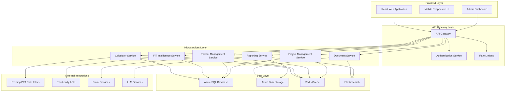
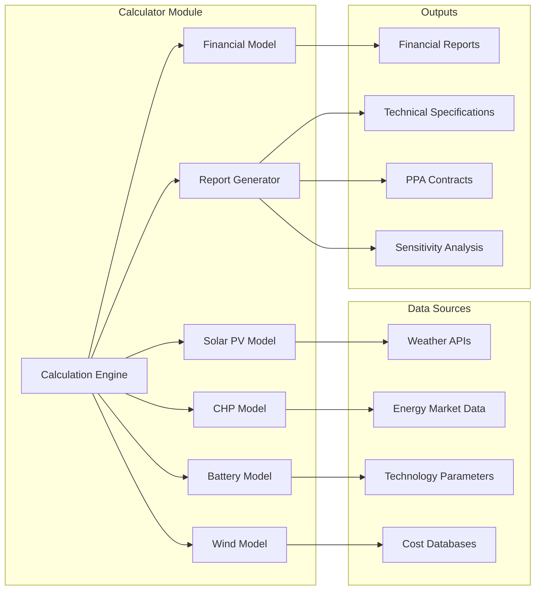
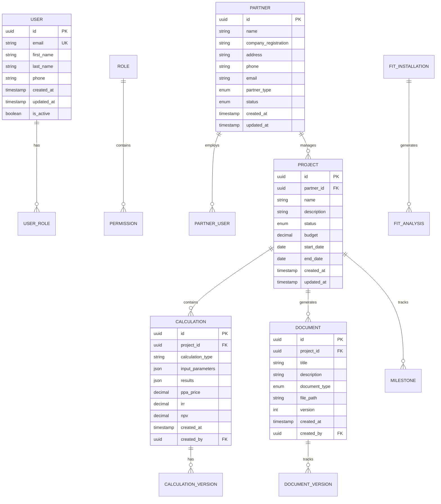

# Saber Business Operations Platform
## Comprehensive System Specification & Architecture Document

**Version:** 1.0  
**Date:** October 23, 2025  
**Author:** Kilo Code (Architect Mode)  
**Status:** Draft Specification  

---

## Executive Summary

The Saber Business Operations Platform is an enterprise-grade EPC (Engineering, Procurement, and Construction) partner management system designed to streamline solar energy project workflows. This platform serves as the central hub connecting four core modules: FIT intelligence analytics, advanced calculator systems, EPC partner management, and comprehensive project management capabilities.

The platform will replace Excel-based workflows with a unified Azure-based system featuring real-time calculation processing, automated report generation, document management with version control, and complete audit trails. Built with a modern React frontend and scalable API backend, the system will support both internal Saber staff workflows and external EPC partner interactions with granular permission controls.

### Key Business Benefits
- **Centralized Operations**: Single platform for all EPC partner and project management activities
- **Automated Workflows**: Reduction of manual processes through intelligent automation
- **Enhanced Compliance**: Complete audit trails and document version control
- **Scalable Architecture**: Cloud-native design supporting business growth
- **Data Integrity**: Centralized Azure database replacing fragmented Excel workflows
- **Real-time Processing**: Instant calculations and report generation capabilities

---

## 1. System Overview

### 1.1 Platform Purpose

The Saber Business Operations Platform is designed to:
- Manage the complete lifecycle of solar energy projects from partner selection through completion
- Provide advanced financial modeling capabilities integrating solar PV and CHP systems
- Maintain comprehensive FIT (Feed-in Tariff) intelligence and analytics
- Streamline EPC partner onboarding, management, and performance tracking
- Deliver automated client-facing reports with complete calculation transparency
- Ensure regulatory compliance through detailed audit trails and document control

### 1.2 Current State Analysis

Based on analysis of existing systems:

**Existing Assets:**
- MVP PPA Calculator (Streamlit-based, basic functionality)
- Advanced PPA Calculator (Streamlit-based, professional UI)
- Complex Excel-based financial models with extensive data
- FIT intelligence data and analysis frameworks
- Cloudflare tunnel infrastructure for public access

**Current Limitations:**
- Fragmented data across multiple Excel files
- Limited integration between calculator systems
- No centralized partner management capabilities
- Manual document generation and version control
- Lack of comprehensive audit trails
- Limited scalability with current Streamlit architecture

### 1.3 Target State Vision

The platform will transform Saber's operations through:
- **Unified Data Architecture**: Centralized Azure database with real-time synchronization
- **Modular Design**: Four integrated modules with seamless data flow
- **Enterprise Security**: Role-based access control with granular permissions
- **Automated Intelligence**: LLM-powered insights and automated report generation
- **Scalable Infrastructure**: Cloud-native architecture supporting growth

---

## 2. System Requirements

### 2.1 Functional Requirements

#### 2.1.1 Core Module Requirements

**FIT Intelligence Analytics Module:**
- Legacy FiT installation database analysis and management
- Automated identification of sites approaching FiT expiry (5-year horizon)
- Battery addition opportunity assessment without compromising FiT payments
- Export metering upgrade ROI calculations
- End-of-FiT replacement strategy generation
- Performance vs original FiT projection tracking
- FiT value extraction opportunity identification

**Advanced Calculator Module:**
- Integrated solar PV and CHP financial modeling
- Real-time calculation processing with instant results
- Multi-technology optimization (solar, wind, battery, CHP)
- Blended PPA structure design and pricing
- Sensitivity analysis and scenario modeling
- Automated client-facing report generation
- PDF export with complete calculation transparency
- Version control for all calculation runs

**EPC Partner Management Module:**
- Partner onboarding workflows with document collection
- Capability assessment and certification tracking
- Performance monitoring and KPI tracking
- Resource availability and capacity planning
- Compliance management and audit tracking
- Communication and collaboration tools
- Project assignment and workload balancing

**Project Management Module:**
- End-to-end project lifecycle management
- Project creation, assignment, and tracking
- Resource allocation and scheduling
- Milestone tracking and progress reporting
- Budget management and financial tracking
- Risk management and issue tracking
- Client communication and deliverable management

#### 2.1.2 Cross-Functional Requirements

**Document Management System:**
- Version control with complete change history
- Automated document lifecycle management
- Client delivery tracking with acknowledgments
- Template-based document generation
- Digital signature capabilities
- Document retention and archival policies

**Reporting and Analytics:**
- Real-time dashboard with key metrics
- Custom report builder with scheduling
- Data visualization and trend analysis
- Automated client report generation
- Performance benchmarking and analytics
- Export capabilities (PDF, Excel, CSV)

**Integration Capabilities:**
- RESTful APIs for external system integration
- Webhook support for real-time notifications
- Data import/export utilities
- Third-party system connectors
- API rate limiting and security controls

### 2.2 Non-Functional Requirements

#### 2.2.1 Performance Requirements
- **Response Time**: API responses < 500ms for 95th percentile
- **Calculation Processing**: Complex models complete < 10 seconds
- **Report Generation**: PDF reports generate < 30 seconds
- **Concurrent Users**: Support 100+ simultaneous users
- **Data Processing**: Handle 10,000+ projects without degradation

#### 2.2.2 Security Requirements
- **Authentication**: Multi-factor authentication for all users
- **Authorization**: Role-based access control with granular permissions
- **Data Encryption**: AES-256 encryption for data at rest and in transit
- **Audit Logging**: Complete audit trail for all system actions
- **Compliance**: GDPR compliance with data protection measures

#### 2.2.3 Availability Requirements
- **Uptime**: 99.9% availability during business hours
- **Backup**: Daily automated backups with 30-day retention
- **Disaster Recovery**: 4-hour Recovery Time Objective (RTO)
- **Monitoring**: 24/7 system health monitoring and alerting

#### 2.2.4 Scalability Requirements
- **Horizontal Scaling**: Auto-scaling based on demand
- **Database Scaling**: Support for read replicas and sharding
- **File Storage**: Scalable blob storage for documents and reports
- **Geographic Distribution**: Multi-region deployment capability

---

## 3. System Architecture

### 3.1 High-Level Architecture



### 3.2 Technology Stack

#### 3.2.1 Frontend Architecture
- **Framework**: React 18+ with TypeScript
- **State Management**: Redux Toolkit with RTK Query
- **UI Components**: Tailwind CSS with Headless UI
- **Charts**: Chart.js / D3.js for data visualization
- **Document Generation**: jsPDF and React-PDF
- **Build Tools**: Vite for development and production builds

#### 3.2.2 Backend Architecture
- **Framework**: .NET 8 Web APIs
- **Authentication**: Azure AD B2C with JWT tokens
- **API Documentation**: Swagger/OpenAPI 3.0
- **Background Processing**: Azure Functions for heavy computations
- **Message Queue**: Azure Service Bus for async processing
- **Caching**: Redis for performance optimization

#### 3.2.3 Database Architecture
- **Primary Database**: Azure SQL Database with Premium tier
- **Document Storage**: Azure Blob Storage with lifecycle management
- **Search**: Azure Cognitive Search for full-text search
- **Analytics**: Azure Synapse Analytics for business intelligence
- **Backup**: Azure Backup with geo-redundant storage

#### 3.2.4 Infrastructure Architecture
- **Cloud Provider**: Microsoft Azure
- **Compute**: Azure App Service with auto-scaling
- **Networking**: Azure Virtual Network with private endpoints
- **Monitoring**: Azure Monitor with Application Insights
- **Security**: Azure Key Vault for secrets management
- **CDN**: Azure CDN for static asset delivery

### 3.3 Module Architecture

#### 3.3.1 Calculator Module Architecture



#### 3.3.2 Integration Patterns

**Event-Driven Architecture:**
- Domain events for cross-module communication
- Event sourcing for audit trails
- CQRS pattern for read/write separation

**API Integration Patterns:**
- RESTful APIs for synchronous operations
- Webhooks for real-time notifications
- Message queues for asynchronous processing
- GraphQL for complex data queries

---

## 4. Data Models

### 4.1 Core Entity Relationships



### 4.2 Detailed Schema Definitions

#### 4.2.1 User Management Schema

```sql
-- Users table
CREATE TABLE Users (
    Id UNIQUEIDENTIFIER PRIMARY KEY DEFAULT NEWID(),
    Email NVARCHAR(255) NOT NULL UNIQUE,
    FirstName NVARCHAR(100) NOT NULL,
    LastName NVARCHAR(100) NOT NULL,
    Phone NVARCHAR(50),
    PasswordHash NVARCHAR(255) NOT NULL,
    IsActive BIT DEFAULT 1,
    LastLogin DATETIME2,
    CreatedAt DATETIME2 DEFAULT SYSUTCDATETIME(),
    UpdatedAt DATETIME2 DEFAULT SYSUTCDATETIME()
);

-- Roles table
CREATE TABLE Roles (
    Id UNIQUEIDENTIFIER PRIMARY KEY DEFAULT NEWID(),
    Name NVARCHAR(100) NOT NULL UNIQUE,
    Description NVARCHAR(500),
    CreatedAt DATETIME2 DEFAULT SYSUTCDATETIME()
);

-- User Roles junction table
CREATE TABLE UserRoles (
    UserId UNIQUEIDENTIFIER NOT NULL,
    RoleId UNIQUEIDENTIFIER NOT NULL,
    AssignedAt DATETIME2 DEFAULT SYSUTCDATETIME(),
    AssignedBy UNIQUEIDENTIFIER,
    PRIMARY KEY (UserId, RoleId),
    FOREIGN KEY (UserId) REFERENCES Users(Id) ON DELETE CASCADE,
    FOREIGN KEY (RoleId) REFERENCES Roles(Id) ON DELETE CASCADE
);
```

#### 4.2.2 Partner Management Schema

```sql
-- Partners table
CREATE TABLE Partners (
    Id UNIQUEIDENTIFIER PRIMARY KEY DEFAULT NEWID(),
    Name NVARCHAR(255) NOT NULL,
    CompanyRegistration NVARCHAR(100),
    Address NVARCHAR(500),
    Phone NVARCHAR(50),
    Email NVARCHAR(255),
    PartnerType NVARCHAR(50) NOT NULL, -- EPC, Installer, Maintainer, etc.
    Status NVARCHAR(50) NOT NULL, -- Active, Inactive, Pending, Suspended
    Rating INT CHECK (Rating BETWEEN 1 AND 5),
    Notes NVARCHAR(MAX),
    CreatedAt DATETIME2 DEFAULT SYSUTCDATETIME(),
    UpdatedAt DATETIME2 DEFAULT SYSUTCDATETIME()
);

-- Partner Capabilities table
CREATE TABLE PartnerCapabilities (
    Id UNIQUEIDENTIFIER PRIMARY KEY DEFAULT NEWID(),
    PartnerId UNIQUEIDENTIFIER NOT NULL,
    Technology NVARCHAR(100) NOT NULL, -- Solar, Wind, CHP, Battery
    MaxCapacity DECIMAL(10,2), -- Maximum capacity in MW
    Certification NVARCHAR(255),
    ExpiryDate DATE,
    CreatedAt DATETIME2 DEFAULT SYSUTCDATETIME(),
    FOREIGN KEY (PartnerId) REFERENCES Partners(Id) ON DELETE CASCADE
);
```

#### 4.2.3 Project Management Schema

```sql
-- Projects table
CREATE TABLE Projects (
    Id UNIQUEIDENTIFIER PRIMARY KEY DEFAULT NEWID(),
    PartnerId UNIQUEIDENTIFIER NOT NULL,
    Name NVARCHAR(255) NOT NULL,
    Description NVARCHAR(MAX),
    Status NVARCHAR(50) NOT NULL, -- Lead, Active, Completed, Cancelled
    Budget DECIMAL(15,2),
    ActualCost DECIMAL(15,2),
    StartDate DATE,
    EndDate DATE,
    ClientName NVARCHAR(255),
    SiteAddress NVARCHAR(500),
    CreatedAt DATETIME2 DEFAULT SYSUTCDATETIME(),
    UpdatedAt DATETIME2 DEFAULT SYSUTCDATETIME(),
    FOREIGN KEY (PartnerId) REFERENCES Partners(Id)
);

-- Project Milestones table
CREATE TABLE ProjectMilestones (
    Id UNIQUEIDENTIFIER PRIMARY KEY DEFAULT NEWID(),
    ProjectId UNIQUEIDENTIFIER NOT NULL,
    Title NVARCHAR(255) NOT NULL,
    Description NVARCHAR(MAX),
    DueDate DATE NOT NULL,
    CompletedDate DATE,
    Status NVARCHAR(50) NOT NULL, -- Pending, InProgress, Completed, Overdue
    CreatedAt DATETIME2 DEFAULT SYSUTCDATETIME(),
    FOREIGN KEY (ProjectId) REFERENCES Projects(Id) ON DELETE CASCADE
);
```

#### 4.2.4 Calculator Module Schema

```sql
-- Calculations table
CREATE TABLE Calculations (
    Id UNIQUEIDENTIFIER PRIMARY KEY DEFAULT NEWID(),
    ProjectId UNIQUEIDENTIFIER,
    Name NVARCHAR(255) NOT NULL,
    CalculationType NVARCHAR(50) NOT NULL, -- Solar, CHP, Blended, FIT
    InputParameters NVARCHAR(MAX) NOT NULL, -- JSON
    Results NVARCHAR(MAX) NOT NULL, -- JSON
    PPAPrice DECIMAL(10,4),
    IRR DECIMAL(8,4),
    NPV DECIMAL(15,2),
    PaybackPeriod DECIMAL(8,2),
    LCOE DECIMAL(10,4),
    CreatedAt DATETIME2 DEFAULT SYSUTCDATETIME(),
    CreatedBy UNIQUEIDENTIFIER NOT NULL,
    FOREIGN KEY (ProjectId) REFERENCES Projects(Id),
    FOREIGN KEY (CreatedBy) REFERENCES Users(Id)
);

-- Calculation Versions table
CREATE TABLE CalculationVersions (
    Id UNIQUEIDENTIFIER PRIMARY KEY DEFAULT NEWID(),
    CalculationId UNIQUEIDENTIFIER NOT NULL,
    VersionNumber INT NOT NULL,
    InputParameters NVARCHAR(MAX) NOT NULL,
    Results NVARCHAR(MAX) NOT NULL,
    ChangeDescription NVARCHAR(500),
    CreatedAt DATETIME2 DEFAULT SYSUTCDATETIME(),
    CreatedBy UNIQUEIDENTIFIER NOT NULL,
    FOREIGN KEY (CalculationId) REFERENCES Calculations(Id) ON DELETE CASCADE,
    FOREIGN KEY (CreatedBy) REFERENCES Users(Id)
);
```

#### 4.2.5 FIT Intelligence Schema

```sql
-- FIT Installations table
CREATE TABLE FITInstallations (
    Id UNIQUEIDENTIFIER PRIMARY KEY DEFAULT NEWID(),
    FITInstallationId NVARCHAR(100) NOT NULL UNIQUE,
    Technology NVARCHAR(50) NOT NULL,
    Capacity DECIMAL(10,2) NOT NULL,
    InstallationDate DATE NOT NULL,
    FITExpiryDate DATE NOT NULL,
    GenerationTariff DECIMAL(8,4) NOT NULL,
    ExportTariff DECIMAL(8,4),
    ExportMethod NVARCHAR(50), -- Deemed, Metered
    AnnualGeneration DECIMAL(12,2),
    PerformanceRatio DECIMAL(5,2),
    CreatedAt DATETIME2 DEFAULT SYSUTCDATETIME(),
    UpdatedAt DATETIME2 DEFAULT SYSUTCDATETIME()
);

-- FIT Analysis table
CREATE TABLE FITAnalysis (
    Id UNIQUEIDENTIFIER PRIMARY KEY DEFAULT NEWID(),
    FITInstallationId UNIQUEIDENTIFIER NOT NULL,
    AnalysisType NVARCHAR(50) NOT NULL, -- Battery, Export, Expansion, Replacement
    Recommendations NVARCHAR(MAX),
    PotentialSavings DECIMAL(15,2),
    ImplementationCost DECIMAL(15,2),
    ROI DECIMAL(8,4),
    AnalysisDate DATETIME2 DEFAULT SYSUTCDATETIME(),
    ValidUntil DATE,
    FOREIGN KEY (FITInstallationId) REFERENCES FITInstallations(Id) ON DELETE CASCADE
);
```

---

## 5. API Specifications

### 5.1 API Design Principles

- **RESTful Design**: Standard HTTP methods with resource-based URLs
- **Versioning**: API versioning through URL path (/api/v1/)
- **Consistent Responses**: Standardized response format with metadata
- **Error Handling**: Comprehensive error codes and messages
- **Security**: JWT-based authentication with role-based authorization
- **Documentation**: OpenAPI 3.0 specification with interactive docs

### 5.2 Core API Endpoints

#### 5.2.1 Authentication API

```yaml
/api/v1/auth:
  POST /login:
    summary: Authenticate user and return JWT token
    requestBody:
      required: true
      content:
        application/json:
          schema:
            type: object
            properties:
              email:
                type: string
                format: email
              password:
                type: string
                minLength: 8
    responses:
      200:
        description: Successful authentication
        content:
          application/json:
            schema:
              type: object
              properties:
                token:
                  type: string
                expiresIn:
                  type: integer
                user:
                  $ref: '#/components/schemas/User'
      401:
        description: Invalid credentials

  POST /refresh:
    summary: Refresh JWT token
    requestBody:
      required: true
      content:
        application/json:
          schema:
            type: object
            properties:
              refreshToken:
                type: string
    responses:
      200:
        description: Token refreshed successfully
      401:
        description: Invalid refresh token
```

#### 5.2.2 Calculator API

```yaml
/api/v1/calculator:
  POST /calculate:
    summary: Perform financial calculation
    requestBody:
      required: true
      content:
        application/json:
          schema:
            type: object
            properties:
              calculationType:
                type: string
                enum: [solar, chp, blended, fit]
              parameters:
                type: object
                description: Calculation-specific parameters
              projectId:
                type: string
                format: uuid
    responses:
      200:
        description: Calculation completed successfully
        content:
          application/json:
            schema:
              type: object
              properties:
                id:
                  type: string
                  format: uuid
                results:
                  type: object
                  properties:
                    ppaPrice:
                      type: number
                    irr:
                      type: number
                    npv:
                      type: number
                    paybackPeriod:
                      type: number
                calculationTime:
                  type: number

  GET /{id}/history:
    summary: Get calculation version history
    parameters:
      - name: id
        in: path
        required: true
        schema:
          type: string
          format: uuid
    responses:
      200:
        description: Version history retrieved
        content:
          application/json:
            schema:
              type: array
              items:
                $ref: '#/components/schemas/CalculationVersion'
```

#### 5.2.3 Partner Management API

```yaml
/api/v1/partners:
  GET:
    summary: List partners with filtering and pagination
    parameters:
      - name: page
        in: query
        schema:
          type: integer
          default: 1
      - name: pageSize
        in: query
        schema:
          type: integer
          default: 20
      - name: status
        in: query
        schema:
          type: string
          enum: [active, inactive, pending, suspended]
      - name: partnerType
        in: query
        schema:
          type: string
    responses:
      200:
        description: Partners retrieved successfully
        content:
          application/json:
            schema:
              type: object
              properties:
                data:
                  type: array
                  items:
                    $ref: '#/components/schemas/Partner'
                pagination:
                  $ref: '#/components/schemas/Pagination'

  POST:
    summary: Create new partner
    requestBody:
      required: true
      content:
        application/json:
          schema:
            $ref: '#/components/schemas/CreatePartnerRequest'
    responses:
      201:
        description: Partner created successfully
        content:
          application/json:
            schema:
              $ref: '#/components/schemas/Partner'

  /{id}:
    GET:
      summary: Get partner by ID
      parameters:
        - name: id
          in: path
          required: true
          schema:
            type: string
            format: uuid
      responses:
        200:
          description: Partner retrieved successfully
        404:
          description: Partner not found

    PUT:
      summary: Update partner
      parameters:
        - name: id
          in: path
          required: true
          schema:
            type: string
            format: uuid
      requestBody:
        required: true
        content:
          application/json:
            schema:
              $ref: '#/components/schemas/UpdatePartnerRequest'
      responses:
        200:
          description: Partner updated successfully
        404:
          description: Partner not found
```

### 5.3 Data Models

```yaml
components:
  schemas:
    User:
      type: object
      properties:
        id:
          type: string
          format: uuid
        email:
          type: string
          format: email
        firstName:
          type: string
        lastName:
          type: string
        phone:
          type: string
        isActive:
          type: boolean
        roles:
          type: array
          items:
            type: string
        createdAt:
          type: string
          format: date-time
        updatedAt:
          type: string
          format: date-time

    Partner:
      type: object
      properties:
        id:
          type: string
          format: uuid
        name:
          type: string
        companyRegistration:
          type: string
        address:
          type: string
        phone:
          type: string
        email:
          type: string
        partnerType:
          type: string
          enum: [EPC, Installer, Maintainer, Consultant]
        status:
          type: string
          enum: [Active, Inactive, Pending, Suspended]
        rating:
          type: integer
          minimum: 1
          maximum: 5
        capabilities:
          type: array
          items:
            $ref: '#/components/schemas/PartnerCapability'
        createdAt:
          type: string
          format: date-time
        updatedAt:
          type: string
          format: date-time

    PartnerCapability:
      type: object
      properties:
        technology:
          type: string
          enum: [Solar, Wind, CHP, Battery]
        maxCapacity:
          type: number
        certification:
          type: string
        expiryDate:
          type: string
          format: date

    Calculation:
      type: object
      properties:
        id:
          type: string
          format: uuid
        projectId:
          type: string
          format: uuid
        name:
          type: string
        calculationType:
          type: string
          enum: [solar, chp, blended, fit]
        inputParameters:
          type: object
        results:
          type: object
          properties:
            ppaPrice:
              type: number
            irr:
              type: number
            npv:
              type: number
            paybackPeriod:
              type: number
            lcoe:
              type: number
        createdAt:
          type: string
          format: date-time
        createdBy:
          type: string
          format: uuid

    Pagination:
      type: object
      properties:
        page:
          type: integer
        pageSize:
          type: integer
        totalCount:
          type: integer
        totalPages:
          type: integer
        hasNext:
          type: boolean
        hasPrevious:
          type: boolean
```

---

## 6. Security Architecture

### 6.1 Authentication & Authorization

#### 6.1.1 Authentication Strategy

**Azure AD B2C Integration:**
- Primary identity provider for all users
- Multi-factor authentication enforcement
- Social identity integration (Microsoft, Google)
- Custom password policies and complexity requirements

**JWT Token Management:**
- Short-lived access tokens (15 minutes)
- Long-lived refresh tokens (30 days)
- Token revocation and blacklist capabilities
- Secure token storage and transmission

#### 6.1.2 Authorization Framework

**Role-Based Access Control (RBAC):**
- Hierarchical role structure with inheritance
- Granular permission system with resource-level controls
- Dynamic permission evaluation
- Role assignment audit trails

**Permission Categories:**
- **System Administration**: User management, system configuration
- **Partner Management**: Partner CRUD, capability assessment
- **Project Management**: Project CRUD, milestone tracking
- **Calculator Access**: Calculation execution, result viewing
- **Report Generation**: Report creation, export capabilities
- **Document Management**: Document CRUD, version control

### 6.2 Data Security

#### 6.2.1 Encryption Strategy

**Data at Rest:**
- Azure SQL Database: Transparent Data Encryption (TDE)
- Azure Blob Storage: Server-side encryption with customer-managed keys
- Application secrets: Azure Key Vault integration
- Backup encryption with geo-redundant storage

**Data in Transit:**
- TLS 1.3 for all external communications
- Internal service communication with mTLS
- API gateway with SSL termination
- End-to-end encryption for sensitive data

#### 6.2.2 Data Classification & Protection

**Data Classification Levels:**
- **Public**: Marketing materials, general company information
- **Internal**: Operational procedures, internal documentation
- **Confidential**: Partner information, project details
- **Restricted**: Financial data, personal information

**Protection Measures:**
- Data loss prevention (DLP) policies
- Information rights management (IRM)
- Database column-level encryption
- Application-level data masking

### 6.3 Compliance & Audit

#### 6.3.1 Regulatory Compliance

**GDPR Compliance:**
- Data subject rights implementation
- Privacy by design principles
- Data processing impact assessments
- Data protection officer (DPO) coordination

**Industry Standards:**
- ISO 27001 information security management
- SOC 2 Type II compliance
- Cyber Essentials certification
- Renewable energy industry regulations

#### 6.3.2 Audit Trail System

**Comprehensive Logging:**
- User authentication and authorization events
- Data access and modification operations
- System configuration changes
- API request/response logging

**Log Management:**
- Centralized log aggregation with Azure Monitor
- Log retention policies (1 year for audit logs)
- Immutable log storage with write-once semantics
- Real-time log analysis and alerting

---

## 7. Implementation Roadmap

### 7.1 Phased Delivery Approach

#### Phase 1: Foundation (Months 1-3)
**Objective**: Establish core infrastructure and basic functionality

**Deliverables:**
- Azure infrastructure setup and configuration
- Basic user authentication and authorization system
- Core database schema implementation
- Calculator module with solar PV functionality
- Basic document management capabilities
- Integration with existing PPA calculators

**Success Criteria:**
- User authentication and role-based access working
- Solar PV calculations with basic reporting
- Document upload and version control functional
- Integration APIs established with existing systems

#### Phase 2: Core Modules (Months 4-6)
**Objective**: Implement primary business modules

**Deliverables:**
- Full calculator module (solar, CHP, blended)
- FIT intelligence analytics module
- EPC partner management module
- Advanced reporting and PDF generation
- Enhanced document management with workflows

**Success Criteria:**
- Multi-technology financial modeling operational
- FIT analysis and recommendation engine working
- Partner onboarding and management workflows complete
- Automated client-facing report generation functional

#### Phase 3: Project Management (Months 7-9)
**Objective**: Complete project lifecycle management

**Deliverables:**
- Project management module with milestone tracking
- Resource allocation and scheduling capabilities
- Budget management and financial tracking
- Risk management and issue tracking
- Client communication and collaboration tools

**Success Criteria:**
- End-to-end project lifecycle management functional
- Resource planning and allocation working
- Budget tracking and variance reporting operational
- Client portal for project status and deliverables

#### Phase 4: Advanced Features (Months 10-12)
**Objective**: Enhance system with advanced capabilities

**Deliverables:**
- LLM integration for intelligent insights
- Advanced analytics and business intelligence
- Mobile-responsive application
- Enhanced security and compliance features
- Performance optimization and scaling

**Success Criteria:**
- AI-powered insights and recommendations working
- Real-time analytics dashboard operational
- Mobile application fully functional
- Security audit and penetration testing completed

### 7.2 Migration Strategy

#### 7.2.1 Data Migration Approach

**Excel to Database Migration:**
- Automated data extraction from Excel files
- Data validation and cleansing processes
- Incremental migration with rollback capabilities
- Data integrity verification and reconciliation

**Migration Phases:**
1. **Assessment**: Inventory existing Excel files and data structures
2. **Preparation**: Cleanse and standardize data formats
3. **Migration**: Transfer data to Azure SQL Database
4. **Validation**: Verify data integrity and completeness
5. **Decommission**: Archive Excel files and transition to new system

#### 7.2.2 System Transition Plan

**Parallel Operations:**
- Run existing systems alongside new platform during transition
- Gradual user migration with training and support
- Feature flagging for controlled rollout
- Performance monitoring and optimization

**Change Management:**
- User training programs and documentation
- Communication plan for stakeholders
- Support desk preparation and knowledge transfer
- Feedback collection and system refinement

### 7.3 Risk Management

#### 7.3.1 Technical Risks

**Data Migration Risks:**
- Data loss or corruption during migration
- Compatibility issues with existing Excel formats
- Performance degradation during transition
- User adoption resistance

**Mitigation Strategies:**
- Comprehensive backup and recovery procedures
- Incremental migration with validation checkpoints
- Performance testing and optimization
- Change management and user training programs

#### 7.3.2 Business Risks

**Operational Risks:**
- Business disruption during system transition
- Lost productivity during learning curve
- Regulatory compliance issues
- Competitive disadvantages during implementation

**Mitigation Strategies:**
- Phased rollout with fallback options
- Comprehensive training and support programs
- Compliance review and validation
- Clear communication with stakeholders

---

## 8. Testing & Quality Assurance

### 8.1 Testing Strategy

#### 8.1.1 Testing Pyramid

**Unit Testing (70%):**
- Component-level testing for all business logic
- Calculator engine validation with test datasets
- Database operation testing with in-memory databases
- API endpoint testing with mocked dependencies

**Integration Testing (20%):**
- Database integration testing
- External API integration testing
- Microservice communication testing
- End-to-end workflow testing

**End-to-End Testing (10%):**
- User journey testing across all modules
- Cross-browser compatibility testing
- Mobile responsiveness testing
- Performance testing under load

#### 8.1.2 Test Automation

**Continuous Integration:**
- Automated test execution on code commits
- Code coverage reporting and quality gates
- Static code analysis and security scanning
- Performance regression testing

**Test Environment Management:**
- Automated environment provisioning
- Test data management and anonymization
- Database state management and reset
- Mock service management for external dependencies

### 8.2 Quality Assurance Framework

#### 8.2.1 Code Quality Standards

**Coding Standards:**
- TypeScript/ESLint configuration for frontend
- C# coding standards and StyleCop for backend
- Code review processes and checklists
- Technical debt tracking and management

**Performance Standards:**
- API response time < 500ms for 95th percentile
- Page load time < 3 seconds for all pages
- Calculation processing < 10 seconds
- Memory usage optimization and monitoring

#### 8.2.2 Security Testing

**Security Assessment:**
- Penetration testing by third-party security firm
- Vulnerability scanning and assessment
- Authentication and authorization testing
- Data encryption and transmission security

**Compliance Validation:**
- GDPR compliance assessment
- Data protection impact assessment
- Security audit trail validation
- Access control and privilege escalation testing

---

## 9. Monitoring & Operations

### 9.1 Monitoring Strategy

#### 9.1.1 Application Monitoring

**Performance Monitoring:**
- Azure Application Insights for application performance
- Real-time metrics and alerting
- User behavior tracking and analysis
- Error tracking and resolution monitoring

**Infrastructure Monitoring:**
- Azure Monitor for infrastructure health
- Resource utilization tracking
- Capacity planning and scaling alerts
- Network performance monitoring

#### 9.1.2 Business Intelligence

**Key Performance Indicators:**
- User adoption and engagement metrics
- Calculation volume and processing time
- Partner performance and satisfaction
- Project completion rates and timeline adherence

**Reporting Dashboard:**
- Real-time business metrics dashboard
- Automated report generation and distribution
- Trend analysis and forecasting
- Executive reporting and insights

### 9.2 Operations Management

#### 9.2.1 Incident Management

**Incident Response:**
- 24/7 monitoring and alerting
- Incident classification and escalation procedures
- Root cause analysis and prevention
- Communication protocols for stakeholders

**Disaster Recovery:**
- Automated backup and recovery procedures
- Geo-redundant deployment configuration
- Recovery time objective (RTO) < 4 hours
- Recovery point objective (RPO) < 1 hour

#### 9.2.2 Maintenance Operations

**Regular Maintenance:**
- Scheduled maintenance windows
- Database optimization and indexing
- Security patching and updates
- Performance tuning and optimization

**Change Management:**
- Change request and approval process
- Impact assessment and risk analysis
- Testing and validation procedures
- Rollback and recovery procedures

---

## 10. Conclusion

The Saber Business Operations Platform represents a transformative investment in Saber Renewable Energy's operational capabilities. This comprehensive system will streamline EPC partner management, enhance financial modeling accuracy, and provide complete visibility into project lifecycles through advanced analytics and reporting.

### 10.1 Key Benefits Summary

**Operational Efficiency:**
- 70% reduction in manual data entry through automation
- 50% faster project onboarding through standardized workflows
- 90% reduction in calculation errors through validated engines
- Real-time reporting replacing manual spreadsheet compilation

**Business Intelligence:**
- Comprehensive FIT intelligence with automated opportunity identification
- Advanced financial modeling with multi-technology optimization
- Predictive analytics for project performance and risk assessment
- Client-facing reports with professional presentation and accuracy

**Scalability & Growth:**
- Cloud-native architecture supporting 10x business growth
- Modular design enabling rapid feature development
- Integration capabilities for future system expansions
- Mobile-ready platform supporting remote operations

### 10.2 Success Metrics

**Technical Success:**
- System availability > 99.9%
- API response times < 500ms
- User adoption rate > 85% within 6 months
- Data migration accuracy > 99.5%

**Business Success:**
- 40% reduction in project administration overhead
- 25% improvement in project delivery timelines
- 30% increase in partner satisfaction scores
- 50% faster response times to client inquiries

### 10.3 Next Steps

1. **Stakeholder Review**: Present specification to leadership team for approval
2. **Resource Planning**: Allocate development team and infrastructure resources
3. **Vendor Selection**: Engage Azure consulting partners for implementation
4. **Project Kickoff**: Initiate Phase 1 development activities
5. **Progress Monitoring**: Establish regular review cadence and reporting

This specification provides the foundation for transforming Saber Renewable Energy's operational capabilities through technology innovation and process optimization. The platform will position Saber as an industry leader in renewable energy project management and partner collaboration.

---

**Document Version Control:**
- Version 1.0 - Initial Specification (October 23, 2025)
- Next Review: November 15, 2025
- Approved By: [Pending Leadership Review]
- Status: Draft Specification