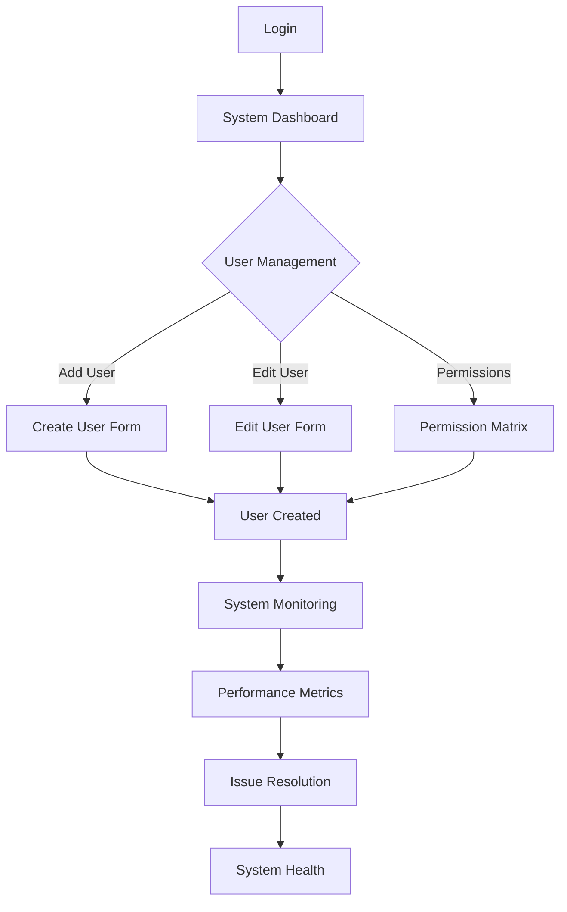
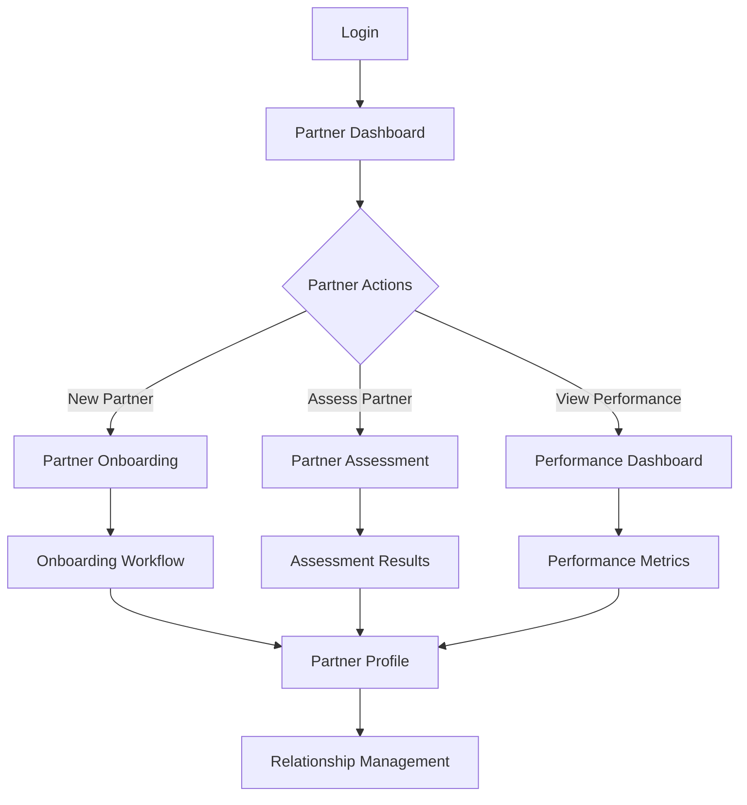
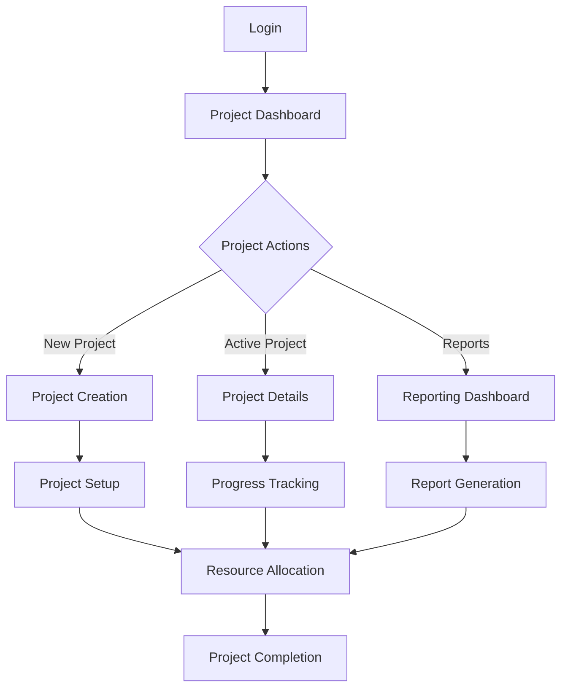
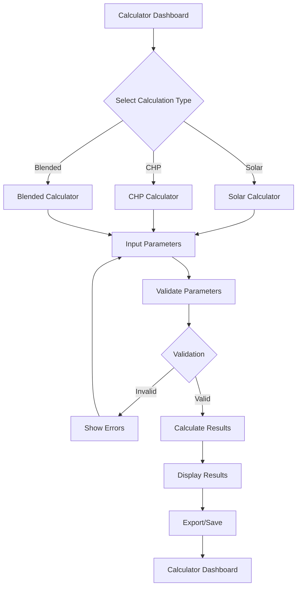
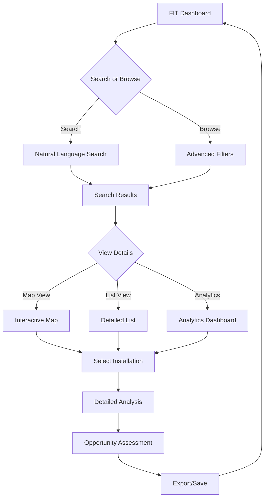
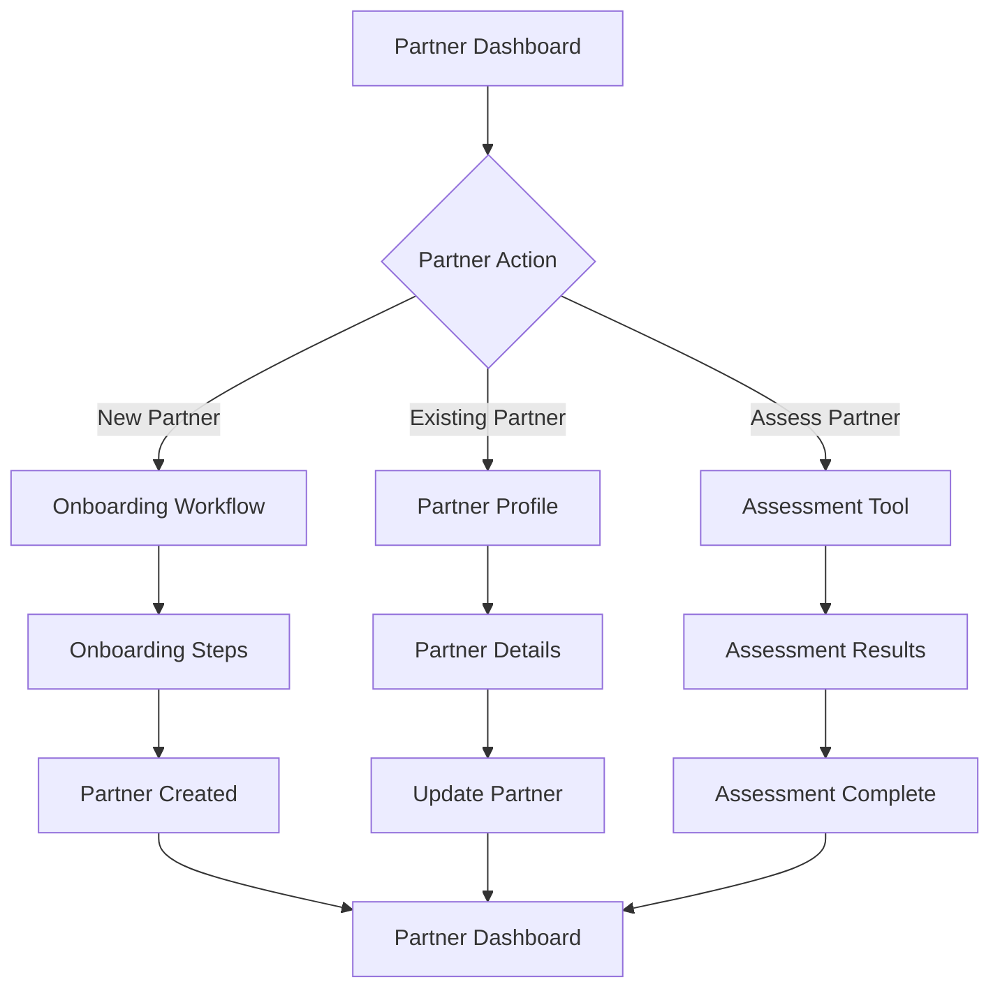
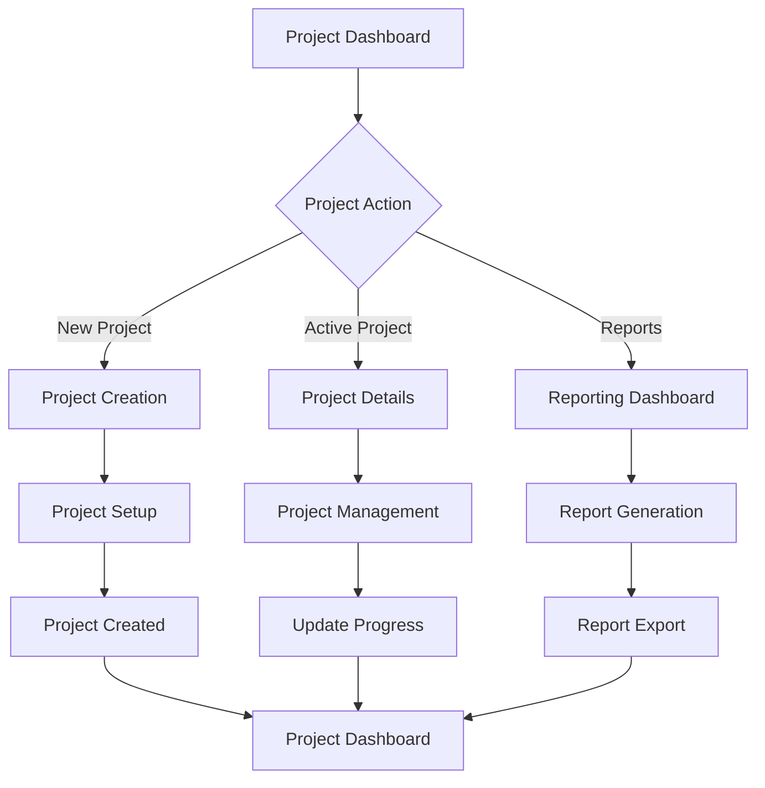

# Saber Business Operations Platform
## User Interface Architecture & User Experience Design

**Version:** 1.0  
**Date:** October 23, 2025  
**Author:** Kilo Code (Architect Mode)  
**Status**: UI/UX Architecture Design  

---

## Executive Summary

This document defines the user interface architecture and user experience design for the Saber Business Operations Platform. The design emphasizes a modern, intuitive interface that streamlines complex workflows while maintaining professional aesthetics aligned with Saber Renewable Energy's brand identity.

### Key Design Principles
- **User-Centered Design**: Intuitive workflows optimized for different user personas
- **Consistent Experience**: Unified design language across all modules
- **Responsive Design**: Seamless experience across desktop, tablet, and mobile devices
- **Accessibility**: WCAG 2.1 AA compliance for inclusive design
- **Performance**: Fast loading and smooth interactions

---

## 1. Design System Overview

### 1.1 Brand Identity & Visual Design

#### Saber Brand Guidelines
```yaml
Brand Colors:
  Primary:
    - Saber Green: #7CC061
    - Saber Blue: #044D73
    - Saber Dark Blue: #091922
  Secondary:
    - Light Green: #A8D5A8
    - Light Blue: #E6F2FF
    - Gray: #F5F5F5
  Accent:
    - Warning: #FF9500
    - Error: #FF3B30
    - Success: #34C759
    - Info: #007AFF

Typography:
  Font Family:
    - Headings: 'Montserrat', sans-serif
    - Body: 'Source Sans Pro', sans-serif
    - Code: 'Fira Code', monospace
  Font Sizes:
    - H1: 32px (Desktop), 28px (Tablet), 24px (Mobile)
    - H2: 24px (Desktop), 20px (Tablet), 18px (Mobile)
    - H3: 20px (Desktop), 18px (Tablet), 16px (Mobile)
    - Body: 16px (Desktop), 14px (Tablet), 14px (Mobile)
    - Small: 14px (Desktop), 12px (Tablet), 12px (Mobile)

Spacing:
  Base Unit: 8px
  Scale: [4px, 8px, 16px, 24px, 32px, 48px, 64px, 96px]

Border Radius:
  Small: 4px
  Medium: 8px
  Large: 12px
  XLarge: 16px

Shadows:
  Subtle: 0 1px 3px rgba(0, 0, 0, 0.1)
  Medium: 0 4px 6px rgba(0, 0, 0, 0.1)
  Strong: 0 10px 15px rgba(0, 0, 0, 0.1)
```

#### Component Library Structure
```yaml
Component Hierarchy:
  1. Atoms:
     - Buttons
     - Inputs
     - Labels
     - Icons
     - Colors
     - Typography
  
  2. Molecules:
     - Forms
     - Cards
     - Headers
     - Navigation
     - Modals
     - Tables
  
  3. Organisms:
     - Dashboards
     - Forms (Complex)
     - Data Tables
     - Navigation (Complex)
     - Sidebars
  
  4. Templates:
     - Page Layouts
     - Dashboard Layouts
     - Form Layouts
     - Authentication Layouts
  
  5. Pages:
     - Specific page implementations
```

### 1.2 Technology Stack

#### Frontend Technology Stack
```yaml
Core Framework:
  - React 18+ with TypeScript
  - Next.js 15 for routing and SSR
  - React Query for data fetching
  - Zustand for state management

Styling:
  - Tailwind CSS 4.1+ for utility-first styling
  - Headless UI for unstyled components
  - Framer Motion for animations
  - React Hook Form for form management

UI Components:
  - Radix UI for accessible primitives
  - React Table for data tables
  - Recharts for data visualization
  - React Hot Toast for notifications

Development Tools:
  - ESLint for code linting
  - Prettier for code formatting
  - Husky for git hooks
  - Storybook for component development
```

---

## 2. User Personas & Journey Mapping

### 2.1 User Personas

#### Primary User Personas
```yaml
System Administrator:
  Role: IT System Management
  Responsibilities:
    - User management and permissions
    - System configuration and maintenance
    - Monitoring and troubleshooting
  Technical Proficiency: Expert
  Goals:
    - Efficient system management
    - High system availability
    - Comprehensive audit trails
  Pain Points:
    - Complex permission management
    - System monitoring overhead
    - User support requests

Partner Manager:
  Role: EPC Partner Relationship Management
  Responsibilities:
    - Partner onboarding and assessment
    - Performance monitoring
    - Relationship management
  Technical Proficiency: Intermediate
  Goals:
    - Streamlined partner onboarding
    - Data-driven partner selection
    - Effective relationship management
  Pain Points:
    - Manual assessment processes
    - Limited partner insights
    - Communication overhead

Project Manager:
  Role: Project Lifecycle Management
  Responsibilities:
    - Project planning and execution
    - Resource allocation
    - Progress tracking and reporting
  Technical Proficiency: Intermediate
  Goals:
    - On-time project delivery
    - Budget adherence
    - Stakeholder satisfaction
  Pain Points:
    - Manual progress tracking
    - Resource scheduling conflicts
    - Reporting overhead

Financial Analyst:
  Role: Financial Analysis and Reporting
  Responsibilities:
    - Financial modeling and analysis
    - Report generation
    - Investment recommendations
  Technical Proficiency: Advanced
  Goals:
    - Accurate financial modeling
    - Comprehensive reporting
    - Data-driven insights
  Pain Points:
    - Complex calculation requirements
    - Manual report generation
    - Data integration challenges

EPC Partner:
  Role: External Partner Collaboration
  Responsibilities:
    - Project execution
    - Reporting and documentation
    - Communication with Saber team
  Technical Proficiency: Basic to Intermediate
  Goals:
    - Efficient project delivery
    - Clear communication
    - Timely payments
  Pain Points:
    - Complex reporting requirements
    - Limited system access
    - Communication delays
```

### 2.2 User Journey Mapping

#### System Administrator Journey


#### Partner Manager Journey


#### Project Manager Journey


---

## 3. Information Architecture

### 3.1 Navigation Structure

#### Primary Navigation
```yaml
Main Navigation:
  - Dashboard:
    - Overview
    - Analytics
    - Recent Activity
  
  - Calculator:
    - New Calculation
    - Calculation History
    - Templates
    - Reports
  
  - FIT Intelligence:
    - Search
    - Opportunities
    - Analytics
    - Reports
  
  - Partners:
    - Partner List
    - Onboarding
    - Assessment
    - Performance
  
  - Projects:
    - Project List
    - Active Projects
    - Reports
    - Resources
  
  - Documents:
    - Document Library
    - Templates
    - Reports
    - Archives
  
  - Settings:
    - Profile
    - Users
    - System
    - Integrations
```

#### Secondary Navigation
```yaml
Contextual Navigation:
  Calculator Module:
    - Parameters
    - Results
    - Scenarios
    - Export
  
  Partner Module:
    - Profile
    - Capabilities
    - Assessment
    - Performance
    - Documents
  
  Project Module:
    - Overview
    - Milestones
    - Resources
    - Budget
    - Reports
    - Documents
```

### 3.2 Information Hierarchy

#### Content Organization
```yaml
Information Hierarchy:
  Level 1 - Strategic:
    - Executive Dashboard
    - Business Intelligence
    - Strategic Reports
  
  Level 2 - Tactical:
    - Module Dashboards
    - Project Management
    - Partner Management
    - Financial Analysis
  
  Level 3 - Operational:
    - Detailed Data Views
    - Transaction Processing
    - Document Management
    - Communication Tools
  
  Level 4 - Reference:
    - Help Documentation
    - System Information
    - User Guides
    - Support Resources
```

---

## 4. Page Layouts & Templates

### 4.1 Application Layout Structure

#### Main Application Layout
```yaml
Layout Components:
  Header:
    - Logo and Branding
    - Global Search
    - Notifications
    - User Menu
    - Help/Support
    
  Sidebar:
    - Main Navigation
    - Module Navigation
    - Quick Actions
    - Recent Items
    
  Main Content:
    - Page Header
      - Breadcrumb Navigation
      - Page Title
      - Page Actions
    - Content Area
      - Dynamic Content
      - Forms
      - Tables
      - Charts
    - Content Footer
      - Pagination
      - Bulk Actions
    
  Footer:
    - System Information
    - Links
    - Copyright
```

#### Responsive Layout Behavior
```yaml
Desktop (>1200px):
  - Fixed sidebar (240px)
  - Full header height (64px)
  - Main content with max width
  
Tablet (768px - 1200px):
  - Collapsible sidebar
  - Compact header
  - Adaptive content width
  
Mobile (<768px):
  - Hidden sidebar (drawer navigation)
  - Mobile header
  - Full-width content
  - Bottom navigation for key actions
```

### 4.2 Dashboard Layouts

#### Executive Dashboard
```yaml
Layout Structure:
  Header:
    - Dashboard Title
    - Date Range Selector
    - Export Options
    - Refresh Button
  
  KPI Section:
    - 4 Primary KPI Cards
    - Trend Indicators
    - Comparison Values
  
  Charts Section:
    - 2x2 Grid of Charts
    - Revenue Trend
    - Project Pipeline
    - Partner Performance
    - Technology Distribution
  
  Recent Activity:
    - Activity Feed
    - Recent Projects
    - Upcoming Milestones
    - System Alerts
```

#### Partner Dashboard
```yaml
Layout Structure:
  Header:
    - Partner Dashboard Title
    - View Options
    - Filter Options
    - Add Partner Button
  
  Partner Overview:
    - Partner Statistics
    - Status Distribution
    - Performance Metrics
  
  Partner List:
    - Data Table with Partners
    - Quick Actions
    - Advanced Filtering
    - Pagination
  
  Quick Actions:
    - Onboarding Queue
    - Assessment Required
    - Performance Reviews
```

### 4.3 Form Layouts

#### Multi-Step Form Pattern
```yaml
Form Structure:
  Progress Indicator:
    - Step Numbers
    - Step Titles
    - Progress Bar
    - Current Step Highlight
  
  Form Content:
    - Step Content Area
    - Form Fields
    - Validation Messages
    - Help Text
  
  Form Navigation:
    - Previous Button
    - Next/Submit Button
    - Save Draft Option
    - Cancel Option
  
  Form Summary:
    - Review Section
    - Field Summary
    - Edit Links
    - Confirmation
```

#### Form Field Patterns
```yaml
Standard Field Layout:
  - Label (Above field)
  - Input Field
  - Help Text (Below field)
  - Validation Message (Below field)
  - Error State (Red highlight)

Complex Field Layout:
  - Field Group
  - Multiple Related Fields
  - Conditional Fields
  - Field Dependencies
  - Validation Logic
```

---

## 5. Component Design Specifications

### 5.1 Core Components

#### Button Component
```yaml
Button Variants:
  Primary:
    - Background: Saber Green (#7CC061)
    - Text: White
    - Hover: Darker Green (#6BAF50)
    - Active: Darkest Green (#5A9E3F)
  
  Secondary:
    - Background: Transparent
    - Border: Saber Green (#7CC061)
    - Text: Saber Green (#7CC061)
    - Hover: Light Green Background (#A8D5A8)
  
  Danger:
    - Background: Error Red (#FF3B30)
    - Text: White
    - Hover: Darker Red (#E63936)
    - Active: Darkest Red (#CC3732)
  
  Ghost:
    - Background: Transparent
    - Text: Saber Dark Blue (#091922)
    - Hover: Light Gray Background (#F5F5F5)

Button Sizes:
  Small:
    - Height: 32px
    - Padding: 8px 16px
    - Font Size: 14px
  
  Medium:
    - Height: 40px
    - Padding: 12px 24px
    - Font Size: 16px
  
  Large:
    - Height: 48px
    - Padding: 16px 32px
    - Font Size: 18px

Button States:
  - Default
  - Hover
  - Active
  - Focus
  - Disabled
  - Loading
```

#### Input Component
```yaml
Input Variants:
  Standard:
    - Border: Light Gray (#E5E5E5)
    - Focus Border: Saber Green (#7CC061)
    - Error Border: Error Red (#FF3B30)
  
  Floating Label:
    - Animated label
    - Focus state
    - Error state
  
  Search:
    - Search icon
    - Clear button
    - Advanced search toggle

Input Sizes:
  Small:
    - Height: 32px
    - Font Size: 14px
  
  Medium:
    - Height: 40px
    - Font Size: 16px
  
  Large:
    - Height: 48px
    - Font Size: 18px

Input States:
  - Default
  - Focus
  - Error
  - Disabled
  - Readonly
```

#### Card Component
```yaml
Card Structure:
  Header:
    - Title
    - Actions
    - Status Indicator
  
  Content:
    - Main Content Area
    - Data Display
    - Charts
    - Tables
  
  Footer:
    - Actions
    - Metadata
    - Timestamps

Card Variants:
  Standard:
    - White Background
    - Subtle Shadow
    - Rounded Corners
  
  Elevated:
    - White Background
    - Medium Shadow
    - Rounded Corners
  
  Outlined:
    - White Background
    - Border
    - No Shadow
  
  Interactive:
    - Hover Effects
    - Click Actions
    - State Changes
```

### 5.2 Data Display Components

#### Table Component
```yaml
Table Structure:
  Header:
    - Column Headers
    - Sort Indicators
    - Filter Options
    - Column Visibility
  
  Body:
    - Data Rows
    - Selection Checkboxes
    - Row Actions
    - Expandable Rows
  
  Footer:
    - Row Count
    - Pagination
    - Bulk Actions

Table Features:
  - Sorting
  - Filtering
  - Pagination
  - Row Selection
  - Column Resizing
  - Export Options
  - Responsive Design
```

#### Chart Component
```yaml
Chart Types:
  - Line Charts
  - Bar Charts
  - Pie Charts
  - Area Charts
  - Scatter Plots
  - Heat Maps

Chart Features:
  - Interactive Tooltips
  - Legend
  - Axis Labels
  - Grid Lines
  - Data Labels
  - Export Options
  - Responsive Design

Chart Customization:
  - Colors (Brand Compliant)
  - Typography
  - Animations
  - Interactions
```

---

## 6. Module-Specific UI Design

### 6.1 Calculator Module UI

#### Calculator Interface Design
```yaml
Calculator Layout:
  Left Panel:
    - Calculation Type Selector
    - Parameter Input Sections
    - Validation Indicators
    - Calculate Button
  
  Right Panel:
    - Results Display
    - Charts and Visualizations
    - Export Options
    - Save/Load Options
  
  Bottom Panel:
    - Scenario Comparison
    - Sensitivity Analysis
    - Historical Calculations

Parameter Input Design:
  - Grouped Parameters
  - Real-time Validation
  - Help Text and Tooltips
  - Default Values
  - Parameter Presets

Results Display Design:
  - Key Metrics Highlight
  - Interactive Charts
  - Detailed Breakdown
  - Comparison Options
  - Export Formats
```

#### User Flow: Calculator


### 6.2 FIT Intelligence Module UI

#### FIT Intelligence Interface Design
```yaml
Search Interface:
  - Natural Language Search Bar
  - Advanced Filter Panel
  - Search History
  - Saved Searches

Results Display:
  - Map View with Markers
  - List View with Details
  - Analytics Panel
  - Export Options

Opportunity Analysis:
  - Opportunity Cards
  - Priority Indicators
  - Value Estimates
  - Action Buttons

Analytics Dashboard:
  - Geographic Distribution
  - Technology Breakdown
  - Expiry Timeline
  - Market Trends
```

#### User Flow: FIT Intelligence


### 6.3 Partner Management Module UI

#### Partner Management Interface Design
```yaml
Partner Dashboard:
  - Partner Statistics
  - Onboarding Queue
  - Performance Metrics
  - Recent Activity

Partner Profile:
  - Basic Information
  - Capabilities
  - Certifications
  - Performance History
  - Documents

Assessment Interface:
  - Assessment Criteria
  - Scoring System
  - Recommendations
  - Status Tracking

Communication Tools:
  - Messaging System
  - Document Sharing
  - Notification Management
  - Activity Log
```

#### User Flow: Partner Management


### 6.4 Project Management Module UI

#### Project Management Interface Design
```yaml
Project Dashboard:
  - Project Overview
  - Timeline View
  - Resource Allocation
  - Budget Tracking
  - Milestone Status

Project Details:
  - Project Information
  - Team Members
  - Tasks and Milestones
  - Documents
  - Communications

Timeline View:
  - Gantt Chart
  - Milestone Markers
  - Dependencies
  - Progress Indicators
  - Resource Assignment

Reporting Interface:
  - Progress Reports
  - Budget Reports
  - Performance Metrics
  - Client Reports
  - Export Options
```

#### User Flow: Project Management


---

## 7. Responsive Design Strategy

### 7.1 Breakpoint Strategy

#### Responsive Breakpoints
```yaml
Breakpoints:
  Mobile:
    - Range: 320px - 767px
    - Layout: Single Column
    - Navigation: Drawer/Bottom
    - Typography: Smaller
    - Touch: Optimized
  
  Tablet:
    - Range: 768px - 1199px
    - Layout: Multi-Column
    - Navigation: Collapsible Sidebar
    - Typography: Medium
    - Touch: Optimized
  
  Desktop:
    - Range: 1200px - 1439px
    - Layout: Full Layout
    - Navigation: Fixed Sidebar
    - Typography: Standard
    - Mouse: Optimized
  
  Large Desktop:
    - Range: 1440px+
    - Layout: Full Layout
    - Navigation: Fixed Sidebar
    - Typography: Large
    - Mouse: Optimized
```

### 7.2 Mobile-First Design

#### Mobile Design Considerations
```yaml
Mobile Optimizations:
  Navigation:
    - Bottom Navigation Bar
    - Hamburger Menu
    - Swipe Gestures
    - Touch Targets (44px minimum)
  
  Content:
    - Single Column Layout
    - Collapsible Sections
    - Progressive Disclosure
    - Vertical Scrolling
  
  Forms:
    - Full-Width Inputs
    - Large Touch Targets
    - Mobile Keyboards
    - Voice Input Support
  
  Tables:
    - Card Layout
    - Horizontal Scrolling
    - Summary View
    - Export Options
```

---

## 8. Accessibility Design

### 8.1 WCAG 2.1 AA Compliance

#### Accessibility Features
```yaml
Visual Accessibility:
  - Color Contrast (4.5:1 minimum)
  - Text Resizing (200%)
  - Focus Indicators
  - High Contrast Mode
  - Animation Controls

Auditory Accessibility:
  - Video Captions
  - Audio Descriptions
  - Visual Alerts
  - Volume Controls
  - Alternative Text

Cognitive Accessibility:
  - Clear Navigation
  - Consistent Layout
  - Error Prevention
  - Help Text
  - Time Extensions

Motor Accessibility:
  - Keyboard Navigation
  - Voice Control
  - Touch Targets
  - Gesture Alternatives
  - Timeout Controls
```

### 8.2 Keyboard Navigation

#### Keyboard Navigation Patterns
```yaml
Navigation Order:
  - Logical Tab Order
  - Skip Links
  - Focus Management
  - Trapped Focus Prevention
  - Visible Focus Indicators

Keyboard Shortcuts:
  - Global Shortcuts
  - Contextual Shortcuts
  - Customizable Shortcuts
  - Shortcut Help
  - Screen Reader Support
```

---

## 9. Performance Optimization

### 9.1 Loading Performance

#### Performance Metrics
```yaml
Performance Targets:
  - First Contentful Paint: <1.5s
  - Largest Contentful Paint: <2.5s
  - First Input Delay: <100ms
  - Cumulative Layout Shift: <0.1
  - Time to Interactive: <3.0s

Optimization Strategies:
  - Code Splitting
  - Lazy Loading
  - Image Optimization
  - Caching Strategy
  - Bundle Optimization
```

### 9.2 User Experience Performance

#### Smooth Interactions
```yaml
Animation Performance:
  - 60fps Animations
  - Hardware Acceleration
  - Reduced Motion Support
  - Animation Controls
  - Performance Monitoring

Interaction Feedback:
  - Loading States
  - Progress Indicators
  - Error Handling
  - Success Confirmations
  - System Status
```

---

## 10. Implementation Guidelines

### 10.1 Development Workflow

#### Component Development Process
```yaml
Development Steps:
  1. Design Review
  2. Component Creation
  3. Unit Testing
  4. Integration Testing
  5. Accessibility Testing
  6. Performance Testing
  7. Documentation
  8. Deployment

Quality Assurance:
  - Code Review
  - Design Review
  - User Testing
  - Accessibility Testing
  - Performance Testing
  - Cross-browser Testing
```

### 10.2 Design System Maintenance

#### Design System Governance
```yaml
Maintenance Process:
  - Regular Reviews
  - Component Updates
  - Pattern Refinement
  - Documentation Updates
  - Version Control
  - Change Management

Evolution Strategy:
  - User Feedback
  - Analytics Review
  - Technology Updates
  - Design Trends
  - Accessibility Updates
  - Performance Optimization
```

---

## 11. Conclusion

### 11.1 UI/UX Architecture Summary

This comprehensive UI/UX architecture provides the foundation for an intuitive, efficient, and accessible Saber Business Operations Platform. The design emphasizes:

1. **User-Centered Design**: Intuitive workflows optimized for different user personas
2. **Consistent Experience**: Unified design language across all modules
3. **Responsive Design**: Seamless experience across all devices
4. **Accessibility**: WCAG 2.1 AA compliance for inclusive design
5. **Performance**: Fast loading and smooth interactions

### 11.2 Implementation Priorities

#### Phase 1: Foundation (Weeks 1-4)
- Design system setup
- Core component library
- Basic layout templates
- Authentication flows

#### Phase 2: Module Implementation (Weeks 5-12)
- Calculator module UI
- FIT intelligence module UI
- Partner management module UI
- Project management module UI

#### Phase 3: Enhancement (Weeks 13-16)
- Advanced features
- Performance optimization
- Accessibility improvements
- User testing and refinement

### 11.3 Success Metrics

#### User Experience Metrics
- User satisfaction score > 4.5/5
- Task completion rate > 90%
- Error rate < 5%
- Learnability time < 30 minutes

#### Performance Metrics
- Page load time < 3 seconds
- Interaction response time < 100ms
- Mobile usability score > 85%
- Accessibility compliance score 100%

---

**Document Version Control:**
- Version 1.0 - Initial Design (October 23, 2025)
- Next Review: November 15, 2025
- Approved By: [Pending Leadership Review]
- Status: UI/UX Architecture Design